# R Programming

## Set Chunk requirements


```r
knitr::opts_chunk$set(echo = TRUE, message = FALSE, warning = FALSE)

#echo=FALSE indicates that the code will not be shown in the final document 
#(though any results/output would still be displayed).

#include=FALSE to have the chunk evaluated, but neither the code nor its output displayed

# warning=FALSE and message=FALSE suppress any R warnings or messages from being included 
#in the final document
```

## loading Relevant packages and Data Set


```r
#Import relevant packages
library(tidyverse)
library(ggplot2)
library(lubridate)
library(scales)
library(janitor)
library("readxl") #loading the excel files

#setwd('F:/Documents/Reinp/GitHub Respositories/COVID-19-Geographic-Disbtribution-Worldwide')

#dt_COVID_19_raw <- read_tsv('data/COVID-19-geographic-disbtribution-worldwide-data.txt', na = character() )

#Country_Code_location <- read_tsv('data/Country_Code_and_location.txt', na = character() )


dt_COVID_19_raw <- read_tsv('https://raw.githubusercontent.com/reinpmomz/COVID-19-Geographic-Disbtribution-Worldwide/main/data/COVID-19-geographic-disbtribution-worldwide-data.txt' , na = character() )


Country_Code_location <- read_tsv('https://raw.githubusercontent.com/reinpmomz/COVID-19-Geographic-Disbtribution-Worldwide/main/data/Country_Code_and_location.txt', na = character() )

sapply(Country_Code_location,function(x) sum(is.na(x)))
```

```
##                    Countries                        geoId 
##                            0                            0 
## countryterritoryCode_adm0_a3                  popData2019 
##                            0                           10 
##     Continent (geographical)              COVID_19_Spread 
##                            0                            0 
##                     latitude                    longitude 
##                            0                            0 
##                      country          country_code_iso_a3 
##                            0                            0 
##                    continent               population2020 
##                            0                            6 
##                iso_code_owid               continent-owid 
##                            0                            0 
##                location-owid 
##                            0
```

```r
dt_COVID_19_raw1 <- merge(dt_COVID_19_raw %>% select(1,2,3,4,5,6,7)%>%
                       mutate(dateRep = dmy(dateRep))%>%
                       mutate(month_name = month(dateRep, label = TRUE))%>%
                       mutate(year = factor(year(dateRep), ordered = TRUE))%>%
                       mutate(week_year = floor_date(dateRep, unit = "week"))%>%
                       mutate(month_year = floor_date(dateRep, unit = "month"))
                     , Country_Code_location %>% select(1,2,3,4,5,6,7,8),
                     by.x = "countriesAndTerritories" , 
                     by.y = "Countries",
                     all.x = TRUE)

dt_COVID_19_raw1 <- dt_COVID_19_raw1 %>%
  janitor:: clean_names()%>%
  dplyr:: rename(countries = countries_and_territories)


duration_d <- data.frame(rng_days = seq(min(dt_COVID_19_raw1$date_rep), max(dt_COVID_19_raw1$date_rep),
                           by = 'day'))%>% 
  mutate(duration_days = factor(row_number(), ordered = TRUE))%>%
                       mutate(week_year = floor_date(rng_days, unit = "week"))%>%
                       mutate(month_year = floor_date(rng_days, unit = "month"))


duration_w <- data.frame(rng_weeks = seq(min(dt_COVID_19_raw1$week_year), max(dt_COVID_19_raw1$week_year),
                           by = 'week'))%>% 
  mutate(duration_weeks = factor(row_number(), ordered = TRUE))

duration_w_d <- merge(duration_w, duration_d,
                     by.x = "rng_weeks" , 
                     by.y = "week_year",
                     all.x = TRUE)

duration_m <- data.frame(rng_months = seq(min(dt_COVID_19_raw1$month_year), max(dt_COVID_19_raw1$month_year),
                           by = 'month'))%>% 
  mutate(duration_months = factor(row_number(), ordered = TRUE))


duration_m_w_d <- merge(duration_m, duration_w_d,
                     by.x = "rng_months" , 
                     by.y = "month_year",
                     all.x = TRUE)


dt_COVID_19 <- merge(dt_COVID_19_raw1, duration_m_w_d %>% select(5,6,4,2),
                     by.x = "date_rep" , 
                     by.y = "rng_days",
                     all.x = TRUE) 


view(dt_COVID_19)

glimpse(dt_COVID_19)
```

```
## Rows: 86,144
## Columns: 20
## $ date_rep                      <date> 2019-12-31, 2019-12-31, 2019-12-31, 201~
## $ countries                     <chr> "Thailand", "Italy", "Ireland", "Afghani~
## $ day_of_month                  <dbl> 31, 31, 31, 31, 31, 31, 31, 31, 31, 31, ~
## $ month                         <dbl> 12, 12, 12, 12, 12, 12, 12, 12, 12, 12, ~
## $ year                          <ord> 2019, 2019, 2019, 2019, 2019, 2019, 2019~
## $ cases                         <dbl> 0, 0, 0, 0, 0, 0, 0, 0, 0, 0, 0, 0, 0, 0~
## $ deaths                        <dbl> 0, 0, 0, 0, 0, 0, 0, 0, 0, 0, 0, 0, 0, 0~
## $ month_name                    <ord> Dec, Dec, Dec, Dec, Dec, Dec, Dec, Dec, ~
## $ week_year                     <date> 2019-12-29, 2019-12-29, 2019-12-29, 201~
## $ month_year                    <date> 2019-12-01, 2019-12-01, 2019-12-01, 201~
## $ geo_id                        <chr> "TH", "IT", "IE", "AF", "MK", "IN", "BH"~
## $ countryterritory_code_adm0_a3 <chr> "THA", "ITA", "IRL", "AFG", "MKD", "IND"~
## $ pop_data2019                  <dbl> 69625581, 60359546, 4904240, 38041757, 2~
## $ continent_geographical        <chr> "Asia", "Europe", "Europe", "Asia", "Eur~
## $ covid_19_spread               <chr> "Asia_Spread", "NewEpiCentre_Europe", "N~
## $ latitude                      <dbl> 15.870032, 41.871940, 53.412910, 33.9391~
## $ longitude                     <dbl> 100.992541, 12.567380, -8.243890, 67.709~
## $ duration_days                 <ord> 1, 1, 1, 1, 1, 1, 1, 1, 1, 1, 1, 1, 1, 1~
## $ duration_weeks                <ord> 1, 1, 1, 1, 1, 1, 1, 1, 1, 1, 1, 1, 1, 1~
## $ duration_months               <ord> 1, 1, 1, 1, 1, 1, 1, 1, 1, 1, 1, 1, 1, 1~
```

```r
# check number of missing values in our data
sapply(dt_COVID_19,function(x) sum(is.na(x)))
```

```
##                      date_rep                     countries 
##                             0                             0 
##                  day_of_month                         month 
##                             0                             0 
##                          year                         cases 
##                             0                             0 
##                        deaths                    month_name 
##                             0                             0 
##                     week_year                    month_year 
##                             0                             0 
##                        geo_id countryterritory_code_adm0_a3 
##                             0                             0 
##                  pop_data2019        continent_geographical 
##                             0                             0 
##               covid_19_spread                      latitude 
##                             0                             0 
##                     longitude                 duration_days 
##                             0                             0 
##                duration_weeks               duration_months 
##                             0                             0
```


## Structure of the Data


```r
head(dt_COVID_19)
```

```
##     date_rep       countries day_of_month month year cases deaths month_name
## 1 2019-12-31        Thailand           31    12 2019     0      0        Dec
## 2 2019-12-31           Italy           31    12 2019     0      0        Dec
## 3 2019-12-31         Ireland           31    12 2019     0      0        Dec
## 4 2019-12-31     Afghanistan           31    12 2019     0      0        Dec
## 5 2019-12-31 North_Macedonia           31    12 2019     0      0        Dec
## 6 2019-12-31           India           31    12 2019     0      0        Dec
##    week_year month_year geo_id countryterritory_code_adm0_a3 pop_data2019
## 1 2019-12-29 2019-12-01     TH                           THA     69625581
## 2 2019-12-29 2019-12-01     IT                           ITA     60359546
## 3 2019-12-29 2019-12-01     IE                           IRL      4904240
## 4 2019-12-29 2019-12-01     AF                           AFG     38041757
## 5 2019-12-29 2019-12-01     MK                           MKD      2077132
## 6 2019-12-29 2019-12-01     IN                           IND   1366417756
##   continent_geographical     covid_19_spread latitude longitude duration_days
## 1                   Asia         Asia_Spread 15.87003 100.99254             1
## 2                 Europe NewEpiCentre_Europe 41.87194  12.56738             1
## 3                 Europe NewEpiCentre_Europe 53.41291  -8.24389             1
## 4                   Asia         Asia_Spread 33.93911  67.70995             1
## 5                 Europe NewEpiCentre_Europe 41.60863  21.74527             1
## 6                   Asia         Asia_Spread 20.59368  78.96288             1
##   duration_weeks duration_months
## 1              1               1
## 2              1               1
## 3              1               1
## 4              1               1
## 5              1               1
## 6              1               1
```

```r
tail(dt_COVID_19)
```

```
##         date_rep            countries day_of_month month year cases deaths
## 86139 2021-04-15               Kosovo           15     4 2021     0      0
## 86140 2021-04-15           Costa_Rica           15     4 2021  2190     21
## 86141 2021-04-15           Montenegro           15     4 2021   183      7
## 86142 2021-04-15 United_Arab_Emirates           15     4 2021  1928      4
## 86143 2021-04-15         Burkina_Faso           15     4 2021    14      0
## 86144 2021-04-15           San_Marino           15     4 2021     6      0
##       month_name  week_year month_year geo_id countryterritory_code_adm0_a3
## 86139        Apr 2021-04-11 2021-04-01     XK                           KOS
## 86140        Apr 2021-04-11 2021-04-01     CR                           CRI
## 86141        Apr 2021-04-11 2021-04-01     ME                           MNE
## 86142        Apr 2021-04-11 2021-04-01     AE                           ARE
## 86143        Apr 2021-04-11 2021-04-01     BF                           BFA
## 86144        Apr 2021-04-11 2021-04-01     SM                           SMR
##       pop_data2019 continent_geographical     covid_19_spread  latitude
## 86139      1798506                 Europe NewEpiCentre_Europe 42.602636
## 86140      5047561          North America    Worldwide_Spread  9.748917
## 86141       622182                 Europe NewEpiCentre_Europe 42.708678
## 86142      9770526                   Asia         Asia_Spread 23.424076
## 86143     20321383                 Africa    Worldwide_Spread 12.238333
## 86144        33860                 Europe NewEpiCentre_Europe 43.942360
##        longitude duration_days duration_weeks duration_months
## 86139  20.902977           472             68              17
## 86140 -83.753428           472             68              17
## 86141  19.374390           472             68              17
## 86142  53.847818           472             68              17
## 86143  -1.561593           472             68              17
## 86144  12.457777           472             68              17
```

```r
# How many variables and observations are there?
ncol(dt_COVID_19)
```

```
## [1] 20
```

```r
nrow(dt_COVID_19)
```

```
## [1] 86144
```

```r
#learn more about the dataset

#help(dt_COVID_19)
#??dt_COVID_19
str(dt_COVID_19)
```

```
## 'data.frame':	86144 obs. of  20 variables:
##  $ date_rep                     : Date, format: "2019-12-31" "2019-12-31" ...
##  $ countries                    : chr  "Thailand" "Italy" "Ireland" "Afghanistan" ...
##  $ day_of_month                 : num  31 31 31 31 31 31 31 31 31 31 ...
##  $ month                        : num  12 12 12 12 12 12 12 12 12 12 ...
##  $ year                         : Ord.factor w/ 3 levels "2019"<"2020"<..: 1 1 1 1 1 1 1 1 1 1 ...
##  $ cases                        : num  0 0 0 0 0 0 0 0 0 0 ...
##  $ deaths                       : num  0 0 0 0 0 0 0 0 0 0 ...
##  $ month_name                   : Ord.factor w/ 12 levels "Jan"<"Feb"<"Mar"<..: 12 12 12 12 12 12 12 12 12 12 ...
##  $ week_year                    : Date, format: "2019-12-29" "2019-12-29" ...
##  $ month_year                   : Date, format: "2019-12-01" "2019-12-01" ...
##  $ geo_id                       : chr  "TH" "IT" "IE" "AF" ...
##  $ countryterritory_code_adm0_a3: chr  "THA" "ITA" "IRL" "AFG" ...
##  $ pop_data2019                 : num  69625581 60359546 4904240 38041757 2077132 ...
##  $ continent_geographical       : chr  "Asia" "Europe" "Europe" "Asia" ...
##  $ covid_19_spread              : chr  "Asia_Spread" "NewEpiCentre_Europe" "NewEpiCentre_Europe" "Asia_Spread" ...
##  $ latitude                     : num  15.9 41.9 53.4 33.9 41.6 ...
##  $ longitude                    : num  100.99 12.57 -8.24 67.71 21.75 ...
##  $ duration_days                : Ord.factor w/ 472 levels "1"<"2"<"3"<"4"<..: 1 1 1 1 1 1 1 1 1 1 ...
##  $ duration_weeks               : Ord.factor w/ 68 levels "1"<"2"<"3"<"4"<..: 1 1 1 1 1 1 1 1 1 1 ...
##  $ duration_months              : Ord.factor w/ 17 levels "1"<"2"<"3"<"4"<..: 1 1 1 1 1 1 1 1 1 1 ...
```

```r
class(dt_COVID_19)
```

```
## [1] "data.frame"
```

```r
typeof(dt_COVID_19) 
```

```
## [1] "list"
```

```r
length(dt_COVID_19)
```

```
## [1] 20
```

```r
names(dt_COVID_19) #display variable names
```

```
##  [1] "date_rep"                      "countries"                    
##  [3] "day_of_month"                  "month"                        
##  [5] "year"                          "cases"                        
##  [7] "deaths"                        "month_name"                   
##  [9] "week_year"                     "month_year"                   
## [11] "geo_id"                        "countryterritory_code_adm0_a3"
## [13] "pop_data2019"                  "continent_geographical"       
## [15] "covid_19_spread"               "latitude"                     
## [17] "longitude"                     "duration_days"                
## [19] "duration_weeks"                "duration_months"
```

```r
#attributes(ds_sd) #names(ds_sd), class(ds_sd), row.names(ds_sd)
```


## Missing data


```r
which(!complete.cases(dt_COVID_19))
```

```
## integer(0)
```

```r
which(is.na(dt_COVID_19$cases)) #check for missing values
```

```
## integer(0)
```

```r
which(is.na(dt_COVID_19$deaths)) #check for missing values
```

```
## integer(0)
```


## Descriptive Statistics


```r
library(knitr)
library(mosaic)

#FormulaSyntax


kable(cbind(sum(~cases, data=dt_COVID_19), sum(~deaths, data=dt_COVID_19)),
      col.names = cbind("Total_Cases", "Total_Deaths"))
```


| Total_Cases| Total_Deaths|
|-----------:|------------:|
|   137619751|      2972474|

```r
kable(cbind(sum(cases~ countries, data=dt_COVID_19), sum(deaths~ countries, data=dt_COVID_19)),
      col.names = cbind("Total_Cases", "Total_Deaths"))
```


|                                           | Total_Cases| Total_Deaths|
|:------------------------------------------|-----------:|------------:|
|Afghanistan                                |       58089|         2535|
|Albania                                    |      128467|         2322|
|Algeria                                    |      118647|         3131|
|Andorra                                    |       12597|          121|
|Angola                                     |       23862|          556|
|Anguilla                                   |          10|            0|
|Antigua_and_Barbuda                        |        1209|           30|
|Argentina                                  |     2624094|        58650|
|Armenia                                    |      206142|         3817|
|Aruba                                      |        5049|           46|
|Australia                                  |       29467|          910|
|Austria                                    |      581868|         9683|
|Azerbaijan                                 |      291099|         4001|
|Bahamas                                    |        9505|          190|
|Bahrain                                    |      160809|          574|
|Bangladesh                                 |      705563|        10044|
|Barbados                                   |        3749|           44|
|Belarus                                    |      338170|         2383|
|Belgium                                    |      938099|        23533|
|Belize                                     |       12447|          316|
|Benin                                      |        7611|           95|
|Bermuda                                    |         431|            9|
|Bhutan                                     |         934|            1|
|Bolivia                                    |      285919|        12597|
|Bonaire, Saint Eustatius and Saba          |         173|            3|
|Bosnia_and_Herzegovina                     |      187371|         7647|
|Botswana                                   |       43703|          670|
|Brazil                                     |    13721488|       365011|
|British_Virgin_Islands                     |          76|            1|
|Brunei_Darussalam                          |         221|            3|
|Bulgaria                                   |      380666|        14829|
|Burkina_Faso                               |       12885|          154|
|Burundi                                    |        3424|            6|
|Cambodia                                   |        5215|           36|
|Cameroon                                   |       61660|          919|
|Canada                                     |     1092431|        23236|
|Cape_Verde                                 |       19776|          188|
|Cases_on_an_international_conveyance_Japan |         696|            7|
|Cayman_Islands                             |         298|            2|
|Central_African_Republic                   |        5682|           75|
|Chad                                       |        4672|          168|
|Chile                                      |     1099787|        24721|
|China                                      |       99729|         4830|
|Colombia                                   |     2593977|        67057|
|Comoros                                    |        3809|          146|
|Congo                                      |        9933|          138|
|Costa_Rica                                 |      225311|         3024|
|Cote_dIvoire                               |       45419|          273|
|Croatia                                    |      299428|         6377|
|Cuba                                       |       90339|          491|
|Curaçao                                    |        3624|           11|
|Cyprus                                     |       53595|          279|
|Czechia                                    |     1593847|        28229|
|Democratic_Republic_of_the_Congo           |       28768|          744|
|Denmark                                    |      237139|         2441|
|Djibouti                                   |       10270|          110|
|Dominica                                   |         164|            0|
|Dominican_Republic                         |      259147|         3402|
|Ecuador                                    |      355361|        17489|
|Egypt                                      |      213287|        12588|
|El_Salvador                                |       67099|         2064|
|Equatorial_Guinea                          |        7259|          106|
|Eritrea                                    |        3486|           10|
|Estonia                                    |      115870|         1059|
|Eswatini                                   |       18355|          667|
|Ethiopia                                   |      236081|         3282|
|Falkland_Islands_(Malvinas)                |          19|            0|
|Faroe_Islands                              |         528|            0|
|Fiji                                       |          68|            2|
|Finland                                    |       82953|          877|
|France                                     |     5189954|        99752|
|French_Polynesia                           |       15618|           91|
|Gabon                                      |       21545|          132|
|Gambia                                     |        5694|          170|
|Georgia                                    |      292244|         3908|
|Germany                                    |     3090069|        79013|
|Ghana                                      |       91545|          766|
|Gibraltar                                  |        1075|            5|
|Greece                                     |      307367|         9177|
|Greenland                                  |          19|            0|
|Grenada                                    |         155|            1|
|Guam                                       |        7106|          118|
|Guatemala                                  |      208571|         7098|
|Guernsey                                   |         289|           13|
|Guinea                                     |       21262|          135|
|Guinea_Bissau                              |        3706|           66|
|Guyana                                     |       11504|          262|
|Haiti                                      |       12913|          252|
|Holy_See                                   |          26|            0|
|Honduras                                   |      198692|         4915|
|Hong_Kong                                  |           0|            0|
|Hungary                                    |      736982|        24521|
|Iceland                                    |        6272|           29|
|India                                      |    14269852|       173954|
|Indonesia                                  |     1583870|        42936|
|Iran                                       |     2161371|        65429|
|Iraq                                       |      955522|        14861|
|Ireland                                    |      242138|         4818|
|Isle_of_Man                                |         370|           25|
|Israel                                     |      835255|         6310|
|Italy                                      |     3814131|       115446|
|Jamaica                                    |       43158|          697|
|Japan                                      |      519138|         9561|
|Jersey                                     |        1779|           32|
|Jordan                                     |      676275|         8015|
|Kazakhstan                                 |      332363|         3280|
|Kenya                                      |      149056|         2418|
|Kosovo                                     |       98881|         2025|
|Kuwait                                     |      252835|         1427|
|Kyrgyzstan                                 |       91144|         1540|
|Laos                                       |          53|            0|
|Latvia                                     |      109521|         2027|
|Lebanon                                    |      503707|         6799|
|Lesotho                                    |       10682|          315|
|Liberia                                    |        2042|           85|
|Libya                                      |      169980|         2858|
|Liechtenstein                              |        2728|           54|
|Lithuania                                  |      230305|         3488|
|Luxembourg                                 |       63921|          771|
|Macau                                      |           0|            0|
|Madagascar                                 |       30258|          526|
|Malawi                                     |       33898|         1134|
|Malaysia                                   |      366606|         1359|
|Maldives                                   |       25928|           67|
|Mali                                       |       12684|          414|
|Malta                                      |       29680|          395|
|Marshall_Islands                           |           4|            0|
|Mauritania                                 |       17717|          446|
|Mauritius                                  |        1194|           15|
|Mexico                                     |     2289505|       210868|
|Micronesia                                 |           1|            0|
|Moldova                                    |      243442|         5467|
|Monaco                                     |        2384|           30|
|Mongolia                                   |       18560|           31|
|Montenegro                                 |       94665|         1409|
|Montserrat                                 |          13|            1|
|Morocco                                    |      503043|         8892|
|Mozambique                                 |       68954|          793|
|Myanmar                                    |      141440|         3182|
|Namibia                                    |       45995|          593|
|Nepal                                      |      281233|         3048|
|Netherlands                                |     1383094|        16929|
|New_Caledonia                              |          36|            0|
|New_Zealand                                |        2235|           26|
|Nicaragua                                  |        6778|          180|
|Niger                                      |        5049|          188|
|Nigeria                                    |      163881|         2061|
|North_Macedonia                            |      144788|         4331|
|Northern_Mariana_Islands                   |         113|            2|
|Norway                                     |      104912|          701|
|Oman                                       |      176404|         1820|
|Pakistan                                   |      742723|        15909|
|Palestine                                  |      289962|         3016|
|Panama                                     |      358218|         6157|
|Papua_New_Guinea                           |        9188|           82|
|Paraguay                                   |      243887|         5092|
|Peru                                       |     1667737|        55812|
|Philippines                                |      902952|        15570|
|Poland                                     |     2637346|        60516|
|Portugal                                   |      827164|        16843|
|Puerto_Rico                                |      107158|         1272|
|Qatar                                      |      193792|          356|
|Romania                                    |     1017049|        25691|
|Russia                                     |     4619791|       102762|
|Rwanda                                     |       23656|          321|
|Saint_Helena                               |           0|            0|
|Saint_Kitts_and_Nevis                      |          43|            0|
|Saint_Lucia                                |        4352|           64|
|Saint_Vincent_and_the_Grenadines           |        1818|           10|
|Samoa                                      |           1|            0|
|San_Marino                                 |        5023|           86|
|Sao_Tome_and_Principe                      |        2270|           35|
|Saudi_Arabia                               |      402017|         6780|
|Senegal                                    |       39535|         1084|
|Serbia                                     |      649938|         5832|
|Seychelles                                 |        4765|           25|
|Sierra_Leone                               |        4011|           79|
|Singapore                                  |       60730|           30|
|Sint_Maarten                               |        1232|           26|
|Slovakia                                   |      373445|        10847|
|Slovenia                                   |      229536|         3494|
|Solomon_Islands                            |          19|            0|
|Somalia                                    |       12837|          656|
|South_Africa                               |     1557768|        53396|
|South_Korea                                |      111909|         1777|
|South_Sudan                                |       10416|          114|
|Spain                                      |     3375376|        76493|
|Sri_Lanka                                  |       95261|          606|
|Sudan                                      |       32454|         2200|
|Suriname                                   |        9452|          185|
|Sweden                                     |      892480|        13761|
|Switzerland                                |      617966|         9722|
|Syria                                      |       20577|         1402|
|Taiwan                                     |        1068|           11|
|Tajikistan                                 |       13271|           90|
|Thailand                                   |       37444|           97|
|Timor_Leste                                |        1138|            2|
|Togo                                       |       12199|          117|
|Trinidad_and_Tobago                        |        8672|          149|
|Tunisia                                    |      279376|         9553|
|Turkey                                     |     3216083|        34584|
|Turks_and_Caicos_islands                   |         769|            6|
|Uganda                                     |       41029|          335|
|Ukraine                                    |     1931799|        39844|
|United_Arab_Emirates                       |      490331|         1544|
|United_Kingdom                             |     4370629|       127108|
|United_Republic_of_Tanzania                |         509|           21|
|United_States_of_America                   |    31124368|       559314|
|United_States_Virgin_Islands               |        1807|           23|
|Uruguay                                    |      156178|         1723|
|Uzbekistan                                 |       85730|          634|
|Vanuatu                                    |           3|            0|
|Venezuela                                  |      178417|         1842|
|Vietnam                                    |        2753|           35|
|Wallis_and_Futuna                          |           3|            0|
|Western_Sahara                             |         766|            1|
|Yemen                                      |        5656|         1097|
|Zambia                                     |       90484|         1230|
|Zimbabwe                                   |       37310|         1548|

```r
kable(cbind(sum(cases~ continent_geographical,data=dt_COVID_19), sum(
  deaths~continent_geographical,data=dt_COVID_19)), col.names=cbind("Total_Cases","Total_Deaths"))
```


|                    | Total_Cases| Total_Deaths|
|:-------------------|-----------:|------------:|
|Africa              |     4386159|       116748|
|Asia                |    27347763|       407325|
|Australia & Oceania |       63862|         1231|
|Europe              |    37416160|       851019|
|Europe / Asia       |     9318684|       161808|
|North America       |    36127007|       823742|
|South America       |    22960116|       610601|

```r
#kable(cbind(sum(cases~ month_name+year,data=dt_COVID_19), 
#sum(deaths~month_name+year,data=dt_COVID_19)), col.names=cbind("Total_Cases","Total_Deaths"))

kable(cbind(sum(cases~ month_year,data=dt_COVID_19), sum(
  deaths~month_year,data=dt_COVID_19)), col.names=cbind("Total_Cases","Total_Deaths"))
```


|           | Total_Cases| Total_Deaths|
|:----------|-----------:|------------:|
|2019-12-01 |          27|            0|
|2020-01-01 |        9799|          213|
|2020-02-01 |       75422|         2708|
|2020-03-01 |      723738|        35814|
|2020-04-01 |     2339594|       189180|
|2020-05-01 |     2891996|       140142|
|2020-06-01 |     4249525|       134069|
|2020-07-01 |     7067524|       166195|
|2020-08-01 |     7963836|       178618|
|2020-09-01 |     8456248|       162169|
|2020-10-01 |    11949041|       181054|
|2020-11-01 |    17134026|       271086|
|2020-12-01 |    19242455|       350190|
|2021-01-01 |    19467762|       410876|
|2021-02-01 |    11152382|       297087|
|2021-03-01 |    14717951|       283195|
|2021-04-01 |    10178425|       169878|

```r
kable(cbind(sum(cases~ week_year,data=dt_COVID_19), sum(
  deaths~week_year,data=dt_COVID_19)), col.names=cbind("Total_Cases","Total_Deaths"))
```


|           | Total_Cases| Total_Deaths|
|:----------|-----------:|------------:|
|2019-12-29 |          44|            0|
|2020-01-05 |          15|            1|
|2020-01-12 |          25|            1|
|2020-01-19 |        1267|           39|
|2020-01-26 |       10596|          218|
|2020-02-02 |       22989|          465|
|2020-02-09 |       32171|          803|
|2020-02-16 |       10701|          832|
|2020-02-23 |        7440|          562|
|2020-03-01 |       17621|          567|
|2020-03-08 |       45955|         1944|
|2020-03-15 |      139490|         5961|
|2020-03-22 |      335734|        16528|
|2020-03-29 |      497071|        32319|
|2020-04-05 |      564320|        45004|
|2020-04-12 |      531630|        51888|
|2020-04-19 |      530718|        42683|
|2020-04-26 |      574997|        39327|
|2020-05-03 |      585636|        35335|
|2020-05-10 |      604361|        32512|
|2020-05-17 |      676910|        30357|
|2020-05-24 |      723121|        26701|
|2020-05-31 |      837100|        29898|
|2020-06-07 |      891956|        29838|
|2020-06-14 |     1015620|        33798|
|2020-06-21 |     1130481|        33180|
|2020-06-28 |     1312851|        31916|
|2020-07-05 |     1422588|        33491|
|2020-07-12 |     1566786|        36577|
|2020-07-19 |     1730841|        42040|
|2020-07-26 |     1813863|        39658|
|2020-08-02 |     1786725|        41407|
|2020-08-09 |     1840734|        44461|
|2020-08-16 |     1753694|        39618|
|2020-08-23 |     1796144|        37539|
|2020-08-30 |     1883744|        37529|
|2020-09-06 |     1873751|        41012|
|2020-09-13 |     2023036|        36711|
|2020-09-20 |     2073423|        37001|
|2020-09-27 |     2069578|        39803|
|2020-10-04 |     2246047|        39472|
|2020-10-11 |     2457727|        36407|
|2020-10-18 |     2889702|        40044|
|2020-10-25 |     3397547|        44715|
|2020-11-01 |     3709014|        54281|
|2020-11-08 |     4098167|        60915|
|2020-11-15 |     4158112|        68368|
|2020-11-22 |     4056349|        70566|
|2020-11-29 |     4228311|        75718|
|2020-12-06 |     4359831|        75484|
|2020-12-13 |     4608309|        81941|
|2020-12-20 |     4072945|        73286|
|2020-12-27 |     4244820|        78812|
|2021-01-03 |     5055461|        90719|
|2021-01-10 |     4824519|        96219|
|2021-01-17 |     4229149|        98588|
|2021-01-24 |     3817617|        99278|
|2021-01-31 |     3182811|        87908|
|2021-02-07 |     2821200|        80901|
|2021-02-14 |     2510081|        66354|
|2021-02-21 |     2716420|        64475|
|2021-02-28 |     2671439|        61776|
|2021-03-07 |     2969119|        59796|
|2021-03-14 |     3335806|        61306|
|2021-03-21 |     3865255|        67488|
|2021-03-28 |     4054810|        68744|
|2021-04-04 |     4583222|        81469|
|2021-04-11 |     3720234|        57920|

```r
kable(cbind(sum(cases~ duration_days, data=dt_COVID_19), 
sum(deaths~ duration_days, data=dt_COVID_19)), col.names=cbind("Total_Cases","Total_Deaths")
, row.names = TRUE )
```


|    | Total_Cases| Total_Deaths|
|:---|-----------:|------------:|
|1   |          27|            0|
|2   |           0|            0|
|3   |           0|            0|
|4   |          17|            0|
|5   |           0|            0|
|6   |          15|            0|
|7   |           0|            0|
|8   |           0|            0|
|9   |           0|            0|
|10  |           0|            0|
|11  |           0|            0|
|12  |           0|            1|
|13  |           0|            0|
|14  |           1|            0|
|15  |           1|            0|
|16  |           1|            1|
|17  |           0|            0|
|18  |           5|            0|
|19  |          17|            0|
|20  |         136|            1|
|21  |          20|            0|
|22  |         153|            3|
|23  |         142|           11|
|24  |          97|            0|
|25  |         266|            9|
|26  |         453|           15|
|27  |         673|           15|
|28  |         797|           25|
|29  |        1767|           25|
|30  |        1480|           26|
|31  |        1757|           38|
|32  |        2001|           43|
|33  |        2121|           46|
|34  |        2608|           46|
|35  |        2818|           57|
|36  |        3243|           65|
|37  |        3909|           66|
|38  |        3751|           72|
|39  |        3218|           73|
|40  |        3442|           86|
|41  |        2618|           89|
|42  |        2992|           97|
|43  |        2563|          108|
|44  |        2072|           97|
|45  |       15151|          255|
|46  |        4215|           13|
|47  |        2560|          144|
|48  |        2162|          142|
|49  |        2067|          106|
|50  |        1995|           98|
|51  |        1864|          139|
|52  |         532|          116|
|53  |         996|          119|
|54  |        1085|          112|
|55  |        1010|          104|
|56  |         523|          156|
|57  |         795|           79|
|58  |         867|           64|
|59  |        1114|           38|
|60  |        1271|           57|
|61  |        1860|           64|
|62  |        1843|           58|
|63  |        2068|           67|
|64  |        1858|           72|
|65  |        2315|           84|
|66  |        2357|           80|
|67  |        3060|          102|
|68  |        4120|          104|
|69  |        3980|           97|
|70  |        4177|          228|
|71  |        4820|          209|
|72  |        5117|          272|
|73  |        7922|          345|
|74  |        9475|          350|
|75  |       10464|          443|
|76  |       12191|          367|
|77  |       12489|          751|
|78  |       14238|          607|
|79  |       17094|          811|
|80  |       20289|          963|
|81  |       31204|         1075|
|82  |       31985|         1387|
|83  |       34234|         1716|
|84  |       34270|         1691|
|85  |       44560|         1854|
|86  |       42544|         2316|
|87  |       53825|         2645|
|88  |       61109|         2814|
|89  |       65192|         3492|
|90  |       62847|         3590|
|91  |       57369|         3231|
|92  |       64722|         3993|
|93  |       74847|         4677|
|94  |       77636|         5016|
|95  |       77647|         5026|
|96  |       82003|         6786|
|97  |       85274|         6299|
|98  |       66262|         4772|
|99  |       73306|         5345|
|100 |       77348|         7576|
|101 |       85091|         6572|
|102 |       87409|         7425|
|103 |       89630|         7015|
|104 |       75356|         6064|
|105 |       68521|         5334|
|106 |       65259|         5390|
|107 |       76975|         7619|
|108 |       78819|        10491|
|109 |       84428|         8527|
|110 |       82272|         8463|
|111 |       79693|         6373|
|112 |       70507|         4988|
|113 |       74666|         5450|
|114 |       87310|         7243|
|115 |       66604|         5935|
|116 |       78789|         7335|
|117 |       73149|         5359|
|118 |       99848|         6161|
|119 |       81832|         3912|
|120 |       66781|         4899|
|121 |       72825|         6566|
|122 |       79507|         6562|
|123 |       85674|         5650|
|124 |       88530|         5577|
|125 |       80639|         4808|
|126 |       77017|         3706|
|127 |       77607|         3986|
|128 |       79558|         5957|
|129 |       88302|         6124|
|130 |       92817|         5642|
|131 |       89696|         5112|
|132 |       88423|         4406|
|133 |       74535|         3426|
|134 |       71367|         3590|
|135 |       87118|         5758|
|136 |       87502|         5017|
|137 |       97180|         5256|
|138 |       98236|         5059|
|139 |       92967|         4224|
|140 |       79049|         2898|
|141 |       87957|         3298|
|142 |       96382|         5184|
|143 |      104973|         4718|
|144 |      108771|         5389|
|145 |      106811|         4646|
|146 |       98946|         3916|
|147 |       92252|         1106|
|148 |       90950|         3368|
|149 |       94641|         3871|
|150 |      103816|         5143|
|151 |      119328|         4641|
|152 |      123188|         4656|
|153 |      127764|         4010|
|154 |      105626|         2914|
|155 |      102772|         3145|
|156 |      113214|         4544|
|157 |      126514|         5516|
|158 |      127354|         5130|
|159 |      133856|         4639|
|160 |      125387|         3787|
|161 |      113667|         3511|
|162 |      108752|         3214|
|163 |      126773|         4853|
|164 |      135663|         5131|
|165 |      136728|         4695|
|166 |      144986|         4647|
|167 |      132970|         4139|
|168 |      119616|         3157|
|169 |      121596|         3377|
|170 |      143251|         6719|
|171 |      178023|         5099|
|172 |      138809|         6275|
|173 |      181355|         5032|
|174 |      159136|         4116|
|175 |      126285|         3967|
|176 |      136494|         3395|
|177 |      164177|         5350|
|178 |      175824|         5215|
|179 |      178867|         6577|
|180 |      189698|         4560|
|181 |      181247|         4591|
|182 |      159070|         3070|
|183 |      161815|         3704|
|184 |      193798|         5623|
|185 |      202237|         4839|
|186 |      208885|         5077|
|187 |      205799|         5012|
|188 |      187773|         4339|
|189 |      176549|         3378|
|190 |      177163|         3841|
|191 |      208510|         5996|
|192 |      215913|         5277|
|193 |      224960|         5383|
|194 |      231720|         5277|
|195 |      215719|         4793|
|196 |      194193|         3889|
|197 |      192553|         3839|
|198 |      225054|         5578|
|199 |      234288|         5501|
|200 |      256151|         5744|
|201 |      248828|         7233|
|202 |      227019|         4978|
|203 |      213629|         3935|
|204 |      204635|         4092|
|205 |      241538|         6123|
|206 |      283889|         6877|
|207 |      275842|         9779|
|208 |      284289|         6256|
|209 |      257000|         5733|
|210 |      229330|         3963|
|211 |      215352|         4656|
|212 |      244711|         6160|
|213 |      299972|         6641|
|214 |      290225|         6383|
|215 |      277273|         6122|
|216 |      262019|         5758|
|217 |      220912|         4233|
|218 |      207322|         4226|
|219 |      256816|         6730|
|220 |      277848|         7098|
|221 |      285966|         6895|
|222 |      275842|         6467|
|223 |      265704|         5634|
|224 |      227503|         4824|
|225 |      221187|         4817|
|226 |      261628|         6137|
|227 |      289725|         6900|
|228 |      285521|         9909|
|229 |      289466|         6240|
|230 |      256330|         5657|
|231 |      230261|         4233|
|232 |      199624|         4297|
|233 |      258063|         6696|
|234 |      280651|         6512|
|235 |      274449|         6353|
|236 |      254316|         5870|
|237 |      263315|         5642|
|238 |      224243|         3340|
|239 |      213162|         4247|
|240 |      256567|         6477|
|241 |      278253|         6294|
|242 |      283627|         6082|
|243 |      276977|         5457|
|244 |      266041|         5698|
|245 |      243225|         3773|
|246 |      245521|         4052|
|247 |      269000|         6513|
|248 |      284989|         6077|
|249 |      280050|         5792|
|250 |      294918|         5624|
|251 |      273436|         5325|
|252 |      246041|         9033|
|253 |      209003|         3820|
|254 |      245736|         4964|
|255 |      289163|         6093|
|256 |      305692|         5893|
|257 |      304680|         5884|
|258 |      284187|         4927|
|259 |      269918|         3880|
|260 |      245519|         4236|
|261 |      303580|         6956|
|262 |      289646|         5437|
|263 |      318191|         5320|
|264 |      311995|         5955|
|265 |      293472|         5073|
|266 |      284342|         3743|
|267 |      268933|         4394|
|268 |      282714|         6067|
|269 |      311482|         6364|
|270 |      320879|         5783|
|271 |      311601|         5577|
|272 |      299288|         5422|
|273 |      279884|         3824|
|274 |      238454|         3923|
|275 |      293934|         6218|
|276 |      316026|         6109|
|277 |      323180|         8773|
|278 |      318812|         5534|
|279 |      301978|         4724|
|280 |      281076|         3966|
|281 |      270276|         4452|
|282 |      326777|         5618|
|283 |      353626|         5851|
|284 |      363056|         9119|
|285 |      349258|         5742|
|286 |      349426|         4867|
|287 |      304057|         3973|
|288 |      285068|         3939|
|289 |      330727|         5531|
|290 |      388395|         6039|
|291 |      402619|         6111|
|292 |      397435|         5947|
|293 |      370484|         5543|
|294 |      362010|         3954|
|295 |      348700|         4672|
|296 |      394988|         6415|
|297 |      452243|         6754|
|298 |      472504|         6367|
|299 |      488773|         6339|
|300 |      459610|         5798|
|301 |      438930|         4449|
|302 |      415915|         5472|
|303 |      479372|         7337|
|304 |      513461|         7153|
|305 |      548100|         7186|
|306 |      542159|         7320|
|307 |      457999|         6426|
|308 |      487232|         5338|
|309 |      470495|         6114|
|310 |      504994|         9859|
|311 |      569890|         9082|
|312 |      612387|         8784|
|313 |      606017|         8678|
|314 |      593273|         7459|
|315 |      528837|         6289|
|316 |      502287|         7281|
|317 |      566934|        10128|
|318 |      623511|        10611|
|319 |      647500|         9151|
|320 |      635825|         9996|
|321 |      594468|         8975|
|322 |      514538|         6694|
|323 |      522070|         8141|
|324 |      584404|        10708|
|325 |      623134|        11106|
|326 |      640252|        10732|
|327 |      679246|        12012|
|328 |      572279|         8541|
|329 |      518260|         7161|
|330 |      534370|         8886|
|331 |      562359|        12208|
|332 |      647881|        12631|
|333 |      571827|        10713|
|334 |      649373|        10426|
|335 |      595768|         9546|
|336 |      516616|         7410|
|337 |      501937|         8803|
|338 |      591801|        12786|
|339 |      657717|        12773|
|340 |      681109|        11941|
|341 |      683363|        12459|
|342 |      634276|         9924|
|343 |      546373|         7500|
|344 |      526221|         8360|
|345 |      626355|        12642|
|346 |      676114|        12376|
|347 |      693352|        12327|
|348 |      657140|        12355|
|349 |      626421|        10254|
|350 |      540659|         7085|
|351 |      636206|        13937|
|352 |      733726|        13717|
|353 |      739582|        13415|
|354 |      720462|        12765|
|355 |      611253|        10768|
|356 |      533473|         7911|
|357 |      549297|         9666|
|358 |      650261|        14307|
|359 |      695122|        13802|
|360 |      666640|        11633|
|361 |      465550|         8574|
|362 |      512602|         7393|
|363 |      438453|         7402|
|364 |      496323|         9755|
|365 |      664428|        15164|
|366 |      761230|        15259|
|367 |      725009|        13137|
|368 |      533018|         9667|
|369 |      626359|         8428|
|370 |      532796|         7335|
|371 |      554118|        10153|
|372 |      740122|        15311|
|373 |      783372|        15056|
|374 |      880837|        14918|
|375 |      803222|        15165|
|376 |      760994|        12781|
|377 |      589134|         8347|
|378 |      619930|        10316|
|379 |      705508|        17105|
|380 |      748388|        16704|
|381 |      755228|        15357|
|382 |      767187|        15118|
|383 |      639144|        13272|
|384 |      529212|         8633|
|385 |      515066|         9406|
|386 |      608426|        16582|
|387 |      692937|        17904|
|388 |      656323|        16765|
|389 |      659061|        16006|
|390 |      568124|        13292|
|391 |      445654|         8968|
|392 |      497340|        10762|
|393 |      556238|        17336|
|394 |      598361|        16683|
|395 |      614251|        17030|
|396 |      590443|        14928|
|397 |      515330|        13571|
|398 |      381639|         7977|
|399 |      446774|        10200|
|400 |      457957|        14880|
|401 |      521981|        15703|
|402 |      466907|        12543|
|403 |      535428|        16509|
|404 |      372125|        10096|
|405 |      398078|         7916|
|406 |      315893|         8325|
|407 |      428033|        15537|
|408 |      435741|        13418|
|409 |      441465|        13449|
|410 |      428689|        12460|
|411 |      373301|         9796|
|412 |      293850|         6330|
|413 |      283166|         6889|
|414 |      351020|        10900|
|415 |      395555|        11344|
|416 |      403516|        11363|
|417 |      412519|        11032|
|418 |      370455|         8496|
|419 |      314446|         5847|
|420 |      288438|         6929|
|421 |      388852|        11181|
|422 |      444937|        12000|
|423 |      447478|        10088|
|424 |      443039|        10309|
|425 |      389230|         8121|
|426 |      303509|         5426|
|427 |      305864|         7203|
|428 |      310288|        10438|
|429 |      441142|        11078|
|430 |      453049|         9780|
|431 |      447052|        10017|
|432 |      410535|         7834|
|433 |      368312|         5269|
|434 |      298723|         6863|
|435 |      414665|         9981|
|436 |      467079|         9692|
|437 |      476896|         9770|
|438 |      489328|         9650|
|439 |      454116|         8571|
|440 |      360385|         5496|
|441 |      348901|         6818|
|442 |      473013|         9884|
|443 |      539285|        10091|
|444 |      553723|        10551|
|445 |      561679|        10366|
|446 |      498820|         8100|
|447 |      423315|         5849|
|448 |      416821|         7364|
|449 |      514245|        11089|
|450 |      633581|         9690|
|451 |      651350|        11458|
|452 |      641351|        12209|
|453 |      584592|         9829|
|454 |      469957|         6471|
|455 |      458406|         7957|
|456 |      568273|        11562|
|457 |      683205|        12265|
|458 |      711786|        11865|
|459 |      633740|        10247|
|460 |      529443|         8377|
|461 |      552803|         6927|
|462 |      489584|         7463|
|463 |      604087|        11807|
|464 |      684346|        14826|
|465 |      839850|        14634|
|466 |      748045|        13405|
|467 |      664507|        12407|
|468 |      690741|         8557|
|469 |      616625|         9298|
|470 |      779567|        13332|
|471 |      817025|        13533|
|472 |      816276|        13200|

```r
kable(cbind(sum(cases~ date_rep, data=dt_COVID_19), 
sum(deaths~ date_rep, data=dt_COVID_19)), col.names=cbind("Total_Cases","Total_Deaths"))
```


|           | Total_Cases| Total_Deaths|
|:----------|-----------:|------------:|
|2019-12-31 |          27|            0|
|2020-01-01 |           0|            0|
|2020-01-02 |           0|            0|
|2020-01-03 |          17|            0|
|2020-01-04 |           0|            0|
|2020-01-05 |          15|            0|
|2020-01-06 |           0|            0|
|2020-01-07 |           0|            0|
|2020-01-08 |           0|            0|
|2020-01-09 |           0|            0|
|2020-01-10 |           0|            0|
|2020-01-11 |           0|            1|
|2020-01-12 |           0|            0|
|2020-01-13 |           1|            0|
|2020-01-14 |           1|            0|
|2020-01-15 |           1|            1|
|2020-01-16 |           0|            0|
|2020-01-17 |           5|            0|
|2020-01-18 |          17|            0|
|2020-01-19 |         136|            1|
|2020-01-20 |          20|            0|
|2020-01-21 |         153|            3|
|2020-01-22 |         142|           11|
|2020-01-23 |          97|            0|
|2020-01-24 |         266|            9|
|2020-01-25 |         453|           15|
|2020-01-26 |         673|           15|
|2020-01-27 |         797|           25|
|2020-01-28 |        1767|           25|
|2020-01-29 |        1480|           26|
|2020-01-30 |        1757|           38|
|2020-01-31 |        2001|           43|
|2020-02-01 |        2121|           46|
|2020-02-02 |        2608|           46|
|2020-02-03 |        2818|           57|
|2020-02-04 |        3243|           65|
|2020-02-05 |        3909|           66|
|2020-02-06 |        3751|           72|
|2020-02-07 |        3218|           73|
|2020-02-08 |        3442|           86|
|2020-02-09 |        2618|           89|
|2020-02-10 |        2992|           97|
|2020-02-11 |        2563|          108|
|2020-02-12 |        2072|           97|
|2020-02-13 |       15151|          255|
|2020-02-14 |        4215|           13|
|2020-02-15 |        2560|          144|
|2020-02-16 |        2162|          142|
|2020-02-17 |        2067|          106|
|2020-02-18 |        1995|           98|
|2020-02-19 |        1864|          139|
|2020-02-20 |         532|          116|
|2020-02-21 |         996|          119|
|2020-02-22 |        1085|          112|
|2020-02-23 |        1010|          104|
|2020-02-24 |         523|          156|
|2020-02-25 |         795|           79|
|2020-02-26 |         867|           64|
|2020-02-27 |        1114|           38|
|2020-02-28 |        1271|           57|
|2020-02-29 |        1860|           64|
|2020-03-01 |        1843|           58|
|2020-03-02 |        2068|           67|
|2020-03-03 |        1858|           72|
|2020-03-04 |        2315|           84|
|2020-03-05 |        2357|           80|
|2020-03-06 |        3060|          102|
|2020-03-07 |        4120|          104|
|2020-03-08 |        3980|           97|
|2020-03-09 |        4177|          228|
|2020-03-10 |        4820|          209|
|2020-03-11 |        5117|          272|
|2020-03-12 |        7922|          345|
|2020-03-13 |        9475|          350|
|2020-03-14 |       10464|          443|
|2020-03-15 |       12191|          367|
|2020-03-16 |       12489|          751|
|2020-03-17 |       14238|          607|
|2020-03-18 |       17094|          811|
|2020-03-19 |       20289|          963|
|2020-03-20 |       31204|         1075|
|2020-03-21 |       31985|         1387|
|2020-03-22 |       34234|         1716|
|2020-03-23 |       34270|         1691|
|2020-03-24 |       44560|         1854|
|2020-03-25 |       42544|         2316|
|2020-03-26 |       53825|         2645|
|2020-03-27 |       61109|         2814|
|2020-03-28 |       65192|         3492|
|2020-03-29 |       62847|         3590|
|2020-03-30 |       57369|         3231|
|2020-03-31 |       64722|         3993|
|2020-04-01 |       74847|         4677|
|2020-04-02 |       77636|         5016|
|2020-04-03 |       77647|         5026|
|2020-04-04 |       82003|         6786|
|2020-04-05 |       85274|         6299|
|2020-04-06 |       66262|         4772|
|2020-04-07 |       73306|         5345|
|2020-04-08 |       77348|         7576|
|2020-04-09 |       85091|         6572|
|2020-04-10 |       87409|         7425|
|2020-04-11 |       89630|         7015|
|2020-04-12 |       75356|         6064|
|2020-04-13 |       68521|         5334|
|2020-04-14 |       65259|         5390|
|2020-04-15 |       76975|         7619|
|2020-04-16 |       78819|        10491|
|2020-04-17 |       84428|         8527|
|2020-04-18 |       82272|         8463|
|2020-04-19 |       79693|         6373|
|2020-04-20 |       70507|         4988|
|2020-04-21 |       74666|         5450|
|2020-04-22 |       87310|         7243|
|2020-04-23 |       66604|         5935|
|2020-04-24 |       78789|         7335|
|2020-04-25 |       73149|         5359|
|2020-04-26 |       99848|         6161|
|2020-04-27 |       81832|         3912|
|2020-04-28 |       66781|         4899|
|2020-04-29 |       72825|         6566|
|2020-04-30 |       79507|         6562|
|2020-05-01 |       85674|         5650|
|2020-05-02 |       88530|         5577|
|2020-05-03 |       80639|         4808|
|2020-05-04 |       77017|         3706|
|2020-05-05 |       77607|         3986|
|2020-05-06 |       79558|         5957|
|2020-05-07 |       88302|         6124|
|2020-05-08 |       92817|         5642|
|2020-05-09 |       89696|         5112|
|2020-05-10 |       88423|         4406|
|2020-05-11 |       74535|         3426|
|2020-05-12 |       71367|         3590|
|2020-05-13 |       87118|         5758|
|2020-05-14 |       87502|         5017|
|2020-05-15 |       97180|         5256|
|2020-05-16 |       98236|         5059|
|2020-05-17 |       92967|         4224|
|2020-05-18 |       79049|         2898|
|2020-05-19 |       87957|         3298|
|2020-05-20 |       96382|         5184|
|2020-05-21 |      104973|         4718|
|2020-05-22 |      108771|         5389|
|2020-05-23 |      106811|         4646|
|2020-05-24 |       98946|         3916|
|2020-05-25 |       92252|         1106|
|2020-05-26 |       90950|         3368|
|2020-05-27 |       94641|         3871|
|2020-05-28 |      103816|         5143|
|2020-05-29 |      119328|         4641|
|2020-05-30 |      123188|         4656|
|2020-05-31 |      127764|         4010|
|2020-06-01 |      105626|         2914|
|2020-06-02 |      102772|         3145|
|2020-06-03 |      113214|         4544|
|2020-06-04 |      126514|         5516|
|2020-06-05 |      127354|         5130|
|2020-06-06 |      133856|         4639|
|2020-06-07 |      125387|         3787|
|2020-06-08 |      113667|         3511|
|2020-06-09 |      108752|         3214|
|2020-06-10 |      126773|         4853|
|2020-06-11 |      135663|         5131|
|2020-06-12 |      136728|         4695|
|2020-06-13 |      144986|         4647|
|2020-06-14 |      132970|         4139|
|2020-06-15 |      119616|         3157|
|2020-06-16 |      121596|         3377|
|2020-06-17 |      143251|         6719|
|2020-06-18 |      178023|         5099|
|2020-06-19 |      138809|         6275|
|2020-06-20 |      181355|         5032|
|2020-06-21 |      159136|         4116|
|2020-06-22 |      126285|         3967|
|2020-06-23 |      136494|         3395|
|2020-06-24 |      164177|         5350|
|2020-06-25 |      175824|         5215|
|2020-06-26 |      178867|         6577|
|2020-06-27 |      189698|         4560|
|2020-06-28 |      181247|         4591|
|2020-06-29 |      159070|         3070|
|2020-06-30 |      161815|         3704|
|2020-07-01 |      193798|         5623|
|2020-07-02 |      202237|         4839|
|2020-07-03 |      208885|         5077|
|2020-07-04 |      205799|         5012|
|2020-07-05 |      187773|         4339|
|2020-07-06 |      176549|         3378|
|2020-07-07 |      177163|         3841|
|2020-07-08 |      208510|         5996|
|2020-07-09 |      215913|         5277|
|2020-07-10 |      224960|         5383|
|2020-07-11 |      231720|         5277|
|2020-07-12 |      215719|         4793|
|2020-07-13 |      194193|         3889|
|2020-07-14 |      192553|         3839|
|2020-07-15 |      225054|         5578|
|2020-07-16 |      234288|         5501|
|2020-07-17 |      256151|         5744|
|2020-07-18 |      248828|         7233|
|2020-07-19 |      227019|         4978|
|2020-07-20 |      213629|         3935|
|2020-07-21 |      204635|         4092|
|2020-07-22 |      241538|         6123|
|2020-07-23 |      283889|         6877|
|2020-07-24 |      275842|         9779|
|2020-07-25 |      284289|         6256|
|2020-07-26 |      257000|         5733|
|2020-07-27 |      229330|         3963|
|2020-07-28 |      215352|         4656|
|2020-07-29 |      244711|         6160|
|2020-07-30 |      299972|         6641|
|2020-07-31 |      290225|         6383|
|2020-08-01 |      277273|         6122|
|2020-08-02 |      262019|         5758|
|2020-08-03 |      220912|         4233|
|2020-08-04 |      207322|         4226|
|2020-08-05 |      256816|         6730|
|2020-08-06 |      277848|         7098|
|2020-08-07 |      285966|         6895|
|2020-08-08 |      275842|         6467|
|2020-08-09 |      265704|         5634|
|2020-08-10 |      227503|         4824|
|2020-08-11 |      221187|         4817|
|2020-08-12 |      261628|         6137|
|2020-08-13 |      289725|         6900|
|2020-08-14 |      285521|         9909|
|2020-08-15 |      289466|         6240|
|2020-08-16 |      256330|         5657|
|2020-08-17 |      230261|         4233|
|2020-08-18 |      199624|         4297|
|2020-08-19 |      258063|         6696|
|2020-08-20 |      280651|         6512|
|2020-08-21 |      274449|         6353|
|2020-08-22 |      254316|         5870|
|2020-08-23 |      263315|         5642|
|2020-08-24 |      224243|         3340|
|2020-08-25 |      213162|         4247|
|2020-08-26 |      256567|         6477|
|2020-08-27 |      278253|         6294|
|2020-08-28 |      283627|         6082|
|2020-08-29 |      276977|         5457|
|2020-08-30 |      266041|         5698|
|2020-08-31 |      243225|         3773|
|2020-09-01 |      245521|         4052|
|2020-09-02 |      269000|         6513|
|2020-09-03 |      284989|         6077|
|2020-09-04 |      280050|         5792|
|2020-09-05 |      294918|         5624|
|2020-09-06 |      273436|         5325|
|2020-09-07 |      246041|         9033|
|2020-09-08 |      209003|         3820|
|2020-09-09 |      245736|         4964|
|2020-09-10 |      289163|         6093|
|2020-09-11 |      305692|         5893|
|2020-09-12 |      304680|         5884|
|2020-09-13 |      284187|         4927|
|2020-09-14 |      269918|         3880|
|2020-09-15 |      245519|         4236|
|2020-09-16 |      303580|         6956|
|2020-09-17 |      289646|         5437|
|2020-09-18 |      318191|         5320|
|2020-09-19 |      311995|         5955|
|2020-09-20 |      293472|         5073|
|2020-09-21 |      284342|         3743|
|2020-09-22 |      268933|         4394|
|2020-09-23 |      282714|         6067|
|2020-09-24 |      311482|         6364|
|2020-09-25 |      320879|         5783|
|2020-09-26 |      311601|         5577|
|2020-09-27 |      299288|         5422|
|2020-09-28 |      279884|         3824|
|2020-09-29 |      238454|         3923|
|2020-09-30 |      293934|         6218|
|2020-10-01 |      316026|         6109|
|2020-10-02 |      323180|         8773|
|2020-10-03 |      318812|         5534|
|2020-10-04 |      301978|         4724|
|2020-10-05 |      281076|         3966|
|2020-10-06 |      270276|         4452|
|2020-10-07 |      326777|         5618|
|2020-10-08 |      353626|         5851|
|2020-10-09 |      363056|         9119|
|2020-10-10 |      349258|         5742|
|2020-10-11 |      349426|         4867|
|2020-10-12 |      304057|         3973|
|2020-10-13 |      285068|         3939|
|2020-10-14 |      330727|         5531|
|2020-10-15 |      388395|         6039|
|2020-10-16 |      402619|         6111|
|2020-10-17 |      397435|         5947|
|2020-10-18 |      370484|         5543|
|2020-10-19 |      362010|         3954|
|2020-10-20 |      348700|         4672|
|2020-10-21 |      394988|         6415|
|2020-10-22 |      452243|         6754|
|2020-10-23 |      472504|         6367|
|2020-10-24 |      488773|         6339|
|2020-10-25 |      459610|         5798|
|2020-10-26 |      438930|         4449|
|2020-10-27 |      415915|         5472|
|2020-10-28 |      479372|         7337|
|2020-10-29 |      513461|         7153|
|2020-10-30 |      548100|         7186|
|2020-10-31 |      542159|         7320|
|2020-11-01 |      457999|         6426|
|2020-11-02 |      487232|         5338|
|2020-11-03 |      470495|         6114|
|2020-11-04 |      504994|         9859|
|2020-11-05 |      569890|         9082|
|2020-11-06 |      612387|         8784|
|2020-11-07 |      606017|         8678|
|2020-11-08 |      593273|         7459|
|2020-11-09 |      528837|         6289|
|2020-11-10 |      502287|         7281|
|2020-11-11 |      566934|        10128|
|2020-11-12 |      623511|        10611|
|2020-11-13 |      647500|         9151|
|2020-11-14 |      635825|         9996|
|2020-11-15 |      594468|         8975|
|2020-11-16 |      514538|         6694|
|2020-11-17 |      522070|         8141|
|2020-11-18 |      584404|        10708|
|2020-11-19 |      623134|        11106|
|2020-11-20 |      640252|        10732|
|2020-11-21 |      679246|        12012|
|2020-11-22 |      572279|         8541|
|2020-11-23 |      518260|         7161|
|2020-11-24 |      534370|         8886|
|2020-11-25 |      562359|        12208|
|2020-11-26 |      647881|        12631|
|2020-11-27 |      571827|        10713|
|2020-11-28 |      649373|        10426|
|2020-11-29 |      595768|         9546|
|2020-11-30 |      516616|         7410|
|2020-12-01 |      501937|         8803|
|2020-12-02 |      591801|        12786|
|2020-12-03 |      657717|        12773|
|2020-12-04 |      681109|        11941|
|2020-12-05 |      683363|        12459|
|2020-12-06 |      634276|         9924|
|2020-12-07 |      546373|         7500|
|2020-12-08 |      526221|         8360|
|2020-12-09 |      626355|        12642|
|2020-12-10 |      676114|        12376|
|2020-12-11 |      693352|        12327|
|2020-12-12 |      657140|        12355|
|2020-12-13 |      626421|        10254|
|2020-12-14 |      540659|         7085|
|2020-12-15 |      636206|        13937|
|2020-12-16 |      733726|        13717|
|2020-12-17 |      739582|        13415|
|2020-12-18 |      720462|        12765|
|2020-12-19 |      611253|        10768|
|2020-12-20 |      533473|         7911|
|2020-12-21 |      549297|         9666|
|2020-12-22 |      650261|        14307|
|2020-12-23 |      695122|        13802|
|2020-12-24 |      666640|        11633|
|2020-12-25 |      465550|         8574|
|2020-12-26 |      512602|         7393|
|2020-12-27 |      438453|         7402|
|2020-12-28 |      496323|         9755|
|2020-12-29 |      664428|        15164|
|2020-12-30 |      761230|        15259|
|2020-12-31 |      725009|        13137|
|2021-01-01 |      533018|         9667|
|2021-01-02 |      626359|         8428|
|2021-01-03 |      532796|         7335|
|2021-01-04 |      554118|        10153|
|2021-01-05 |      740122|        15311|
|2021-01-06 |      783372|        15056|
|2021-01-07 |      880837|        14918|
|2021-01-08 |      803222|        15165|
|2021-01-09 |      760994|        12781|
|2021-01-10 |      589134|         8347|
|2021-01-11 |      619930|        10316|
|2021-01-12 |      705508|        17105|
|2021-01-13 |      748388|        16704|
|2021-01-14 |      755228|        15357|
|2021-01-15 |      767187|        15118|
|2021-01-16 |      639144|        13272|
|2021-01-17 |      529212|         8633|
|2021-01-18 |      515066|         9406|
|2021-01-19 |      608426|        16582|
|2021-01-20 |      692937|        17904|
|2021-01-21 |      656323|        16765|
|2021-01-22 |      659061|        16006|
|2021-01-23 |      568124|        13292|
|2021-01-24 |      445654|         8968|
|2021-01-25 |      497340|        10762|
|2021-01-26 |      556238|        17336|
|2021-01-27 |      598361|        16683|
|2021-01-28 |      614251|        17030|
|2021-01-29 |      590443|        14928|
|2021-01-30 |      515330|        13571|
|2021-01-31 |      381639|         7977|
|2021-02-01 |      446774|        10200|
|2021-02-02 |      457957|        14880|
|2021-02-03 |      521981|        15703|
|2021-02-04 |      466907|        12543|
|2021-02-05 |      535428|        16509|
|2021-02-06 |      372125|        10096|
|2021-02-07 |      398078|         7916|
|2021-02-08 |      315893|         8325|
|2021-02-09 |      428033|        15537|
|2021-02-10 |      435741|        13418|
|2021-02-11 |      441465|        13449|
|2021-02-12 |      428689|        12460|
|2021-02-13 |      373301|         9796|
|2021-02-14 |      293850|         6330|
|2021-02-15 |      283166|         6889|
|2021-02-16 |      351020|        10900|
|2021-02-17 |      395555|        11344|
|2021-02-18 |      403516|        11363|
|2021-02-19 |      412519|        11032|
|2021-02-20 |      370455|         8496|
|2021-02-21 |      314446|         5847|
|2021-02-22 |      288438|         6929|
|2021-02-23 |      388852|        11181|
|2021-02-24 |      444937|        12000|
|2021-02-25 |      447478|        10088|
|2021-02-26 |      443039|        10309|
|2021-02-27 |      389230|         8121|
|2021-02-28 |      303509|         5426|
|2021-03-01 |      305864|         7203|
|2021-03-02 |      310288|        10438|
|2021-03-03 |      441142|        11078|
|2021-03-04 |      453049|         9780|
|2021-03-05 |      447052|        10017|
|2021-03-06 |      410535|         7834|
|2021-03-07 |      368312|         5269|
|2021-03-08 |      298723|         6863|
|2021-03-09 |      414665|         9981|
|2021-03-10 |      467079|         9692|
|2021-03-11 |      476896|         9770|
|2021-03-12 |      489328|         9650|
|2021-03-13 |      454116|         8571|
|2021-03-14 |      360385|         5496|
|2021-03-15 |      348901|         6818|
|2021-03-16 |      473013|         9884|
|2021-03-17 |      539285|        10091|
|2021-03-18 |      553723|        10551|
|2021-03-19 |      561679|        10366|
|2021-03-20 |      498820|         8100|
|2021-03-21 |      423315|         5849|
|2021-03-22 |      416821|         7364|
|2021-03-23 |      514245|        11089|
|2021-03-24 |      633581|         9690|
|2021-03-25 |      651350|        11458|
|2021-03-26 |      641351|        12209|
|2021-03-27 |      584592|         9829|
|2021-03-28 |      469957|         6471|
|2021-03-29 |      458406|         7957|
|2021-03-30 |      568273|        11562|
|2021-03-31 |      683205|        12265|
|2021-04-01 |      711786|        11865|
|2021-04-02 |      633740|        10247|
|2021-04-03 |      529443|         8377|
|2021-04-04 |      552803|         6927|
|2021-04-05 |      489584|         7463|
|2021-04-06 |      604087|        11807|
|2021-04-07 |      684346|        14826|
|2021-04-08 |      839850|        14634|
|2021-04-09 |      748045|        13405|
|2021-04-10 |      664507|        12407|
|2021-04-11 |      690741|         8557|
|2021-04-12 |      616625|         9298|
|2021-04-13 |      779567|        13332|
|2021-04-14 |      817025|        13533|
|2021-04-15 |      816276|        13200|

```r
##one continous variable
favstats(~cases, data=dt_COVID_19)[c("max", "mean","sd", "n")]
```

```
##     max     mean       sd     n
##  300310 1597.555 8739.806 86144
```

```r
favstats(~deaths, data=dt_COVID_19)[c("max", "mean","sd", "n")]
```

```
##   max     mean       sd     n
##  4928 34.50587 170.4534 86144
```

```r
##one continous one categorical

favstats(cases~ countries, data=dt_COVID_19)[c("countries", "max", "mean", "sd", "n")]
```

```
##                                      countries    max         mean           sd
## 1                                  Afghanistan   1485 1.257338e+02 1.942114e+02
## 2                                      Albania   1239 3.187767e+02 3.284882e+02
## 3                                      Algeria   1133 2.540621e+02 2.415000e+02
## 4                                      Andorra    299 3.165075e+01 4.414735e+01
## 5                                       Angola    355 6.118462e+01 6.867087e+01
## 6                                     Anguilla      2 3.021148e-02 2.181040e-01
## 7                          Antigua_and_Barbuda     82 3.084184e+00 9.141153e+00
## 8                                    Argentina  27001 6.479244e+03 5.313851e+03
## 9                                      Armenia   4527 4.452311e+02 5.521444e+02
## 10                                       Aruba    176 1.891011e+01 3.177457e+01
## 11                                   Australia    721 6.243008e+01 1.216326e+02
## 12                                     Austria  10368 1.232771e+03 1.685549e+03
## 13                                  Azerbaijan   4451 6.260194e+02 1.025038e+03
## 14                                     Bahamas    242 2.412437e+01 3.914054e+01
## 15                                     Bahrain   1316 3.414204e+02 2.937334e+02
## 16                                  Bangladesh   7626 1.777237e+03 1.425914e+03
## 17                                    Barbados    207 9.515228e+00 2.442074e+01
## 18                                     Belarus   1975 7.288147e+02 6.445304e+02
## 19                                     Belgium  22210 1.987498e+03 3.235842e+03
## 20                                      Belize   1382 3.207990e+01 8.516381e+01
## 21                                       Benin    637 1.926835e+01 6.119992e+01
## 22                                     Bermuda     40 1.193906e+00 3.872419e+00
## 23                                      Bhutan     57 2.346734e+00 5.714922e+00
## 24                                     Bolivia   2866 7.165890e+02 6.405740e+02
## 25           Bonaire, Saint Eustatius and Saba     21 6.731518e-01 2.599989e+00
## 26                      Bosnia_and_Herzegovina   3755 4.696015e+02 6.153043e+02
## 27                                    Botswana   2356 1.150079e+02 3.175552e+02
## 28                                      Brazil 100158 2.907095e+04 2.504082e+04
## 29                      British_Virgin_Islands     16 2.889734e-01 1.469847e+00
## 30                           Brunei_Darussalam     15 5.511222e-01 1.872967e+00
## 31                                    Bulgaria   7560 9.469303e+02 1.336796e+03
## 32                                Burkina_Faso    315 3.229323e+01 5.194916e+01
## 33                                     Burundi    108 9.010526e+00 1.689108e+01
## 34                                    Cambodia    576 1.126350e+01 4.951653e+01
## 35                                    Cameroon   9668 1.545363e+02 6.936381e+02
## 36                                      Canada  16141 2.314472e+03 2.574681e+03
## 37                                  Cape_Verde    376 5.057801e+01 4.688845e+01
## 38  Cases_on_an_international_conveyance_Japan    134 1.087500e+01 2.753036e+01
## 39                              Cayman_Islands     17 7.862797e-01 1.969133e+00
## 40                    Central_African_Republic    216 1.434848e+01 3.442313e+01
## 41                                        Chad     91 1.191837e+01 1.487728e+01
## 42                                       Chile  36179 2.702179e+03 2.523568e+03
## 43                                       China  15141 2.112903e+02 8.883458e+02
## 44                                    Colombia  21078 6.468771e+03 4.687725e+03
## 45                                     Comoros    234 1.091404e+01 2.794748e+01
## 46                                       Congo    649 2.508333e+01 7.367534e+01
## 47                                  Costa_Rica   3115 5.577005e+02 6.518872e+02
## 48                                Cote_dIvoire    767 1.141181e+02 1.339388e+02
## 49                                     Croatia   4620 6.384392e+02 1.028744e+03
## 50                                        Cuba   1162 2.275542e+02 3.365720e+02
## 51                                     Curaçao    172 1.362406e+01 2.888000e+01
## 52                                      Cyprus    907 1.339875e+02 1.840191e+02
## 53                                     Czechia  17773 3.376794e+03 4.589206e+03
## 54            Democratic_Republic_of_the_Congo    547 7.210025e+01 7.532843e+01
## 55                                     Denmark   4508 5.024131e+02 7.407359e+02
## 56                                    Djibouti    415 2.613232e+01 5.552098e+01
## 57                                    Dominica     26 4.215938e-01 1.970699e+00
## 58                          Dominican_Republic   2370 5.597127e+02 4.811412e+02
## 59                                     Ecuador  11536 7.609443e+02 9.744322e+02
## 60                                       Egypt   1774 4.557415e+02 4.388181e+02
## 61                                 El_Salvador    998 1.707354e+02 1.480665e+02
## 62                           Equatorial_Guinea   1750 1.828463e+01 1.085032e+02
## 63                                     Eritrea    209 8.938462e+00 2.287715e+01
## 64                                     Estonia   1956 2.481156e+02 3.992365e+02
## 65                                    Eswatini   1017 4.623426e+01 7.826843e+01
## 66                                    Ethiopia   2372 5.931683e+02 5.582107e+02
## 67                 Falkland_Islands_(Malvinas)      6 6.031746e-02 4.217569e-01
## 68                               Faroe_Islands     50 1.466667e+00 4.699790e+00
## 69                                        Fiji      5 1.734694e-01 6.519773e-01
## 70                                     Finland    863 1.772500e+02 2.066084e+02
## 71                                      France 117900 1.099567e+04 1.534279e+04
## 72                            French_Polynesia   1384 5.763100e+01 1.547005e+02
## 73                                       Gabon    595 5.413317e+01 1.054606e+02
## 74                                      Gambia    416 1.445178e+01 3.590139e+01
## 75                                     Georgia   7592 6.231215e+02 1.143167e+03
## 76                                     Germany  49044 6.546756e+03 8.680732e+03
## 77                                       Ghana   1583 2.300126e+02 3.155612e+02
## 78                                   Gibraltar     31 2.953297e+00 4.953838e+00
## 79                                      Greece   4322 6.539723e+02 9.385352e+02
## 80                                   Greenland      3 5.459770e-02 2.838732e-01
## 81                                     Grenada     26 3.984576e-01 1.987875e+00
## 82                                        Guam    421 2.622140e+01 4.591339e+01
## 83                                   Guatemala   4233 5.253678e+02 4.425822e+02
## 84                                    Guernsey     23 8.401163e-01 3.036324e+00
## 85                                      Guinea    315 5.355668e+01 5.404735e+01
## 86                               Guinea_Bissau    128 9.625974e+00 2.004020e+01
## 87                                      Guyana    153 2.897733e+01 3.113285e+01
## 88                                       Haiti    284 3.294133e+01 4.983532e+01
## 89                                    Holy_See      7 6.549118e-02 5.511632e-01
## 90                                    Honduras   2152 4.992261e+02 3.526281e+02
## 91                                   Hong_Kong      0 0.000000e+00 0.000000e+00
## 92                                     Hungary  11265 1.815227e+03 2.503728e+03
## 93                                     Iceland    106 1.328814e+01 2.251825e+01
## 94                                       India 217353 3.029693e+04 3.414432e+04
## 95                                   Indonesia  14518 3.406172e+03 3.404829e+03
## 96                                        Iran  27564 4.579176e+03 4.625401e+03
## 97                                        Iraq   8331 2.033026e+03 1.947717e+03
## 98                                     Ireland   8227 5.151872e+02 9.823426e+02
## 99                                 Isle_of_Man     43 1.048159e+00 4.085792e+00
## 100                                     Israel  11934 1.780928e+03 2.390419e+03
## 101                                      Italy  40902 8.080786e+03 9.832778e+03
## 102                                    Jamaica    878 1.081654e+02 1.573780e+02
## 103                                      Japan   7863 1.099869e+03 1.451648e+03
## 104                                     Jersey     96 5.171512e+00 1.376869e+01
## 105                                     Jordan   9535 1.694925e+03 2.329516e+03
## 106                                 Kazakhstan  19246 8.371864e+02 1.155038e+03
## 107                                      Kenya   2135 3.745126e+02 4.026475e+02
## 108                                     Kosovo   4257 2.484447e+02 4.502437e+02
## 109                                     Kuwait   1716 5.390938e+02 4.099154e+02
## 110                                 Kyrgyzstan  11505 2.319186e+02 6.154141e+02
## 111                                       Laos     14 1.369509e-01 8.359500e-01
## 112                                     Latvia   1861 2.704222e+02 3.578657e+02
## 113                                    Lebanon   6154 1.076297e+03 1.324173e+03
## 114                                    Lesotho    931 3.179167e+01 1.024384e+02
## 115                                    Liberia     97 5.169620e+00 1.039739e+01
## 116                                      Libya   1639 4.392248e+02 4.014575e+02
## 117                              Liechtenstein     69 6.802993e+00 1.219174e+01
## 118                                  Lithuania   4455 4.974190e+02 8.216012e+02
## 119                                 Luxembourg   1309 1.374645e+02 2.221766e+02
## 120                                      Macau      0 0.000000e+00 0.000000e+00
## 121                                 Madagascar   1201 7.738619e+01 1.383109e+02
## 122                                     Malawi   1316 8.967725e+01 1.940512e+02
## 123                                   Malaysia   5728 7.783567e+02 1.124082e+03
## 124                                   Maldives    300 6.449751e+01 5.512494e+01
## 125                                       Mali    413 3.286010e+01 4.591422e+01
## 126                                      Malta    510 7.328395e+01 7.959785e+01
## 127                           Marshall_Islands      3 2.366864e-02 2.428174e-01
## 128                                 Mauritania    806 4.462720e+01 8.798968e+01
## 129                                  Mauritius     62 3.045918e+00 7.756389e+00
## 130                                     Mexico  26626 4.850646e+03 4.547627e+03
## 131                                 Micronesia      1 1.176471e-02 1.084652e-01
## 132                                    Moldova   2273 6.055771e+02 5.109508e+02
## 133                                     Monaco     45 5.182609e+00 7.913842e+00
## 134                                   Mongolia   1589 4.686869e+01 1.733160e+02
## 135                                 Montenegro    874 2.402665e+02 2.229257e+02
## 136                                 Montserrat      4 4.062500e-02 3.190497e-01
## 137                                    Morocco   6566 1.251351e+03 1.458744e+03
## 138                                 Mozambique   1275 1.772596e+02 2.610768e+02
## 139                                    Myanmar   2158 3.635990e+02 5.205331e+02
## 140                                    Namibia    683 1.158564e+02 1.301250e+02
## 141                                      Nepal   5743 6.127081e+02 9.344326e+02
## 142                                Netherlands  13072 2.930284e+03 3.319338e+03
## 143                              New_Caledonia      5 1.338290e-01 5.080771e-01
## 144                                New_Zealand     95 4.827214e+00 1.128058e+01
## 145                                  Nicaragua    480 1.724682e+01 5.791838e+01
## 146                                      Niger    145 1.291304e+01 2.172161e+01
## 147                                    Nigeria   2464 3.554902e+02 4.151318e+02
## 148                            North_Macedonia   1511 3.127171e+02 3.902207e+02
## 149                   Northern_Mariana_Islands      6 4.362934e-01 9.877130e-01
## 150                                     Norway   1737 2.222712e+02 2.949442e+02
## 151                                       Oman   3544 3.785494e+02 5.165430e+02
## 152                                   Pakistan   6825 1.590413e+03 1.515627e+03
## 153                                  Palestine   6056 7.195087e+02 7.592645e+02
## 154                                     Panama   5186 8.910896e+02 8.426036e+02
## 155                           Papua_New_Guinea    551 2.349872e+01 7.847426e+01
## 156                                   Paraguay   2688 6.097175e+02 6.049645e+02
## 157                                       Peru  19271 4.128062e+03 3.612691e+03
## 158                                Philippines  15298 1.929385e+03 2.384532e+03
## 159                                     Poland  35253 6.495926e+03 8.479527e+03
## 160                                   Portugal  16432 2.022406e+03 3.029068e+03
## 161                                Puerto_Rico   2730 4.090000e+02 4.513667e+02
## 162                                      Qatar   2355 4.140855e+02 4.476668e+02
## 163                                    Romania  10269 2.163934e+03 2.483124e+03
## 164                                     Russia  29499 9.787693e+03 8.352774e+03
## 165                                     Rwanda    574 5.958690e+01 7.454353e+01
## 166                               Saint_Helena      0 0.000000e+00 0.000000e+00
## 167                      Saint_Kitts_and_Nevis      5 1.113990e-01 4.507133e-01
## 168                                Saint_Lucia    389 1.096222e+01 4.072414e+01
## 169           Saint_Vincent_and_the_Grenadines    158 4.685567e+00 1.662348e+01
## 170                                      Samoa      1 8.196721e-03 9.053575e-02
## 171                                 San_Marino     89 1.066454e+01 1.717315e+01
## 172                      Sao_Tome_and_Principe    156 6.102151e+00 1.586382e+01
## 173                               Saudi_Arabia   4919 9.901897e+02 1.098167e+03
## 174                                    Senegal    462 9.834577e+01 8.836293e+01
## 175                                     Serbia   9983 1.616761e+03 2.122189e+03
## 176                                 Seychelles    215 1.200252e+01 3.169277e+01
## 177                               Sierra_Leone    146 1.055526e+01 1.444742e+01
## 178                                  Singapore   1426 1.286653e+02 2.252123e+02
## 179                               Sint_Maarten     31 4.666667e+00 6.678570e+00
## 180                                   Slovakia   6315 9.243688e+02 1.163621e+03
## 181                                   Slovenia   3354 5.653596e+02 7.140384e+02
## 182                            Solomon_Islands      5 1.043956e-01 5.612559e-01
## 183                                    Somalia    325 3.249873e+01 6.150071e+01
## 184                               South_Africa  21980 3.855861e+03 4.571791e+03
## 185                                South_Korea   1237 2.370953e+02 2.685312e+02
## 186                                South_Sudan    348 2.777600e+01 5.821505e+01
## 187                                      Spain  93822 7.166403e+03 1.278507e+04
## 188                                  Sri_Lanka    976 2.057473e+02 2.724135e+02
## 189                                      Sudan   1215 8.154271e+01 1.424029e+02
## 190                                   Suriname    139 2.411224e+01 2.965044e+01
## 191                                     Sweden  32485 1.890847e+03 3.847478e+03
## 192                                Switzerland  21842 1.309250e+03 2.583699e+03
## 193                                      Syria    172 5.289717e+01 4.511274e+01
## 194                                     Taiwan     31 2.262712e+00 4.241996e+00
## 195                                 Tajikistan    463 3.791714e+01 4.889890e+01
## 196                                   Thailand   1732 8.052473e+01 2.076264e+02
## 197                                Timor_Leste     99 2.917949e+00 1.081123e+01
## 198                                       Togo    405 3.065075e+01 4.837335e+01
## 199                        Trinidad_and_Tobago    217 2.173434e+01 3.443222e+01
## 200                                    Tunisia   5752 6.932407e+02 8.890704e+02
## 201                                     Turkey  62797 8.080611e+03 1.208639e+04
## 202                   Turks_and_Caicos_islands     48 2.288690e+00 6.213370e+00
## 203                                     Uganda   1199 1.052026e+02 1.595087e+02
## 204                                    Ukraine  29155 4.853766e+03 5.144909e+03
## 205                       United_Arab_Emirates   3977 1.052212e+03 1.031522e+03
## 206                             United_Kingdom  68192 9.259807e+03 1.324268e+04
## 207                United_Republic_of_Tanzania    174 1.288608e+00 1.052832e+01
## 208                   United_States_of_America 300310 6.594146e+04 6.628801e+04
## 209               United_States_Virgin_Islands     92 6.818868e+00 1.284248e+01
## 210                                    Uruguay   7289 3.933955e+02 8.073593e+02
## 211                                 Uzbekistan   1156 2.164899e+02 2.185150e+02
## 212                                    Vanuatu      2 1.923077e-02 1.785661e-01
## 213                                  Venezuela   2133 4.505480e+02 4.095344e+02
## 214                                    Vietnam    110 5.882479e+00 1.150798e+01
## 215                          Wallis_and_Futuna      1 5.084746e-02 2.215719e-01
## 216                             Western_Sahara    242 3.287554e+00 2.361671e+01
## 217                                      Yemen    174 1.524528e+01 2.738014e+01
## 218                                     Zambia   1796 2.302392e+02 3.682399e+02
## 219                                   Zimbabwe   1365 9.542199e+01 1.882864e+02
##       n
## 1   462
## 2   403
## 3   467
## 4   398
## 5   390
## 6   331
## 7   392
## 8   405
## 9   463
## 10  267
## 11  472
## 12  472
## 13  465
## 14  394
## 15  471
## 16  397
## 17  394
## 18  464
## 19  472
## 20  388
## 21  395
## 22  361
## 23  398
## 24  399
## 25  257
## 26  399
## 27  380
## 28  472
## 29  263
## 30  401
## 31  402
## 32  399
## 33  380
## 34  463
## 35  399
## 36  472
## 37  391
## 38   64
## 39  379
## 40  396
## 41  392
## 42  407
## 43  472
## 44  401
## 45  349
## 46  396
## 47  404
## 48  398
## 49  469
## 50  397
## 51  266
## 52  400
## 53  472
## 54  399
## 55  472
## 56  393
## 57  389
## 58  463
## 59  467
## 60  468
## 61  393
## 62  397
## 63  390
## 64  467
## 65  397
## 66  398
## 67  315
## 68  360
## 69  392
## 70  468
## 71  472
## 72  271
## 73  398
## 74  394
## 75  469
## 76  472
## 77  398
## 78  364
## 79  470
## 80  348
## 81  389
## 82  271
## 83  397
## 84  344
## 85  397
## 86  385
## 87  397
## 88  392
## 89  397
## 90  398
## 91   54
## 92  406
## 93  472
## 94  471
## 95  465
## 96  472
## 97  470
## 98  470
## 99  353
## 100 469
## 101 472
## 102 399
## 103 472
## 104 344
## 105 399
## 106 397
## 107 398
## 108 398
## 109 469
## 110 393
## 111 387
## 112 405
## 113 468
## 114 336
## 115 395
## 116 387
## 117 401
## 118 463
## 119 465
## 120  65
## 121 391
## 122 378
## 123 471
## 124 402
## 125 386
## 126 405
## 127 169
## 128 397
## 129 392
## 130 472
## 131  85
## 132 402
## 133 460
## 134 396
## 135 394
## 136 320
## 137 402
## 138 389
## 139 389
## 140 397
## 141 459
## 142 472
## 143 269
## 144 463
## 145 393
## 146 391
## 147 461
## 148 463
## 149 259
## 150 472
## 151 466
## 152 467
## 153 403
## 154 402
## 155 391
## 156 400
## 157 404
## 158 468
## 159 406
## 160 409
## 161 262
## 162 468
## 163 470
## 164 472
## 165 397
## 166  51
## 167 386
## 168 397
## 169 388
## 170 122
## 171 471
## 172 372
## 173 406
## 174 402
## 175 402
## 176 397
## 177 380
## 178 472
## 179 264
## 180 404
## 181 406
## 182 182
## 183 395
## 184 404
## 185 472
## 186 375
## 187 471
## 188 463
## 189 398
## 190 392
## 191 472
## 192 472
## 193 389
## 194 472
## 195 350
## 196 465
## 197 390
## 198 398
## 199 399
## 200 403
## 201 398
## 202 336
## 203 390
## 204 398
## 205 466
## 206 472
## 207 395
## 208 472
## 209 265
## 210 397
## 211 396
## 212 156
## 213 396
## 214 468
## 215  59
## 216 233
## 217 371
## 218 393
## 219 391
```

```r
favstats(cases~ continent_geographical, data=dt_COVID_19)[c("continent_geographical","max",
                                                            "mean","sd", "n")]
```

```
##   continent_geographical    max       mean          sd     n
## 1                 Africa  21980  202.87507   886.97483 21620
## 2                   Asia 217353 1506.68079  7415.55137 18151
## 3    Australia & Oceania   1384   17.93373    72.02461  3561
## 4                 Europe 117900 1804.31885  5342.95966 20737
## 5          Europe / Asia  62797 2636.86587  6308.99729  3534
## 6          North America 300310 2861.77178 17905.03550 12624
## 7          South America 100158 3880.36437 10710.60238  5917
```

```r
favstats(cases~ month_year, data=dt_COVID_19)[c("month_year","max","mean","sd", "n")]
```

```
##    month_year    max         mean           sd    n
## 1  2019-12-01     27    0.4029851     3.298575   67
## 2  2020-01-01   1980    4.7178623    80.696751 2077
## 3  2020-02-01  15141   38.8172928   439.776133 1943
## 4  2020-03-01  21595  187.8375292  1021.299525 3853
## 5  2020-04-01  48529  381.9745306  2199.920745 6125
## 6  2020-05-01  33955  447.4003713  2137.865805 6464
## 7  2020-06-01  54771  677.8632956  3179.140462 6269
## 8  2020-07-01  78427 1090.8356228  5824.014836 6479
## 9  2020-08-01  78761 1229.1767248  6394.660101 6479
## 10 2020-09-01  97894 1348.6838915  7135.811956 6270
## 11 2020-10-01 101273 1834.6447106  7092.791446 6513
## 12 2020-11-01 207913 2685.5840125 11681.456771 6380
## 13 2020-12-01 251969 3103.1212708 15589.066667 6201
## 14 2021-01-01 300310 3243.0054973 15936.974140 6003
## 15 2021-02-01 135202 1958.6199508  7847.768430 5694
## 16 2021-03-01 100158 2321.8095914  8112.127039 6339
## 17 2021-04-01 217353 3406.4340696 13650.127882 2988
```

```r
favstats(cases~ week_year, data=dt_COVID_19)[c("week_year","max","mean","sd", "n")]
```

```
##     week_year    max         mean           sd    n
## 1  2019-12-29     27 1.313433e-01 1.740862e+00  335
## 2  2020-01-05     15 3.198294e-02 6.926356e-01  469
## 3  2020-01-12     17 5.330490e-02 8.108076e-01  469
## 4  2020-01-19    441 2.701493e+00 2.650811e+01  469
## 5  2020-01-26   2095 2.259275e+01 1.927183e+02  469
## 6  2020-02-02   3872 4.901706e+01 3.990380e+02  469
## 7  2020-02-09  15141 6.859488e+01 7.689476e+02  469
## 8  2020-02-16   2052 2.281663e+01 1.868960e+02  469
## 9  2020-02-23    909 1.586354e+01 7.796412e+01  469
## 10 2020-03-01   1234 4.438539e+01 1.405540e+02  397
## 11 2020-03-08   2651 8.340290e+01 2.804028e+02  551
## 12 2020-03-15   5986 1.370236e+02 5.972956e+02 1018
## 13 2020-03-22  18695 2.572674e+02 1.242867e+03 1305
## 14 2020-03-29  32425 3.594150e+02 1.978712e+03 1383
## 15 2020-04-05  35527 3.962921e+02 2.364631e+03 1424
## 16 2020-04-12  31667 3.704739e+02 2.108177e+03 1435
## 17 2020-04-19  37289 3.698383e+02 2.036682e+03 1435
## 18 2020-04-26  48529 3.979218e+02 2.329020e+03 1445
## 19 2020-05-03  29288 4.022225e+02 2.054182e+03 1456
## 20 2020-05-10  27143 4.145137e+02 1.959679e+03 1458
## 21 2020-05-17  25434 4.626863e+02 2.119413e+03 1463
## 22 2020-05-24  26928 4.942727e+02 2.195273e+03 1463
## 23 2020-05-31  33274 5.721805e+02 2.610863e+03 1463
## 24 2020-06-07  32913 6.096760e+02 2.649091e+03 1463
## 25 2020-06-14  54771 6.946785e+02 3.175859e+03 1462
## 26 2020-06-21  46860 7.727143e+02 3.764113e+03 1463
## 27 2020-06-28  54442 8.973691e+02 4.512217e+03 1463
## 28 2020-07-05  66625 9.723773e+02 5.078255e+03 1463
## 29 2020-07-12  76930 1.070941e+03 5.732742e+03 1463
## 30 2020-07-19  78427 1.183077e+03 6.387919e+03 1463
## 31 2020-07-26  74985 1.239824e+03 6.645632e+03 1463
## 32 2020-08-02  62538 1.221275e+03 6.301798e+03 1463
## 33 2020-08-09  66999 1.258191e+03 6.596147e+03 1463
## 34 2020-08-16  69878 1.198697e+03 6.108644e+03 1463
## 35 2020-08-23  77266 1.227713e+03 6.393584e+03 1463
## 36 2020-08-30  86432 1.287590e+03 6.949377e+03 1463
## 37 2020-09-06  97570 1.280759e+03 7.178857e+03 1463
## 38 2020-09-13  97894 1.382800e+03 7.442326e+03 1463
## 39 2020-09-20  92605 1.417241e+03 7.111061e+03 1463
## 40 2020-09-27  88600 1.414612e+03 6.855485e+03 1463
## 41 2020-10-04  78524 1.535234e+03 6.609944e+03 1463
## 42 2020-10-11  74383 1.676485e+03 6.626257e+03 1466
## 43 2020-10-18  85329 1.956467e+03 6.984443e+03 1477
## 44 2020-10-25 101273 2.295640e+03 8.005895e+03 1480
## 45 2020-11-01 130623 2.499336e+03 9.238982e+03 1484
## 46 2020-11-08 184813 2.754144e+03 1.164836e+04 1488
## 47 2020-11-15 196117 2.788808e+03 1.279763e+04 1491
## 48 2020-11-22 207913 2.720556e+03 1.277466e+04 1491
## 49 2020-11-29 231930 2.835889e+03 1.376295e+04 1491
## 50 2020-12-06 234633 2.924099e+03 1.537895e+04 1491
## 51 2020-12-13 251969 3.363729e+03 1.683935e+04 1370
## 52 2020-12-20 229618 3.076242e+03 1.507294e+04 1324
## 53 2020-12-27 300310 3.189196e+03 1.650054e+04 1331
## 54 2021-01-03 295215 3.801098e+03 1.927021e+04 1330
## 55 2021-01-10 242731 3.571073e+03 1.738737e+04 1351
## 56 2021-01-17 193818 3.116543e+03 1.418699e+04 1357
## 57 2021-01-24 168610 2.756402e+03 1.231043e+04 1385
## 58 2021-01-31 135202 2.271814e+03 9.905469e+03 1401
## 59 2021-02-07 105760 1.978401e+03 8.246715e+03 1426
## 60 2021-02-14  79297 1.757760e+03 6.405974e+03 1428
## 61 2021-02-21  77501 1.894296e+03 6.847112e+03 1434
## 62 2021-02-28  75495 1.861630e+03 7.062620e+03 1435
## 63 2021-03-07  85663 2.069072e+03 7.214965e+03 1435
## 64 2021-03-14  90570 2.324603e+03 7.882557e+03 1435
## 65 2021-03-21 100158 2.708658e+03 9.199392e+03 1427
## 66 2021-03-28  93249 2.859528e+03 9.735264e+03 1418
## 67 2021-04-04 152879 3.262080e+03 1.272277e+04 1405
## 68 2021-04-11 217353 3.807814e+03 1.633500e+04  977
```

```r
favstats(cases~ duration_days, data=dt_COVID_19)[c("duration_days", "max", "mean","sd", "n")]
```

```
##     duration_days    max         mean           sd   n
## 1               1     27 4.029851e-01 3.298575e+00  67
## 2               2      0 0.000000e+00 0.000000e+00  67
## 3               3      0 0.000000e+00 0.000000e+00  67
## 4               4     17 2.537313e-01 2.076881e+00  67
## 5               5      0 0.000000e+00 0.000000e+00  67
## 6               6     15 2.238806e-01 1.832542e+00  67
## 7               7      0 0.000000e+00 0.000000e+00  67
## 8               8      0 0.000000e+00 0.000000e+00  67
## 9               9      0 0.000000e+00 0.000000e+00  67
## 10             10      0 0.000000e+00 0.000000e+00  67
## 11             11      0 0.000000e+00 0.000000e+00  67
## 12             12      0 0.000000e+00 0.000000e+00  67
## 13             13      0 0.000000e+00 0.000000e+00  67
## 14             14      1 1.492537e-02 1.221694e-01  67
## 15             15      1 1.492537e-02 1.221694e-01  67
## 16             16      1 1.492537e-02 1.221694e-01  67
## 17             17      0 0.000000e+00 0.000000e+00  67
## 18             18      4 7.462687e-02 5.019185e-01  67
## 19             19     17 2.537313e-01 2.076881e+00  67
## 20             20    136 2.029851e+00 1.661504e+01  67
## 21             21     19 2.985075e-01 2.322583e+00  67
## 22             22    151 2.283582e+00 1.844468e+01  67
## 23             23    140 2.119403e+00 1.710177e+01  67
## 24             24     97 1.447761e+00 1.185044e+01  67
## 25             25    259 3.970149e+00 3.163234e+01  67
## 26             26    441 6.761194e+00 5.385786e+01  67
## 27             27    665 1.004478e+01 8.122909e+01  67
## 28             28    787 1.189552e+01 9.613061e+01  67
## 29             29   1753 2.637313e+01 2.141386e+02  67
## 30             30   1466 2.208955e+01 1.790758e+02  67
## 31             31   1740 2.622388e+01 2.125447e+02  67
## 32             32   1980 2.986567e+01 2.418580e+02  67
## 33             33   2095 3.165672e+01 2.558989e+02  67
## 34             34   2590 3.892537e+01 3.163864e+02  67
## 35             35   2812 4.205970e+01 3.435296e+02  67
## 36             36   3237 4.840299e+01 3.954515e+02  67
## 37             37   3872 5.834328e+01 4.729746e+02  67
## 38             38   3727 5.598507e+01 4.552834e+02  67
## 39             39   3160 4.802985e+01 3.859810e+02  67
## 40             40   3418 5.137313e+01 4.175324e+02  67
## 41             41   2607 3.907463e+01 3.184766e+02  67
## 42             42   2974 4.465672e+01 3.633000e+02  67
## 43             43   2490 3.825373e+01 3.041703e+02  67
## 44             44   2028 3.092537e+01 2.477241e+02  67
## 45             45  15141 2.261343e+02 1.849749e+03  67
## 46             46   4156 6.291045e+01 5.076602e+02  67
## 47             47   2538 3.820896e+01 3.100289e+02  67
## 48             48   2007 3.226866e+01 2.454576e+02  67
## 49             49   2052 3.085075e+01 2.506658e+02  67
## 50             50   1890 2.977612e+01 2.310224e+02  67
## 51             51   1750 2.782090e+01 2.138633e+02  67
## 52             52    394 7.940299e+00 4.904385e+01  67
## 53             53    891 1.486567e+01 1.090570e+02  67
## 54             54    826 1.619403e+01 1.031109e+02  67
## 55             55    647 1.507463e+01 8.471061e+01  67
## 56             56    218 7.805970e+00 3.389030e+01  67
## 57             57    515 1.186567e+01 6.545618e+01  67
## 58             58    410 1.294030e+01 5.930989e+01  67
## 59             59    449 1.662687e+01 7.637583e+01  67
## 60             60    427 1.897015e+01 7.205679e+01  67
## 61             61    909 2.776119e+01 1.253149e+02  67
## 62             62    595 2.750746e+01 1.058016e+02  67
## 63             63    686 3.086567e+01 1.178675e+02  67
## 64             64    600 4.423810e+01 1.302393e+02  42
## 65             65    835 4.925532e+01 1.541665e+02  47
## 66             66    587 5.014894e+01 1.322129e+02  47
## 67             67    769 5.100000e+01 1.411469e+02  60
## 68             68   1234 6.149254e+01 1.884113e+02  67
## 69             69   1247 6.524590e+01 2.147014e+02  61
## 70             70   1492 6.426154e+01 2.154703e+02  65
## 71             71   1797 7.303030e+01 2.499683e+02  66
## 72             72    977 6.477215e+01 1.875566e+02  79
## 73             73   2313 8.802222e+01 2.936151e+02  90
## 74             74   2651 1.029891e+02 3.488432e+02  92
## 75             75   2547 1.067755e+02 3.485740e+02  98
## 76             76   3497 9.911382e+01 4.030878e+02 123
## 77             77   2823 9.681395e+01 3.406922e+02 129
## 78             78   4000 1.024317e+02 4.351171e+02 139
## 79             79   3694 1.195385e+02 4.761184e+02 143
## 80             80   4207 1.352600e+02 5.569070e+02 150
## 81             81   5940 1.914356e+02 8.226104e+02 163
## 82             82   5986 1.870468e+02 8.134493e+02 171
## 83             83   7123 1.956229e+02 8.661188e+02 175
## 84             84   8459 1.914525e+02 8.750272e+02 179
## 85             85  11236 2.421739e+02 1.147060e+03 184
## 86             86   8789 2.275080e+02 1.019232e+03 187
## 87             87  13963 2.818063e+02 1.334045e+03 191
## 88             88  16797 3.149948e+02 1.536212e+03 194
## 89             89  18695 3.343179e+02 1.631382e+03 195
## 90             90  19979 3.222923e+02 1.640729e+03 195
## 91             91  18360 2.942000e+02 1.499883e+03 195
## 92             92  21595 3.370938e+02 1.769207e+03 192
## 93             93  24998 3.780152e+02 2.015527e+03 198
## 94             94  27103 3.881800e+02 2.115459e+03 200
## 95             95  28819 3.863035e+02 2.200975e+03 201
## 96             96  32425 4.059554e+02 2.435955e+03 202
## 97             97  34272 4.242488e+02 2.565040e+03 201
## 98             98  25398 3.264138e+02 1.881463e+03 203
## 99             99  30561 3.611133e+02 2.243246e+03 203
## 100           100  30613 3.810246e+02 2.267502e+03 203
## 101           101  33323 4.171127e+02 2.462434e+03 204
## 102           102  33901 4.263854e+02 2.489541e+03 205
## 103           103  35527 4.372195e+02 2.594596e+03 205
## 104           104  28391 3.675902e+02 2.095702e+03 205
## 105           105  27620 3.342488e+02 2.014328e+03 205
## 106           106  25023 3.183366e+02 1.832491e+03 205
## 107           107  26922 3.754878e+02 2.012814e+03 205
## 108           108  30148 3.844829e+02 2.201709e+03 205
## 109           109  31667 4.118439e+02 2.320457e+03 205
## 110           110  30833 4.013268e+02 2.267962e+03 205
## 111           111  32922 3.887463e+02 2.389187e+03 205
## 112           112  24601 3.439366e+02 1.842611e+03 205
## 113           113  28065 3.642244e+02 2.053247e+03 205
## 114           114  37289 4.259024e+02 2.693076e+03 205
## 115           115  17588 3.248976e+02 1.402544e+03 205
## 116           116  26543 3.843366e+02 1.972933e+03 205
## 117           117  21352 3.568244e+02 1.649352e+03 205
## 118           118  48529 4.846990e+02 3.455875e+03 206
## 119           119  26857 3.972427e+02 2.120342e+03 206
## 120           120  22541 3.241796e+02 1.695523e+03 206
## 121           121  24132 3.535194e+02 1.830967e+03 206
## 122           122  27326 3.859563e+02 2.044451e+03 206
## 123           123  29917 4.138841e+02 2.244411e+03 207
## 124           124  33955 4.256250e+02 2.494727e+03 208
## 125           125  29288 3.876875e+02 2.201253e+03 208
## 126           126  24972 3.702740e+02 1.950255e+03 208
## 127           127  22593 3.731106e+02 1.832146e+03 208
## 128           128  23841 3.824904e+02 1.902965e+03 208
## 129           129  24128 4.245288e+02 2.040309e+03 208
## 130           130  28369 4.462356e+02 2.265072e+03 208
## 131           131  26957 4.312308e+02 2.175710e+03 208
## 132           132  25612 4.251106e+02 2.102920e+03 208
## 133           133  20258 3.583413e+02 1.707843e+03 208
## 134           134  18117 3.431106e+02 1.587187e+03 208
## 135           135  22048 4.188365e+02 1.878960e+03 208
## 136           136  20782 4.206827e+02 1.853160e+03 208
## 137           137  27143 4.649761e+02 2.271791e+03 209
## 138           138  25508 4.700287e+02 2.232434e+03 209
## 139           139  24487 4.448182e+02 2.138270e+03 209
## 140           140  18873 3.782249e+02 1.651419e+03 209
## 141           141  21841 4.208469e+02 1.934361e+03 209
## 142           142  19970 4.611579e+02 2.030367e+03 209
## 143           143  23285 5.022632e+02 2.290688e+03 209
## 144           144  25434 5.204354e+02 2.351554e+03 209
## 145           145  24147 5.110574e+02 2.369775e+03 209
## 146           146  21236 4.734258e+02 2.062339e+03 209
## 147           147  20568 4.413971e+02 1.988334e+03 209
## 148           148  19064 4.351675e+02 1.801756e+03 209
## 149           149  18910 4.528278e+02 1.955534e+03 209
## 150           150  20599 4.967273e+02 2.135155e+03 209
## 151           151  26417 5.709474e+02 2.556583e+03 209
## 152           152  26928 5.894163e+02 2.734579e+03 209
## 153           153  33274 6.113110e+02 2.983157e+03 209
## 154           154  19807 5.053876e+02 2.097343e+03 209
## 155           155  21086 4.917321e+02 1.982161e+03 209
## 156           156  28936 5.416938e+02 2.639621e+03 209
## 157           157  28633 6.053301e+02 2.673446e+03 209
## 158           158  30916 6.093493e+02 2.801843e+03 209
## 159           159  30830 6.404593e+02 2.949566e+03 209
## 160           160  27075 5.999378e+02 2.649722e+03 209
## 161           161  22302 5.438612e+02 2.310259e+03 209
## 162           162  18822 5.203445e+02 2.034799e+03 209
## 163           163  32091 6.065694e+02 2.789077e+03 209
## 164           164  32913 6.491053e+02 2.920325e+03 209
## 165           165  30412 6.542010e+02 2.903217e+03 209
## 166           166  25982 6.937129e+02 2.840503e+03 209
## 167           167  25540 6.362201e+02 2.633019e+03 209
## 168           168  19543 5.723254e+02 2.189142e+03 209
## 169           169  20647 5.817990e+02 2.307166e+03 209
## 170           170  34918 6.854115e+02 3.147738e+03 209
## 171           171  36179 8.558798e+02 3.959005e+03 208
## 172           172  27762 6.641579e+02 2.793328e+03 209
## 173           173  54771 8.677273e+02 4.516546e+03 209
## 174           174  34666 7.614163e+02 3.611109e+03 209
## 175           175  25793 6.042344e+02 2.522115e+03 209
## 176           176  31390 6.530813e+02 2.941886e+03 209
## 177           177  39436 7.855359e+02 3.877093e+03 209
## 178           178  42725 8.412632e+02 4.046459e+03 209
## 179           179  40949 8.558230e+02 4.183782e+03 209
## 180           180  46860 9.076459e+02 4.748661e+03 209
## 181           181  42486 8.672105e+02 4.277126e+03 209
## 182           182  38673 7.611005e+02 3.726675e+03 209
## 183           183  41556 7.742344e+02 3.659083e+03 209
## 184           184  43880 9.272632e+02 4.311213e+03 209
## 185           185  52048 9.676411e+02 5.073232e+03 209
## 186           186  53399 9.994498e+02 5.231424e+03 209
## 187           187  54442 9.846842e+02 5.078030e+03 209
## 188           188  45221 8.984354e+02 4.505940e+03 209
## 189           189  49093 8.447321e+02 4.258841e+03 209
## 190           190  49990 8.476699e+02 4.136952e+03 209
## 191           191  57473 9.976555e+02 5.360934e+03 209
## 192           192  58906 1.033077e+03 5.438573e+03 209
## 193           193  63004 1.076364e+03 5.658773e+03 209
## 194           194  66625 1.108708e+03 5.941234e+03 209
## 195           195  63051 1.032148e+03 5.568220e+03 209
## 196           196  57258 9.291531e+02 4.834106e+03 209
## 197           197  58114 9.213062e+02 4.794767e+03 209
## 198           198  68518 1.076813e+03 5.968181e+03 209
## 199           199  67717 1.120995e+03 5.962509e+03 209
## 200           200  76930 1.225603e+03 6.701535e+03 209
## 201           201  71494 1.190565e+03 6.121146e+03 209
## 202           202  63749 1.086215e+03 5.622333e+03 209
## 203           203  61796 1.022148e+03 5.444665e+03 209
## 204           204  56750 9.791148e+02 4.980105e+03 209
## 205           205  72048 1.155684e+03 6.334729e+03 209
## 206           206  68848 1.358321e+03 7.437234e+03 209
## 207           207  63196 1.319818e+03 6.974978e+03 209
## 208           208  78427 1.360234e+03 7.517208e+03 209
## 209           209  65498 1.229665e+03 6.695549e+03 209
## 210           210  55993 1.097273e+03 5.556912e+03 209
## 211           211  56243 1.030392e+03 5.404855e+03 209
## 212           212  61734 1.170866e+03 6.168865e+03 209
## 213           213  74985 1.435273e+03 7.943349e+03 209
## 214           214  68032 1.388636e+03 7.300274e+03 209
## 215           215  67023 1.326665e+03 7.135798e+03 209
## 216           216  58407 1.253679e+03 6.434772e+03 209
## 217           217  52972 1.056995e+03 5.346966e+03 209
## 218           218  52050 9.919713e+02 5.013708e+03 209
## 219           219  57525 1.228785e+03 6.483583e+03 209
## 220           220  57152 1.329416e+03 6.698859e+03 209
## 221           221  62538 1.368258e+03 7.074384e+03 209
## 222           222  61537 1.319818e+03 6.849654e+03 209
## 223           223  64399 1.271311e+03 6.881411e+03 209
## 224           224  62064 1.088531e+03 5.693394e+03 209
## 225           225  53601 1.058311e+03 5.352149e+03 209
## 226           226  60963 1.251809e+03 6.478709e+03 209
## 227           227  66999 1.386244e+03 7.192211e+03 209
## 228           228  64553 1.366129e+03 7.097150e+03 209
## 229           229  65002 1.385005e+03 7.295229e+03 209
## 230           230  63490 1.226459e+03 6.274384e+03 209
## 231           231  57981 1.101727e+03 5.411408e+03 209
## 232           232  55079 9.551388e+02 4.777975e+03 209
## 233           233  64531 1.234751e+03 6.402408e+03 209
## 234           234  69652 1.342828e+03 6.824415e+03 209
## 235           235  68898 1.313153e+03 6.541641e+03 209
## 236           236  69878 1.216823e+03 6.351599e+03 209
## 237           237  69239 1.259880e+03 6.707120e+03 209
## 238           238  61408 1.072933e+03 5.358130e+03 209
## 239           239  60975 1.019914e+03 5.208359e+03 209
## 240           240  67151 1.227593e+03 6.322842e+03 209
## 241           241  75760 1.331354e+03 6.913182e+03 209
## 242           242  77266 1.357067e+03 7.012509e+03 209
## 243           243  76472 1.325249e+03 7.032155e+03 209
## 244           244  78761 1.272923e+03 6.931750e+03 209
## 245           245  78512 1.163756e+03 6.322926e+03 209
## 246           246  69921 1.174742e+03 6.285045e+03 209
## 247           247  78357 1.287081e+03 6.948707e+03 209
## 248           248  83883 1.363584e+03 7.233691e+03 209
## 249           249  83341 1.339952e+03 7.056766e+03 209
## 250           250  86432 1.411091e+03 7.839551e+03 209
## 251           251  90632 1.308306e+03 7.334412e+03 209
## 252           252  90802 1.177230e+03 7.017327e+03 209
## 253           253  75809 1.000014e+03 5.623556e+03 209
## 254           254  89706 1.175770e+03 6.644165e+03 209
## 255           255  95735 1.383555e+03 7.493866e+03 209
## 256           256  96551 1.462641e+03 7.792154e+03 209
## 257           257  97570 1.457799e+03 8.147389e+03 209
## 258           258  94372 1.359746e+03 7.540346e+03 209
## 259           259  92071 1.291474e+03 7.157488e+03 209
## 260           260  83809 1.174732e+03 6.439876e+03 209
## 261           261  90123 1.452536e+03 7.674142e+03 209
## 262           262  97894 1.385866e+03 7.532024e+03 209
## 263           263  96424 1.522445e+03 7.848058e+03 209
## 264           264  93337 1.492799e+03 7.902647e+03 209
## 265           265  92605 1.404172e+03 7.441548e+03 209
## 266           266  86961 1.360488e+03 7.104243e+03 209
## 267           267  75083 1.286761e+03 6.576981e+03 209
## 268           268  83347 1.352699e+03 6.866804e+03 209
## 269           269  86508 1.490344e+03 7.097691e+03 209
## 270           270  86052 1.535306e+03 7.261445e+03 209
## 271           271  85362 1.490914e+03 7.484459e+03 209
## 272           272  88600 1.432000e+03 7.297780e+03 209
## 273           273  82170 1.339158e+03 6.725185e+03 209
## 274           274  70589 1.140928e+03 5.593062e+03 209
## 275           275  80472 1.406383e+03 6.812332e+03 209
## 276           276  86821 1.512086e+03 7.229182e+03 209
## 277           277  81484 1.546316e+03 7.078107e+03 209
## 278           278  79476 1.525416e+03 7.189035e+03 209
## 279           279  75829 1.444871e+03 6.760965e+03 209
## 280           280  74442 1.344861e+03 6.231711e+03 209
## 281           281  61267 1.293187e+03 5.408895e+03 209
## 282           282  72049 1.563526e+03 6.725436e+03 209
## 283           283  78524 1.691990e+03 7.069555e+03 209
## 284           284  70496 1.737110e+03 6.926421e+03 209
## 285           285  73272 1.671091e+03 7.065760e+03 209
## 286           286  74383 1.671895e+03 7.073368e+03 209
## 287           287  66732 1.454818e+03 6.154064e+03 209
## 288           288  55342 1.363962e+03 5.170628e+03 209
## 289           289  63509 1.582426e+03 6.180352e+03 209
## 290           290  67708 1.858349e+03 7.043231e+03 209
## 291           291  63785 1.917233e+03 7.213877e+03 210
## 292           292  70256 1.883578e+03 7.328590e+03 211
## 293           293  61871 1.755848e+03 6.697407e+03 211
## 294           294  55722 1.715687e+03 6.356791e+03 211
## 295           295  60160 1.652607e+03 5.963724e+03 211
## 296           296  58549 1.871981e+03 6.531226e+03 211
## 297           297  62978 2.143332e+03 7.122395e+03 211
## 298           298  72058 2.239355e+03 7.671463e+03 211
## 299           299  85329 2.316460e+03 8.328248e+03 211
## 300           300  83056 2.178246e+03 8.055218e+03 211
## 301           301  59440 2.080237e+03 7.618397e+03 211
## 302           302  68359 1.971161e+03 6.583644e+03 211
## 303           303  75129 2.271905e+03 7.596143e+03 211
## 304           304  78371 2.421986e+03 7.997783e+03 212
## 305           305  88130 2.585377e+03 8.697875e+03 212
## 306           306 101273 2.557354e+03 9.295397e+03 212
## 307           307  78934 2.160373e+03 7.625221e+03 212
## 308           308  81001 2.298264e+03 8.669537e+03 212
## 309           309  83883 2.219316e+03 8.039338e+03 212
## 310           310  92734 2.382047e+03 8.405199e+03 212
## 311           311 102507 2.688160e+03 9.352893e+03 212
## 312           312 122436 2.888618e+03 1.076642e+04 212
## 313           313 130623 2.858571e+03 1.128702e+04 212
## 314           314 121413 2.798458e+03 1.146472e+04 212
## 315           315 110693 2.494514e+03 9.916182e+03 212
## 316           316 138901 2.369278e+03 1.058616e+04 212
## 317           317 147274 2.661662e+03 1.142683e+04 213
## 318           318 143306 2.927282e+03 1.175850e+04 213
## 319           319 153669 3.039906e+03 1.222271e+04 213
## 320           320 184813 2.985094e+03 1.388756e+04 213
## 321           321 165277 2.790930e+03 1.273513e+04 213
## 322           322 132170 2.415671e+03 1.045710e+04 213
## 323           323 168425 2.451033e+03 1.223209e+04 213
## 324           324 154316 2.743681e+03 1.205868e+04 213
## 325           325 170005 2.925512e+03 1.293508e+04 213
## 326           326 188020 3.005878e+03 1.408650e+04 213
## 327           327 196117 3.188948e+03 1.477467e+04 213
## 328           328 175494 2.686756e+03 1.313944e+04 213
## 329           329 157471 2.433146e+03 1.181067e+04 213
## 330           330 173963 2.508779e+03 1.265474e+04 213
## 331           331 170293 2.640183e+03 1.270537e+04 213
## 332           332 186589 3.041695e+03 1.402433e+04 213
## 333           333 106091 2.684634e+03 9.228978e+03 213
## 334           334 207913 3.048700e+03 1.520041e+04 213
## 335           335 154893 2.797033e+03 1.218936e+04 213
## 336           336 136670 2.425427e+03 1.048949e+04 213
## 337           337 157903 2.356512e+03 1.157841e+04 213
## 338           338 180421 2.778408e+03 1.348065e+04 213
## 339           339 203311 3.087873e+03 1.498194e+04 213
## 340           340 214747 3.197695e+03 1.577351e+04 213
## 341           341 231930 3.208277e+03 1.681945e+04 213
## 342           342 211933 2.977822e+03 1.543504e+04 213
## 343           343 173432 2.565131e+03 1.272875e+04 213
## 344           344 197334 2.470521e+03 1.407541e+04 213
## 345           345 217344 2.940634e+03 1.578630e+04 213
## 346           346 220025 3.174244e+03 1.606886e+04 213
## 347           347 224680 3.255174e+03 1.639428e+04 213
## 348           348 234633 3.085164e+03 1.694617e+04 213
## 349           349 216017 2.940944e+03 1.567235e+04 213
## 350           350 189723 2.550278e+03 1.368875e+04 212
## 351           351 209006 3.366169e+03 1.616306e+04 189
## 352           352 246700 3.882148e+03 1.915766e+04 189
## 353           353 239725 3.913132e+03 1.873853e+04 189
## 354           354 251969 3.811968e+03 1.924540e+04 189
## 355           355 191906 3.234143e+03 1.503601e+04 189
## 356           356 187819 2.822608e+03 1.438783e+04 189
## 357           357 199049 2.906333e+03 1.515890e+04 189
## 358           358 198011 3.440534e+03 1.571970e+04 189
## 359           359 229618 3.677894e+03 1.769860e+04 189
## 360           360 194204 3.527196e+03 1.552963e+04 189
## 361           361  97646 2.463228e+03 8.567872e+03 189
## 362           362 226288 2.697905e+03 1.685984e+04 190
## 363           363 155635 2.307647e+03 1.194294e+04 190
## 364           364 174634 2.612226e+03 1.344082e+04 190
## 365           365 200252 3.496989e+03 1.601928e+04 190
## 366           366 233684 4.006474e+03 1.841952e+04 190
## 367           367 235667 3.795859e+03 1.832913e+04 191
## 368           368 153628 2.805358e+03 1.240420e+04 190
## 369           369 300310 3.296626e+03 2.242228e+04 190
## 370           370 208746 2.804189e+03 1.589903e+04 190
## 371           371 184282 2.916411e+03 1.443970e+04 190
## 372           372 235111 3.895379e+03 1.849092e+04 190
## 373           373 255444 4.123011e+03 1.996234e+04 190
## 374           374 278290 4.635984e+03 2.207983e+04 190
## 375           375 295215 4.227484e+03 2.252478e+04 190
## 376           376 260695 4.005232e+03 2.029217e+04 190
## 377           377 213248 3.052508e+03 1.621427e+04 193
## 378           378 214994 3.212073e+03 1.664261e+04 193
## 379           379 226920 3.655482e+03 1.763245e+04 193
## 380           380 230362 3.877658e+03 1.797453e+04 193
## 381           381 235707 3.913098e+03 1.841795e+04 193
## 382           382 242731 3.975062e+03 1.902802e+04 193
## 383           383 201680 3.311627e+03 1.580155e+04 193
## 384           384 177782 2.742031e+03 1.357854e+04 193
## 385           385 143416 2.668736e+03 1.249441e+04 193
## 386           386 176706 3.152466e+03 1.417072e+04 193
## 387           387 183236 3.590347e+03 1.498640e+04 193
## 388           388 193818 3.365759e+03 1.533328e+04 195
## 389           389 190753 3.379800e+03 1.512506e+04 195
## 390           390 170613 2.913456e+03 1.357251e+04 195
## 391           391 131062 2.262203e+03 1.013602e+04 197
## 392           392 151969 2.524569e+03 1.300706e+04 197
## 393           393 147540 2.823543e+03 1.206504e+04 197
## 394           394 153945 3.022025e+03 1.264743e+04 198
## 395           395 168610 3.102278e+03 1.347775e+04 198
## 396           396 166568 2.967050e+03 1.323382e+04 199
## 397           397 142312 2.589598e+03 1.142125e+04 199
## 398           398 111997 1.908195e+03 8.599997e+03 200
## 399           399 135202 2.245095e+03 1.140188e+04 199
## 400           400 115333 2.301291e+03 9.598975e+03 199
## 401           401 121641 2.609905e+03 1.021421e+04 200
## 402           402 123975 2.322920e+03 1.012903e+04 201
## 403           403 134397 2.663821e+03 1.112235e+04 201
## 404           404 103987 1.851368e+03 7.913345e+03 201
## 405           405  89648 1.970683e+03 8.692670e+03 202
## 406           406  90315 1.548495e+03 7.334196e+03 204
## 407           407  95632 2.098201e+03 8.867955e+03 204
## 408           408  95177 2.135985e+03 8.391738e+03 204
## 409           409 105760 2.164044e+03 8.776132e+03 204
## 410           410  99638 2.101417e+03 8.312569e+03 204
## 411           411  87122 1.829907e+03 7.301467e+03 204
## 412           412  65021 1.440441e+03 5.384002e+03 204
## 413           413  54186 1.388069e+03 5.122787e+03 204
## 414           414  62719 1.720686e+03 6.323843e+03 204
## 415           415  70118 1.938995e+03 6.908658e+03 204
## 416           416  69924 1.978020e+03 6.718724e+03 204
## 417           417  79297 2.022152e+03 7.296231e+03 204
## 418           418  71525 1.815956e+03 6.837100e+03 204
## 419           419  57080 1.541402e+03 5.188642e+03 204
## 420           420  56220 1.407015e+03 4.919851e+03 205
## 421           421  72263 1.896839e+03 7.134385e+03 205
## 422           422  74732 2.170424e+03 7.717794e+03 205
## 423           423  77501 2.182820e+03 7.752453e+03 205
## 424           424  77346 2.161166e+03 7.729930e+03 205
## 425           425  64575 1.898683e+03 6.886476e+03 205
## 426           426  51357 1.480532e+03 4.984183e+03 205
## 427           427  58229 1.492020e+03 5.226760e+03 205
## 428           428  59925 1.513600e+03 8.340579e+03 205
## 429           429  71704 2.151912e+03 7.592336e+03 205
## 430           430  75102 2.209995e+03 7.783999e+03 205
## 431           431  75495 2.180741e+03 7.728422e+03 205
## 432           432  69609 2.002610e+03 7.085784e+03 205
## 433           433  80508 1.796644e+03 6.927898e+03 205
## 434           434  45036 1.457185e+03 4.479239e+03 205
## 435           435  70764 2.022756e+03 7.030323e+03 205
## 436           436  79876 2.278434e+03 7.848493e+03 205
## 437           437  75412 2.326322e+03 7.780172e+03 205
## 438           438  85663 2.386966e+03 8.247352e+03 205
## 439           439  76178 2.215200e+03 7.589536e+03 205
## 440           440  43812 1.757976e+03 5.383494e+03 205
## 441           441  56666 1.701956e+03 5.455254e+03 205
## 442           442  83926 2.307380e+03 7.963892e+03 205
## 443           443  90303 2.630659e+03 8.881456e+03 205
## 444           444  86982 2.701088e+03 8.985631e+03 205
## 445           445  90570 2.739898e+03 9.127131e+03 205
## 446           446  79069 2.433268e+03 8.399073e+03 205
## 447           447  47774 2.064951e+03 6.360753e+03 205
## 448           448  51593 2.043240e+03 6.528130e+03 204
## 449           449  82493 2.520809e+03 8.314234e+03 204
## 450           450  89992 3.105789e+03 1.110040e+04 204
## 451           451 100158 3.192892e+03 1.067060e+04 204
## 452           452  84245 3.159365e+03 1.034402e+04 203
## 453           453  85948 2.879764e+03 9.873570e+03 203
## 454           454  68020 2.315059e+03 7.677422e+03 203
## 455           455  69429 2.258158e+03 7.551222e+03 203
## 456           456  84494 2.799374e+03 9.236938e+03 203
## 457           457  90638 3.365542e+03 1.108019e+04 203
## 458           458  91097 3.523693e+03 1.164705e+04 202
## 459           459  89129 3.137327e+03 1.073319e+04 202
## 460           460  93249 2.621005e+03 9.492896e+03 202
## 461           461 103558 2.736649e+03 1.044298e+04 202
## 462           462  96982 2.423683e+03 9.616948e+03 202
## 463           463 115736 2.990530e+03 1.177096e+04 202
## 464           464 126789 3.387851e+03 1.311166e+04 202
## 465           465 131968 4.220352e+03 1.510276e+04 199
## 466           466 145384 3.759020e+03 1.450770e+04 199
## 467           467 152879 3.339231e+03 1.368186e+04 199
## 468           468 168912 3.488591e+03 1.573028e+04 198
## 469           469 161736 3.114268e+03 1.360358e+04 198
## 470           470 184372 3.957193e+03 1.641964e+04 197
## 471           471 200739 4.211469e+03 1.736844e+04 194
## 472           472 217353 4.296189e+03 1.839680e+04 190
```

```r
favstats(cases~ date_rep, data=dt_COVID_19)[c("date_rep", "max", "mean","sd", "n")]
```

```
##       date_rep    max         mean           sd   n
## 1   2019-12-31     27 4.029851e-01 3.298575e+00  67
## 2   2020-01-01      0 0.000000e+00 0.000000e+00  67
## 3   2020-01-02      0 0.000000e+00 0.000000e+00  67
## 4   2020-01-03     17 2.537313e-01 2.076881e+00  67
## 5   2020-01-04      0 0.000000e+00 0.000000e+00  67
## 6   2020-01-05     15 2.238806e-01 1.832542e+00  67
## 7   2020-01-06      0 0.000000e+00 0.000000e+00  67
## 8   2020-01-07      0 0.000000e+00 0.000000e+00  67
## 9   2020-01-08      0 0.000000e+00 0.000000e+00  67
## 10  2020-01-09      0 0.000000e+00 0.000000e+00  67
## 11  2020-01-10      0 0.000000e+00 0.000000e+00  67
## 12  2020-01-11      0 0.000000e+00 0.000000e+00  67
## 13  2020-01-12      0 0.000000e+00 0.000000e+00  67
## 14  2020-01-13      1 1.492537e-02 1.221694e-01  67
## 15  2020-01-14      1 1.492537e-02 1.221694e-01  67
## 16  2020-01-15      1 1.492537e-02 1.221694e-01  67
## 17  2020-01-16      0 0.000000e+00 0.000000e+00  67
## 18  2020-01-17      4 7.462687e-02 5.019185e-01  67
## 19  2020-01-18     17 2.537313e-01 2.076881e+00  67
## 20  2020-01-19    136 2.029851e+00 1.661504e+01  67
## 21  2020-01-20     19 2.985075e-01 2.322583e+00  67
## 22  2020-01-21    151 2.283582e+00 1.844468e+01  67
## 23  2020-01-22    140 2.119403e+00 1.710177e+01  67
## 24  2020-01-23     97 1.447761e+00 1.185044e+01  67
## 25  2020-01-24    259 3.970149e+00 3.163234e+01  67
## 26  2020-01-25    441 6.761194e+00 5.385786e+01  67
## 27  2020-01-26    665 1.004478e+01 8.122909e+01  67
## 28  2020-01-27    787 1.189552e+01 9.613061e+01  67
## 29  2020-01-28   1753 2.637313e+01 2.141386e+02  67
## 30  2020-01-29   1466 2.208955e+01 1.790758e+02  67
## 31  2020-01-30   1740 2.622388e+01 2.125447e+02  67
## 32  2020-01-31   1980 2.986567e+01 2.418580e+02  67
## 33  2020-02-01   2095 3.165672e+01 2.558989e+02  67
## 34  2020-02-02   2590 3.892537e+01 3.163864e+02  67
## 35  2020-02-03   2812 4.205970e+01 3.435296e+02  67
## 36  2020-02-04   3237 4.840299e+01 3.954515e+02  67
## 37  2020-02-05   3872 5.834328e+01 4.729746e+02  67
## 38  2020-02-06   3727 5.598507e+01 4.552834e+02  67
## 39  2020-02-07   3160 4.802985e+01 3.859810e+02  67
## 40  2020-02-08   3418 5.137313e+01 4.175324e+02  67
## 41  2020-02-09   2607 3.907463e+01 3.184766e+02  67
## 42  2020-02-10   2974 4.465672e+01 3.633000e+02  67
## 43  2020-02-11   2490 3.825373e+01 3.041703e+02  67
## 44  2020-02-12   2028 3.092537e+01 2.477241e+02  67
## 45  2020-02-13  15141 2.261343e+02 1.849749e+03  67
## 46  2020-02-14   4156 6.291045e+01 5.076602e+02  67
## 47  2020-02-15   2538 3.820896e+01 3.100289e+02  67
## 48  2020-02-16   2007 3.226866e+01 2.454576e+02  67
## 49  2020-02-17   2052 3.085075e+01 2.506658e+02  67
## 50  2020-02-18   1890 2.977612e+01 2.310224e+02  67
## 51  2020-02-19   1750 2.782090e+01 2.138633e+02  67
## 52  2020-02-20    394 7.940299e+00 4.904385e+01  67
## 53  2020-02-21    891 1.486567e+01 1.090570e+02  67
## 54  2020-02-22    826 1.619403e+01 1.031109e+02  67
## 55  2020-02-23    647 1.507463e+01 8.471061e+01  67
## 56  2020-02-24    218 7.805970e+00 3.389030e+01  67
## 57  2020-02-25    515 1.186567e+01 6.545618e+01  67
## 58  2020-02-26    410 1.294030e+01 5.930989e+01  67
## 59  2020-02-27    449 1.662687e+01 7.637583e+01  67
## 60  2020-02-28    427 1.897015e+01 7.205679e+01  67
## 61  2020-02-29    909 2.776119e+01 1.253149e+02  67
## 62  2020-03-01    595 2.750746e+01 1.058016e+02  67
## 63  2020-03-02    686 3.086567e+01 1.178675e+02  67
## 64  2020-03-03    600 4.423810e+01 1.302393e+02  42
## 65  2020-03-04    835 4.925532e+01 1.541665e+02  47
## 66  2020-03-05    587 5.014894e+01 1.322129e+02  47
## 67  2020-03-06    769 5.100000e+01 1.411469e+02  60
## 68  2020-03-07   1234 6.149254e+01 1.884113e+02  67
## 69  2020-03-08   1247 6.524590e+01 2.147014e+02  61
## 70  2020-03-09   1492 6.426154e+01 2.154703e+02  65
## 71  2020-03-10   1797 7.303030e+01 2.499683e+02  66
## 72  2020-03-11    977 6.477215e+01 1.875566e+02  79
## 73  2020-03-12   2313 8.802222e+01 2.936151e+02  90
## 74  2020-03-13   2651 1.029891e+02 3.488432e+02  92
## 75  2020-03-14   2547 1.067755e+02 3.485740e+02  98
## 76  2020-03-15   3497 9.911382e+01 4.030878e+02 123
## 77  2020-03-16   2823 9.681395e+01 3.406922e+02 129
## 78  2020-03-17   4000 1.024317e+02 4.351171e+02 139
## 79  2020-03-18   3694 1.195385e+02 4.761184e+02 143
## 80  2020-03-19   4207 1.352600e+02 5.569070e+02 150
## 81  2020-03-20   5940 1.914356e+02 8.226104e+02 163
## 82  2020-03-21   5986 1.870468e+02 8.134493e+02 171
## 83  2020-03-22   7123 1.956229e+02 8.661188e+02 175
## 84  2020-03-23   8459 1.914525e+02 8.750272e+02 179
## 85  2020-03-24  11236 2.421739e+02 1.147060e+03 184
## 86  2020-03-25   8789 2.275080e+02 1.019232e+03 187
## 87  2020-03-26  13963 2.818063e+02 1.334045e+03 191
## 88  2020-03-27  16797 3.149948e+02 1.536212e+03 194
## 89  2020-03-28  18695 3.343179e+02 1.631382e+03 195
## 90  2020-03-29  19979 3.222923e+02 1.640729e+03 195
## 91  2020-03-30  18360 2.942000e+02 1.499883e+03 195
## 92  2020-03-31  21595 3.370938e+02 1.769207e+03 192
## 93  2020-04-01  24998 3.780152e+02 2.015527e+03 198
## 94  2020-04-02  27103 3.881800e+02 2.115459e+03 200
## 95  2020-04-03  28819 3.863035e+02 2.200975e+03 201
## 96  2020-04-04  32425 4.059554e+02 2.435955e+03 202
## 97  2020-04-05  34272 4.242488e+02 2.565040e+03 201
## 98  2020-04-06  25398 3.264138e+02 1.881463e+03 203
## 99  2020-04-07  30561 3.611133e+02 2.243246e+03 203
## 100 2020-04-08  30613 3.810246e+02 2.267502e+03 203
## 101 2020-04-09  33323 4.171127e+02 2.462434e+03 204
## 102 2020-04-10  33901 4.263854e+02 2.489541e+03 205
## 103 2020-04-11  35527 4.372195e+02 2.594596e+03 205
## 104 2020-04-12  28391 3.675902e+02 2.095702e+03 205
## 105 2020-04-13  27620 3.342488e+02 2.014328e+03 205
## 106 2020-04-14  25023 3.183366e+02 1.832491e+03 205
## 107 2020-04-15  26922 3.754878e+02 2.012814e+03 205
## 108 2020-04-16  30148 3.844829e+02 2.201709e+03 205
## 109 2020-04-17  31667 4.118439e+02 2.320457e+03 205
## 110 2020-04-18  30833 4.013268e+02 2.267962e+03 205
## 111 2020-04-19  32922 3.887463e+02 2.389187e+03 205
## 112 2020-04-20  24601 3.439366e+02 1.842611e+03 205
## 113 2020-04-21  28065 3.642244e+02 2.053247e+03 205
## 114 2020-04-22  37289 4.259024e+02 2.693076e+03 205
## 115 2020-04-23  17588 3.248976e+02 1.402544e+03 205
## 116 2020-04-24  26543 3.843366e+02 1.972933e+03 205
## 117 2020-04-25  21352 3.568244e+02 1.649352e+03 205
## 118 2020-04-26  48529 4.846990e+02 3.455875e+03 206
## 119 2020-04-27  26857 3.972427e+02 2.120342e+03 206
## 120 2020-04-28  22541 3.241796e+02 1.695523e+03 206
## 121 2020-04-29  24132 3.535194e+02 1.830967e+03 206
## 122 2020-04-30  27326 3.859563e+02 2.044451e+03 206
## 123 2020-05-01  29917 4.138841e+02 2.244411e+03 207
## 124 2020-05-02  33955 4.256250e+02 2.494727e+03 208
## 125 2020-05-03  29288 3.876875e+02 2.201253e+03 208
## 126 2020-05-04  24972 3.702740e+02 1.950255e+03 208
## 127 2020-05-05  22593 3.731106e+02 1.832146e+03 208
## 128 2020-05-06  23841 3.824904e+02 1.902965e+03 208
## 129 2020-05-07  24128 4.245288e+02 2.040309e+03 208
## 130 2020-05-08  28369 4.462356e+02 2.265072e+03 208
## 131 2020-05-09  26957 4.312308e+02 2.175710e+03 208
## 132 2020-05-10  25612 4.251106e+02 2.102920e+03 208
## 133 2020-05-11  20258 3.583413e+02 1.707843e+03 208
## 134 2020-05-12  18117 3.431106e+02 1.587187e+03 208
## 135 2020-05-13  22048 4.188365e+02 1.878960e+03 208
## 136 2020-05-14  20782 4.206827e+02 1.853160e+03 208
## 137 2020-05-15  27143 4.649761e+02 2.271791e+03 209
## 138 2020-05-16  25508 4.700287e+02 2.232434e+03 209
## 139 2020-05-17  24487 4.448182e+02 2.138270e+03 209
## 140 2020-05-18  18873 3.782249e+02 1.651419e+03 209
## 141 2020-05-19  21841 4.208469e+02 1.934361e+03 209
## 142 2020-05-20  19970 4.611579e+02 2.030367e+03 209
## 143 2020-05-21  23285 5.022632e+02 2.290688e+03 209
## 144 2020-05-22  25434 5.204354e+02 2.351554e+03 209
## 145 2020-05-23  24147 5.110574e+02 2.369775e+03 209
## 146 2020-05-24  21236 4.734258e+02 2.062339e+03 209
## 147 2020-05-25  20568 4.413971e+02 1.988334e+03 209
## 148 2020-05-26  19064 4.351675e+02 1.801756e+03 209
## 149 2020-05-27  18910 4.528278e+02 1.955534e+03 209
## 150 2020-05-28  20599 4.967273e+02 2.135155e+03 209
## 151 2020-05-29  26417 5.709474e+02 2.556583e+03 209
## 152 2020-05-30  26928 5.894163e+02 2.734579e+03 209
## 153 2020-05-31  33274 6.113110e+02 2.983157e+03 209
## 154 2020-06-01  19807 5.053876e+02 2.097343e+03 209
## 155 2020-06-02  21086 4.917321e+02 1.982161e+03 209
## 156 2020-06-03  28936 5.416938e+02 2.639621e+03 209
## 157 2020-06-04  28633 6.053301e+02 2.673446e+03 209
## 158 2020-06-05  30916 6.093493e+02 2.801843e+03 209
## 159 2020-06-06  30830 6.404593e+02 2.949566e+03 209
## 160 2020-06-07  27075 5.999378e+02 2.649722e+03 209
## 161 2020-06-08  22302 5.438612e+02 2.310259e+03 209
## 162 2020-06-09  18822 5.203445e+02 2.034799e+03 209
## 163 2020-06-10  32091 6.065694e+02 2.789077e+03 209
## 164 2020-06-11  32913 6.491053e+02 2.920325e+03 209
## 165 2020-06-12  30412 6.542010e+02 2.903217e+03 209
## 166 2020-06-13  25982 6.937129e+02 2.840503e+03 209
## 167 2020-06-14  25540 6.362201e+02 2.633019e+03 209
## 168 2020-06-15  19543 5.723254e+02 2.189142e+03 209
## 169 2020-06-16  20647 5.817990e+02 2.307166e+03 209
## 170 2020-06-17  34918 6.854115e+02 3.147738e+03 209
## 171 2020-06-18  36179 8.558798e+02 3.959005e+03 208
## 172 2020-06-19  27762 6.641579e+02 2.793328e+03 209
## 173 2020-06-20  54771 8.677273e+02 4.516546e+03 209
## 174 2020-06-21  34666 7.614163e+02 3.611109e+03 209
## 175 2020-06-22  25793 6.042344e+02 2.522115e+03 209
## 176 2020-06-23  31390 6.530813e+02 2.941886e+03 209
## 177 2020-06-24  39436 7.855359e+02 3.877093e+03 209
## 178 2020-06-25  42725 8.412632e+02 4.046459e+03 209
## 179 2020-06-26  40949 8.558230e+02 4.183782e+03 209
## 180 2020-06-27  46860 9.076459e+02 4.748661e+03 209
## 181 2020-06-28  42486 8.672105e+02 4.277126e+03 209
## 182 2020-06-29  38673 7.611005e+02 3.726675e+03 209
## 183 2020-06-30  41556 7.742344e+02 3.659083e+03 209
## 184 2020-07-01  43880 9.272632e+02 4.311213e+03 209
## 185 2020-07-02  52048 9.676411e+02 5.073232e+03 209
## 186 2020-07-03  53399 9.994498e+02 5.231424e+03 209
## 187 2020-07-04  54442 9.846842e+02 5.078030e+03 209
## 188 2020-07-05  45221 8.984354e+02 4.505940e+03 209
## 189 2020-07-06  49093 8.447321e+02 4.258841e+03 209
## 190 2020-07-07  49990 8.476699e+02 4.136952e+03 209
## 191 2020-07-08  57473 9.976555e+02 5.360934e+03 209
## 192 2020-07-09  58906 1.033077e+03 5.438573e+03 209
## 193 2020-07-10  63004 1.076364e+03 5.658773e+03 209
## 194 2020-07-11  66625 1.108708e+03 5.941234e+03 209
## 195 2020-07-12  63051 1.032148e+03 5.568220e+03 209
## 196 2020-07-13  57258 9.291531e+02 4.834106e+03 209
## 197 2020-07-14  58114 9.213062e+02 4.794767e+03 209
## 198 2020-07-15  68518 1.076813e+03 5.968181e+03 209
## 199 2020-07-16  67717 1.120995e+03 5.962509e+03 209
## 200 2020-07-17  76930 1.225603e+03 6.701535e+03 209
## 201 2020-07-18  71494 1.190565e+03 6.121146e+03 209
## 202 2020-07-19  63749 1.086215e+03 5.622333e+03 209
## 203 2020-07-20  61796 1.022148e+03 5.444665e+03 209
## 204 2020-07-21  56750 9.791148e+02 4.980105e+03 209
## 205 2020-07-22  72048 1.155684e+03 6.334729e+03 209
## 206 2020-07-23  68848 1.358321e+03 7.437234e+03 209
## 207 2020-07-24  63196 1.319818e+03 6.974978e+03 209
## 208 2020-07-25  78427 1.360234e+03 7.517208e+03 209
## 209 2020-07-26  65498 1.229665e+03 6.695549e+03 209
## 210 2020-07-27  55993 1.097273e+03 5.556912e+03 209
## 211 2020-07-28  56243 1.030392e+03 5.404855e+03 209
## 212 2020-07-29  61734 1.170866e+03 6.168865e+03 209
## 213 2020-07-30  74985 1.435273e+03 7.943349e+03 209
## 214 2020-07-31  68032 1.388636e+03 7.300274e+03 209
## 215 2020-08-01  67023 1.326665e+03 7.135798e+03 209
## 216 2020-08-02  58407 1.253679e+03 6.434772e+03 209
## 217 2020-08-03  52972 1.056995e+03 5.346966e+03 209
## 218 2020-08-04  52050 9.919713e+02 5.013708e+03 209
## 219 2020-08-05  57525 1.228785e+03 6.483583e+03 209
## 220 2020-08-06  57152 1.329416e+03 6.698859e+03 209
## 221 2020-08-07  62538 1.368258e+03 7.074384e+03 209
## 222 2020-08-08  61537 1.319818e+03 6.849654e+03 209
## 223 2020-08-09  64399 1.271311e+03 6.881411e+03 209
## 224 2020-08-10  62064 1.088531e+03 5.693394e+03 209
## 225 2020-08-11  53601 1.058311e+03 5.352149e+03 209
## 226 2020-08-12  60963 1.251809e+03 6.478709e+03 209
## 227 2020-08-13  66999 1.386244e+03 7.192211e+03 209
## 228 2020-08-14  64553 1.366129e+03 7.097150e+03 209
## 229 2020-08-15  65002 1.385005e+03 7.295229e+03 209
## 230 2020-08-16  63490 1.226459e+03 6.274384e+03 209
## 231 2020-08-17  57981 1.101727e+03 5.411408e+03 209
## 232 2020-08-18  55079 9.551388e+02 4.777975e+03 209
## 233 2020-08-19  64531 1.234751e+03 6.402408e+03 209
## 234 2020-08-20  69652 1.342828e+03 6.824415e+03 209
## 235 2020-08-21  68898 1.313153e+03 6.541641e+03 209
## 236 2020-08-22  69878 1.216823e+03 6.351599e+03 209
## 237 2020-08-23  69239 1.259880e+03 6.707120e+03 209
## 238 2020-08-24  61408 1.072933e+03 5.358130e+03 209
## 239 2020-08-25  60975 1.019914e+03 5.208359e+03 209
## 240 2020-08-26  67151 1.227593e+03 6.322842e+03 209
## 241 2020-08-27  75760 1.331354e+03 6.913182e+03 209
## 242 2020-08-28  77266 1.357067e+03 7.012509e+03 209
## 243 2020-08-29  76472 1.325249e+03 7.032155e+03 209
## 244 2020-08-30  78761 1.272923e+03 6.931750e+03 209
## 245 2020-08-31  78512 1.163756e+03 6.322926e+03 209
## 246 2020-09-01  69921 1.174742e+03 6.285045e+03 209
## 247 2020-09-02  78357 1.287081e+03 6.948707e+03 209
## 248 2020-09-03  83883 1.363584e+03 7.233691e+03 209
## 249 2020-09-04  83341 1.339952e+03 7.056766e+03 209
## 250 2020-09-05  86432 1.411091e+03 7.839551e+03 209
## 251 2020-09-06  90632 1.308306e+03 7.334412e+03 209
## 252 2020-09-07  90802 1.177230e+03 7.017327e+03 209
## 253 2020-09-08  75809 1.000014e+03 5.623556e+03 209
## 254 2020-09-09  89706 1.175770e+03 6.644165e+03 209
## 255 2020-09-10  95735 1.383555e+03 7.493866e+03 209
## 256 2020-09-11  96551 1.462641e+03 7.792154e+03 209
## 257 2020-09-12  97570 1.457799e+03 8.147389e+03 209
## 258 2020-09-13  94372 1.359746e+03 7.540346e+03 209
## 259 2020-09-14  92071 1.291474e+03 7.157488e+03 209
## 260 2020-09-15  83809 1.174732e+03 6.439876e+03 209
## 261 2020-09-16  90123 1.452536e+03 7.674142e+03 209
## 262 2020-09-17  97894 1.385866e+03 7.532024e+03 209
## 263 2020-09-18  96424 1.522445e+03 7.848058e+03 209
## 264 2020-09-19  93337 1.492799e+03 7.902647e+03 209
## 265 2020-09-20  92605 1.404172e+03 7.441548e+03 209
## 266 2020-09-21  86961 1.360488e+03 7.104243e+03 209
## 267 2020-09-22  75083 1.286761e+03 6.576981e+03 209
## 268 2020-09-23  83347 1.352699e+03 6.866804e+03 209
## 269 2020-09-24  86508 1.490344e+03 7.097691e+03 209
## 270 2020-09-25  86052 1.535306e+03 7.261445e+03 209
## 271 2020-09-26  85362 1.490914e+03 7.484459e+03 209
## 272 2020-09-27  88600 1.432000e+03 7.297780e+03 209
## 273 2020-09-28  82170 1.339158e+03 6.725185e+03 209
## 274 2020-09-29  70589 1.140928e+03 5.593062e+03 209
## 275 2020-09-30  80472 1.406383e+03 6.812332e+03 209
## 276 2020-10-01  86821 1.512086e+03 7.229182e+03 209
## 277 2020-10-02  81484 1.546316e+03 7.078107e+03 209
## 278 2020-10-03  79476 1.525416e+03 7.189035e+03 209
## 279 2020-10-04  75829 1.444871e+03 6.760965e+03 209
## 280 2020-10-05  74442 1.344861e+03 6.231711e+03 209
## 281 2020-10-06  61267 1.293187e+03 5.408895e+03 209
## 282 2020-10-07  72049 1.563526e+03 6.725436e+03 209
## 283 2020-10-08  78524 1.691990e+03 7.069555e+03 209
## 284 2020-10-09  70496 1.737110e+03 6.926421e+03 209
## 285 2020-10-10  73272 1.671091e+03 7.065760e+03 209
## 286 2020-10-11  74383 1.671895e+03 7.073368e+03 209
## 287 2020-10-12  66732 1.454818e+03 6.154064e+03 209
## 288 2020-10-13  55342 1.363962e+03 5.170628e+03 209
## 289 2020-10-14  63509 1.582426e+03 6.180352e+03 209
## 290 2020-10-15  67708 1.858349e+03 7.043231e+03 209
## 291 2020-10-16  63785 1.917233e+03 7.213877e+03 210
## 292 2020-10-17  70256 1.883578e+03 7.328590e+03 211
## 293 2020-10-18  61871 1.755848e+03 6.697407e+03 211
## 294 2020-10-19  55722 1.715687e+03 6.356791e+03 211
## 295 2020-10-20  60160 1.652607e+03 5.963724e+03 211
## 296 2020-10-21  58549 1.871981e+03 6.531226e+03 211
## 297 2020-10-22  62978 2.143332e+03 7.122395e+03 211
## 298 2020-10-23  72058 2.239355e+03 7.671463e+03 211
## 299 2020-10-24  85329 2.316460e+03 8.328248e+03 211
## 300 2020-10-25  83056 2.178246e+03 8.055218e+03 211
## 301 2020-10-26  59440 2.080237e+03 7.618397e+03 211
## 302 2020-10-27  68359 1.971161e+03 6.583644e+03 211
## 303 2020-10-28  75129 2.271905e+03 7.596143e+03 211
## 304 2020-10-29  78371 2.421986e+03 7.997783e+03 212
## 305 2020-10-30  88130 2.585377e+03 8.697875e+03 212
## 306 2020-10-31 101273 2.557354e+03 9.295397e+03 212
## 307 2020-11-01  78934 2.160373e+03 7.625221e+03 212
## 308 2020-11-02  81001 2.298264e+03 8.669537e+03 212
## 309 2020-11-03  83883 2.219316e+03 8.039338e+03 212
## 310 2020-11-04  92734 2.382047e+03 8.405199e+03 212
## 311 2020-11-05 102507 2.688160e+03 9.352893e+03 212
## 312 2020-11-06 122436 2.888618e+03 1.076642e+04 212
## 313 2020-11-07 130623 2.858571e+03 1.128702e+04 212
## 314 2020-11-08 121413 2.798458e+03 1.146472e+04 212
## 315 2020-11-09 110693 2.494514e+03 9.916182e+03 212
## 316 2020-11-10 138901 2.369278e+03 1.058616e+04 212
## 317 2020-11-11 147274 2.661662e+03 1.142683e+04 213
## 318 2020-11-12 143306 2.927282e+03 1.175850e+04 213
## 319 2020-11-13 153669 3.039906e+03 1.222271e+04 213
## 320 2020-11-14 184813 2.985094e+03 1.388756e+04 213
## 321 2020-11-15 165277 2.790930e+03 1.273513e+04 213
## 322 2020-11-16 132170 2.415671e+03 1.045710e+04 213
## 323 2020-11-17 168425 2.451033e+03 1.223209e+04 213
## 324 2020-11-18 154316 2.743681e+03 1.205868e+04 213
## 325 2020-11-19 170005 2.925512e+03 1.293508e+04 213
## 326 2020-11-20 188020 3.005878e+03 1.408650e+04 213
## 327 2020-11-21 196117 3.188948e+03 1.477467e+04 213
## 328 2020-11-22 175494 2.686756e+03 1.313944e+04 213
## 329 2020-11-23 157471 2.433146e+03 1.181067e+04 213
## 330 2020-11-24 173963 2.508779e+03 1.265474e+04 213
## 331 2020-11-25 170293 2.640183e+03 1.270537e+04 213
## 332 2020-11-26 186589 3.041695e+03 1.402433e+04 213
## 333 2020-11-27 106091 2.684634e+03 9.228978e+03 213
## 334 2020-11-28 207913 3.048700e+03 1.520041e+04 213
## 335 2020-11-29 154893 2.797033e+03 1.218936e+04 213
## 336 2020-11-30 136670 2.425427e+03 1.048949e+04 213
## 337 2020-12-01 157903 2.356512e+03 1.157841e+04 213
## 338 2020-12-02 180421 2.778408e+03 1.348065e+04 213
## 339 2020-12-03 203311 3.087873e+03 1.498194e+04 213
## 340 2020-12-04 214747 3.197695e+03 1.577351e+04 213
## 341 2020-12-05 231930 3.208277e+03 1.681945e+04 213
## 342 2020-12-06 211933 2.977822e+03 1.543504e+04 213
## 343 2020-12-07 173432 2.565131e+03 1.272875e+04 213
## 344 2020-12-08 197334 2.470521e+03 1.407541e+04 213
## 345 2020-12-09 217344 2.940634e+03 1.578630e+04 213
## 346 2020-12-10 220025 3.174244e+03 1.606886e+04 213
## 347 2020-12-11 224680 3.255174e+03 1.639428e+04 213
## 348 2020-12-12 234633 3.085164e+03 1.694617e+04 213
## 349 2020-12-13 216017 2.940944e+03 1.567235e+04 213
## 350 2020-12-14 189723 2.550278e+03 1.368875e+04 212
## 351 2020-12-15 209006 3.366169e+03 1.616306e+04 189
## 352 2020-12-16 246700 3.882148e+03 1.915766e+04 189
## 353 2020-12-17 239725 3.913132e+03 1.873853e+04 189
## 354 2020-12-18 251969 3.811968e+03 1.924540e+04 189
## 355 2020-12-19 191906 3.234143e+03 1.503601e+04 189
## 356 2020-12-20 187819 2.822608e+03 1.438783e+04 189
## 357 2020-12-21 199049 2.906333e+03 1.515890e+04 189
## 358 2020-12-22 198011 3.440534e+03 1.571970e+04 189
## 359 2020-12-23 229618 3.677894e+03 1.769860e+04 189
## 360 2020-12-24 194204 3.527196e+03 1.552963e+04 189
## 361 2020-12-25  97646 2.463228e+03 8.567872e+03 189
## 362 2020-12-26 226288 2.697905e+03 1.685984e+04 190
## 363 2020-12-27 155635 2.307647e+03 1.194294e+04 190
## 364 2020-12-28 174634 2.612226e+03 1.344082e+04 190
## 365 2020-12-29 200252 3.496989e+03 1.601928e+04 190
## 366 2020-12-30 233684 4.006474e+03 1.841952e+04 190
## 367 2020-12-31 235667 3.795859e+03 1.832913e+04 191
## 368 2021-01-01 153628 2.805358e+03 1.240420e+04 190
## 369 2021-01-02 300310 3.296626e+03 2.242228e+04 190
## 370 2021-01-03 208746 2.804189e+03 1.589903e+04 190
## 371 2021-01-04 184282 2.916411e+03 1.443970e+04 190
## 372 2021-01-05 235111 3.895379e+03 1.849092e+04 190
## 373 2021-01-06 255444 4.123011e+03 1.996234e+04 190
## 374 2021-01-07 278290 4.635984e+03 2.207983e+04 190
## 375 2021-01-08 295215 4.227484e+03 2.252478e+04 190
## 376 2021-01-09 260695 4.005232e+03 2.029217e+04 190
## 377 2021-01-10 213248 3.052508e+03 1.621427e+04 193
## 378 2021-01-11 214994 3.212073e+03 1.664261e+04 193
## 379 2021-01-12 226920 3.655482e+03 1.763245e+04 193
## 380 2021-01-13 230362 3.877658e+03 1.797453e+04 193
## 381 2021-01-14 235707 3.913098e+03 1.841795e+04 193
## 382 2021-01-15 242731 3.975062e+03 1.902802e+04 193
## 383 2021-01-16 201680 3.311627e+03 1.580155e+04 193
## 384 2021-01-17 177782 2.742031e+03 1.357854e+04 193
## 385 2021-01-18 143416 2.668736e+03 1.249441e+04 193
## 386 2021-01-19 176706 3.152466e+03 1.417072e+04 193
## 387 2021-01-20 183236 3.590347e+03 1.498640e+04 193
## 388 2021-01-21 193818 3.365759e+03 1.533328e+04 195
## 389 2021-01-22 190753 3.379800e+03 1.512506e+04 195
## 390 2021-01-23 170613 2.913456e+03 1.357251e+04 195
## 391 2021-01-24 131062 2.262203e+03 1.013602e+04 197
## 392 2021-01-25 151969 2.524569e+03 1.300706e+04 197
## 393 2021-01-26 147540 2.823543e+03 1.206504e+04 197
## 394 2021-01-27 153945 3.022025e+03 1.264743e+04 198
## 395 2021-01-28 168610 3.102278e+03 1.347775e+04 198
## 396 2021-01-29 166568 2.967050e+03 1.323382e+04 199
## 397 2021-01-30 142312 2.589598e+03 1.142125e+04 199
## 398 2021-01-31 111997 1.908195e+03 8.599997e+03 200
## 399 2021-02-01 135202 2.245095e+03 1.140188e+04 199
## 400 2021-02-02 115333 2.301291e+03 9.598975e+03 199
## 401 2021-02-03 121641 2.609905e+03 1.021421e+04 200
## 402 2021-02-04 123975 2.322920e+03 1.012903e+04 201
## 403 2021-02-05 134397 2.663821e+03 1.112235e+04 201
## 404 2021-02-06 103987 1.851368e+03 7.913345e+03 201
## 405 2021-02-07  89648 1.970683e+03 8.692670e+03 202
## 406 2021-02-08  90315 1.548495e+03 7.334196e+03 204
## 407 2021-02-09  95632 2.098201e+03 8.867955e+03 204
## 408 2021-02-10  95177 2.135985e+03 8.391738e+03 204
## 409 2021-02-11 105760 2.164044e+03 8.776132e+03 204
## 410 2021-02-12  99638 2.101417e+03 8.312569e+03 204
## 411 2021-02-13  87122 1.829907e+03 7.301467e+03 204
## 412 2021-02-14  65021 1.440441e+03 5.384002e+03 204
## 413 2021-02-15  54186 1.388069e+03 5.122787e+03 204
## 414 2021-02-16  62719 1.720686e+03 6.323843e+03 204
## 415 2021-02-17  70118 1.938995e+03 6.908658e+03 204
## 416 2021-02-18  69924 1.978020e+03 6.718724e+03 204
## 417 2021-02-19  79297 2.022152e+03 7.296231e+03 204
## 418 2021-02-20  71525 1.815956e+03 6.837100e+03 204
## 419 2021-02-21  57080 1.541402e+03 5.188642e+03 204
## 420 2021-02-22  56220 1.407015e+03 4.919851e+03 205
## 421 2021-02-23  72263 1.896839e+03 7.134385e+03 205
## 422 2021-02-24  74732 2.170424e+03 7.717794e+03 205
## 423 2021-02-25  77501 2.182820e+03 7.752453e+03 205
## 424 2021-02-26  77346 2.161166e+03 7.729930e+03 205
## 425 2021-02-27  64575 1.898683e+03 6.886476e+03 205
## 426 2021-02-28  51357 1.480532e+03 4.984183e+03 205
## 427 2021-03-01  58229 1.492020e+03 5.226760e+03 205
## 428 2021-03-02  59925 1.513600e+03 8.340579e+03 205
## 429 2021-03-03  71704 2.151912e+03 7.592336e+03 205
## 430 2021-03-04  75102 2.209995e+03 7.783999e+03 205
## 431 2021-03-05  75495 2.180741e+03 7.728422e+03 205
## 432 2021-03-06  69609 2.002610e+03 7.085784e+03 205
## 433 2021-03-07  80508 1.796644e+03 6.927898e+03 205
## 434 2021-03-08  45036 1.457185e+03 4.479239e+03 205
## 435 2021-03-09  70764 2.022756e+03 7.030323e+03 205
## 436 2021-03-10  79876 2.278434e+03 7.848493e+03 205
## 437 2021-03-11  75412 2.326322e+03 7.780172e+03 205
## 438 2021-03-12  85663 2.386966e+03 8.247352e+03 205
## 439 2021-03-13  76178 2.215200e+03 7.589536e+03 205
## 440 2021-03-14  43812 1.757976e+03 5.383494e+03 205
## 441 2021-03-15  56666 1.701956e+03 5.455254e+03 205
## 442 2021-03-16  83926 2.307380e+03 7.963892e+03 205
## 443 2021-03-17  90303 2.630659e+03 8.881456e+03 205
## 444 2021-03-18  86982 2.701088e+03 8.985631e+03 205
## 445 2021-03-19  90570 2.739898e+03 9.127131e+03 205
## 446 2021-03-20  79069 2.433268e+03 8.399073e+03 205
## 447 2021-03-21  47774 2.064951e+03 6.360753e+03 205
## 448 2021-03-22  51593 2.043240e+03 6.528130e+03 204
## 449 2021-03-23  82493 2.520809e+03 8.314234e+03 204
## 450 2021-03-24  89992 3.105789e+03 1.110040e+04 204
## 451 2021-03-25 100158 3.192892e+03 1.067060e+04 204
## 452 2021-03-26  84245 3.159365e+03 1.034402e+04 203
## 453 2021-03-27  85948 2.879764e+03 9.873570e+03 203
## 454 2021-03-28  68020 2.315059e+03 7.677422e+03 203
## 455 2021-03-29  69429 2.258158e+03 7.551222e+03 203
## 456 2021-03-30  84494 2.799374e+03 9.236938e+03 203
## 457 2021-03-31  90638 3.365542e+03 1.108019e+04 203
## 458 2021-04-01  91097 3.523693e+03 1.164705e+04 202
## 459 2021-04-02  89129 3.137327e+03 1.073319e+04 202
## 460 2021-04-03  93249 2.621005e+03 9.492896e+03 202
## 461 2021-04-04 103558 2.736649e+03 1.044298e+04 202
## 462 2021-04-05  96982 2.423683e+03 9.616948e+03 202
## 463 2021-04-06 115736 2.990530e+03 1.177096e+04 202
## 464 2021-04-07 126789 3.387851e+03 1.311166e+04 202
## 465 2021-04-08 131968 4.220352e+03 1.510276e+04 199
## 466 2021-04-09 145384 3.759020e+03 1.450770e+04 199
## 467 2021-04-10 152879 3.339231e+03 1.368186e+04 199
## 468 2021-04-11 168912 3.488591e+03 1.573028e+04 198
## 469 2021-04-12 161736 3.114268e+03 1.360358e+04 198
## 470 2021-04-13 184372 3.957193e+03 1.641964e+04 197
## 471 2021-04-14 200739 4.211469e+03 1.736844e+04 194
## 472 2021-04-15 217353 4.296189e+03 1.839680e+04 190
```

```r
favstats(deaths~ countries, data=dt_COVID_19)[c("countries", "max", "mean","sd", "n")]
```

```
##                                      countries  max         mean           sd
## 1                                  Afghanistan   56 5.487013e+00 8.454474e+00
## 2                                      Albania   21 5.761787e+00 5.582741e+00
## 3                                      Algeria   42 6.704497e+00 5.482164e+00
## 4                                      Andorra    6 3.040201e-01 7.101523e-01
## 5                                       Angola   13 1.425641e+00 1.771920e+00
## 6                                     Anguilla    0 0.000000e+00 0.000000e+00
## 7                          Antigua_and_Barbuda    5 7.653061e-02 3.841624e-01
## 8                                    Argentina 3351 1.448148e+02 2.032592e+02
## 9                                      Armenia   41 8.244060e+00 9.011947e+00
## 10                                       Aruba    3 1.722846e-01 4.508759e-01
## 11                                   Australia   59 1.927966e+00 5.123020e+00
## 12                                     Austria  218 2.051483e+01 3.238764e+01
## 13                                  Azerbaijan   47 8.604301e+00 1.202397e+01
## 14                                     Bahamas   11 4.822335e-01 1.235991e+00
## 15                                     Bahrain    7 1.218684e+00 1.579439e+00
## 16                                  Bangladesh   96 2.529975e+01 1.657500e+01
## 17                                    Barbados    3 1.116751e-01 3.942536e-01
## 18                                     Belarus   11 5.135776e+00 3.346268e+00
## 19                                     Belgium  322 4.985805e+01 6.675235e+01
## 20                                      Belize   16 8.144330e-01 1.858453e+00
## 21                                       Benin    9 2.405063e-01 8.986057e-01
## 22                                     Bermuda    2 2.493075e-02 1.730095e-01
## 23                                      Bhutan    1 2.512563e-03 5.012547e-02
## 24                                     Bolivia 1610 3.157143e+01 8.294307e+01
## 25           Bonaire, Saint Eustatius and Saba    1 1.167315e-02 1.076195e-01
## 26                      Bosnia_and_Herzegovina  207 1.916541e+01 3.018590e+01
## 27                                    Botswana   62 1.763158e+00 6.751270e+00
## 28                                      Brazil 4249 7.733284e+02 7.624871e+02
## 29                      British_Virgin_Islands    1 3.802281e-03 6.166264e-02
## 30                           Brunei_Darussalam    1 7.481297e-03 8.627798e-02
## 31                                    Bulgaria  248 3.688806e+01 5.105456e+01
## 32                                Burkina_Faso    6 3.859649e-01 9.030398e-01
## 33                                     Burundi    3 1.578947e-02 1.772352e-01
## 34                                    Cambodia    4 7.775378e-02 4.192367e-01
## 35                                    Cameroon  130 2.303258e+00 1.086998e+01
## 36                                      Canada  241 4.922881e+01 5.387130e+01
## 37                                  Cape_Verde    5 4.808184e-01 7.967983e-01
## 38  Cases_on_an_international_conveyance_Japan    2 1.093750e-01 4.030514e-01
## 39                              Cayman_Islands    1 5.277045e-03 7.254712e-02
## 40                    Central_African_Republic    7 1.893939e-01 8.031512e-01
## 41                                        Chad   10 4.285714e-01 1.060811e+00
## 42                                       Chile 1057 6.073956e+01 7.690075e+01
## 43                                       China 1290 1.023305e+01 6.406639e+01
## 44                                    Colombia  400 1.672244e+02 1.113187e+02
## 45                                     Comoros   12 4.183381e-01 1.296461e+00
## 46                                       Congo   16 3.484848e-01 1.250731e+00
## 47                                  Costa_Rica   58 7.485149e+00 9.982231e+00
## 48                                Cote_dIvoire    6 6.859296e-01 1.073779e+00
## 49                                     Croatia   92 1.359701e+01 2.038103e+01
## 50                                        Cuba   11 1.236776e+00 1.731864e+00
## 51                                     Curaçao    3 4.135338e-02 2.645403e-01
## 52                                      Cyprus    8 6.975000e-01 1.286519e+00
## 53                                     Czechia  278 5.980720e+01 7.676425e+01
## 54            Democratic_Republic_of_the_Congo  196 1.864662e+00 1.001239e+01
## 55                                     Denmark   60 5.171610e+00 8.296406e+00
## 56                                    Djibouti    9 2.798982e-01 8.910141e-01
## 57                                    Dominica    0 0.000000e+00 0.000000e+00
## 58                          Dominican_Republic   39 7.347732e+00 7.581736e+00
## 59                                     Ecuador 3800 3.744968e+01 1.790938e+02
## 60                                       Egypt   97 2.689744e+01 2.348917e+01
## 61                                 El_Salvador   31 5.251908e+00 4.769177e+00
## 62                           Equatorial_Guinea   32 2.670025e-01 2.143641e+00
## 63                                     Eritrea    3 2.564103e-02 2.135728e-01
## 64                                     Estonia   17 2.267666e+00 3.706375e+00
## 65                                    Eswatini   24 1.680101e+00 3.888072e+00
## 66                                    Ethiopia   52 8.246231e+00 8.098243e+00
## 67                 Falkland_Islands_(Malvinas)    0 0.000000e+00 0.000000e+00
## 68                               Faroe_Islands    0 0.000000e+00 0.000000e+00
## 69                                        Fiji    1 5.102041e-03 7.133717e-02
## 70                                     Finland   43 1.873932e+00 3.851517e+00
## 71                                      France 2004 2.113390e+02 2.739895e+02
## 72                            French_Polynesia   10 3.357934e-01 1.229939e+00
## 73                                       Gabon    5 3.316583e-01 8.520550e-01
## 74                                      Gambia   14 4.314721e-01 1.356025e+00
## 75                                     Georgia   74 8.332623e+00 1.324620e+01
## 76                                     Germany 1734 1.674004e+02 2.679117e+02
## 77                                       Ghana   28 1.924623e+00 3.658515e+00
## 78                                   Gibraltar    1 1.373626e-02 1.165543e-01
## 79                                      Greece  121 1.952553e+01 2.876777e+01
## 80                                   Greenland    0 0.000000e+00 0.000000e+00
## 81                                     Grenada    1 2.570694e-03 5.070201e-02
## 82                                        Guam    5 4.354244e-01 9.282000e-01
## 83                                   Guatemala   74 1.787909e+01 1.464359e+01
## 84                                    Guernsey    2 3.779070e-02 2.193864e-01
## 85                                      Guinea    4 3.400504e-01 6.873555e-01
## 86                               Guinea_Bissau    5 1.714286e-01 5.922365e-01
## 87                                      Guyana    6 6.599496e-01 9.680413e-01
## 88                                       Haiti   12 6.428571e-01 1.416021e+00
## 89                                    Holy_See    0 0.000000e+00 0.000000e+00
## 90                                    Honduras   64 1.234925e+01 1.195841e+01
## 91                                   Hong_Kong    0 0.000000e+00 0.000000e+00
## 92                                     Hungary  311 6.039655e+01 7.548544e+01
## 93                                     Iceland    5 6.144068e-02 3.545824e-01
## 94                                       India 2003 3.693291e+02 3.697833e+02
## 95                                   Indonesia  476 9.233548e+01 8.299426e+01
## 96                                        Iran  955 1.386208e+02 1.253452e+02
## 97                                        Iraq  122 3.161915e+01 3.199276e+01
## 98                                     Ireland  234 1.025106e+01 1.970336e+01
## 99                                 Isle_of_Man    5 7.082153e-02 4.170699e-01
## 100                                     Israel  101 1.345416e+01 1.686613e+01
## 101                                      Italy  993 2.445890e+02 2.521372e+02
## 102                                    Jamaica   16 1.746867e+00 2.594657e+00
## 103                                      Japan  248 2.025636e+01 2.852786e+01
## 104                                     Jersey    4 9.302326e-02 4.148246e-01
## 105                                     Jordan  111 2.008772e+01 2.817221e+01
## 106                                 Kazakhstan  324 8.261965e+00 3.017913e+01
## 107                                      Kenya   49 6.075377e+00 6.608471e+00
## 108                                     Kosovo   59 5.087940e+00 7.400034e+00
## 109                                     Kuwait   14 3.042644e+00 2.981835e+00
## 110                                 Kyrgyzstan  728 3.918575e+00 4.368853e+01
## 111                                       Laos    0 0.000000e+00 0.000000e+00
## 112                                     Latvia   44 5.004938e+00 7.762564e+00
## 113                                    Lebanon  351 1.452778e+01 2.595609e+01
## 114                                    Lesotho   25 9.375000e-01 2.944100e+00
## 115                                    Liberia   15 2.151899e-01 9.434638e-01
## 116                                      Libya   53 7.385013e+00 8.872387e+00
## 117                              Liechtenstein    5 1.346633e-01 5.448123e-01
## 118                                  Lithuania   61 7.533477e+00 1.223536e+01
## 119                                 Luxembourg   29 1.658065e+00 2.963365e+00
## 120                                      Macau    0 0.000000e+00 0.000000e+00
## 121                                 Madagascar   26 1.345269e+00 2.687287e+00
## 122                                     Malawi   73 3.000000e+00 7.730198e+00
## 123                                   Malaysia   25 2.885350e+00 4.298394e+00
## 124                                   Maldives    2 1.666667e-01 3.862775e-01
## 125                                       Mali   11 1.072539e+00 1.616449e+00
## 126                                      Malta    6 9.753086e-01 1.329179e+00
## 127                           Marshall_Islands    0 0.000000e+00 0.000000e+00
## 128                                 Mauritania   18 1.123426e+00 2.548000e+00
## 129                                  Mauritius    3 3.826531e-02 2.696309e-01
## 130                                     Mexico 3050 4.467542e+02 4.256918e+02
## 131                                 Micronesia    0 0.000000e+00 0.000000e+00
## 132                                    Moldova   46 1.359950e+01 1.022082e+01
## 133                                     Monaco    3 6.521739e-02 3.167216e-01
## 134                                   Mongolia    5 7.828283e-02 4.345032e-01
## 135                                 Montenegro   18 3.576142e+00 3.760724e+00
## 136                                 Montserrat    1 3.125000e-03 5.590170e-02
## 137                                    Morocco  140 2.211940e+01 2.380125e+01
## 138                                 Mozambique   58 2.038560e+00 4.848324e+00
## 139                                    Myanmar   48 8.179949e+00 1.158378e+01
## 140                                    Namibia   13 1.493703e+00 2.212929e+00
## 141                                      Nepal  619 6.640523e+00 3.146210e+01
## 142                                Netherlands  234 3.586653e+01 4.270405e+01
## 143                              New_Caledonia    0 0.000000e+00 0.000000e+00
## 144                                New_Zealand    4 5.615551e-02 3.104945e-01
## 145                                  Nicaragua   18 4.580153e-01 1.793950e+00
## 146                                      Niger    7 4.808184e-01 1.019812e+00
## 147                                    Nigeria   31 4.470716e+00 5.467464e+00
## 148                            North_Macedonia   51 9.354212e+00 1.087970e+01
## 149                   Northern_Mariana_Islands    1 7.722008e-03 8.770449e-02
## 150                                     Norway   27 1.485169e+00 3.336696e+00
## 151                                       Oman   67 3.905579e+00 6.683609e+00
## 152                                   Pakistan  313 3.406638e+01 3.531182e+01
## 153                                  Palestine   44 7.483871e+00 8.475109e+00
## 154                                     Panama   61 1.531592e+01 1.218957e+01
## 155                           Papua_New_Guinea   11 2.097187e-01 9.984643e-01
## 156                                   Paraguay   89 1.273000e+01 1.450182e+01
## 157                                       Peru 3935 1.381485e+02 2.845872e+02
## 158                                Philippines  401 3.326923e+01 4.680572e+01
## 159                                     Poland  956 1.490542e+02 1.982572e+02
## 160                                   Portugal  303 4.118093e+01 6.215163e+01
## 161                                Puerto_Rico   22 4.854962e+00 4.919462e+00
## 162                                      Qatar    9 7.606838e-01 1.334116e+00
## 163                                    Romania  213 5.466170e+01 5.347209e+01
## 164                                     Russia  624 2.177161e+02 1.921964e+02
## 165                                     Rwanda    9 8.085642e-01 1.397555e+00
## 166                               Saint_Helena    0 0.000000e+00 0.000000e+00
## 167                      Saint_Kitts_and_Nevis    0 0.000000e+00 0.000000e+00
## 168                                Saint_Lucia    4 1.612091e-01 5.633652e-01
## 169           Saint_Vincent_and_the_Grenadines    2 2.577320e-02 1.884403e-01
## 170                                      Samoa    0 0.000000e+00 0.000000e+00
## 171                                 San_Marino    6 1.825902e-01 5.729677e-01
## 172                      Sao_Tome_and_Principe    4 9.408602e-02 3.585949e-01
## 173                               Saudi_Arabia   58 1.669951e+01 1.403605e+01
## 174                                    Senegal   18 2.696517e+00 3.191703e+00
## 175                                     Serbia   80 1.450746e+01 1.717190e+01
## 176                                 Seychelles    2 6.297229e-02 3.074237e-01
## 177                               Sierra_Leone    5 2.078947e-01 5.914436e-01
## 178                                  Singapore    2 6.355932e-02 2.768231e-01
## 179                               Sint_Maarten    4 9.848485e-02 3.969436e-01
## 180                                   Slovakia  204 2.684901e+01 3.918030e+01
## 181                                   Slovenia  111 8.605911e+00 1.364623e+01
## 182                            Solomon_Islands    0 0.000000e+00 0.000000e+00
## 183                                    Somalia   38 1.660759e+00 4.258924e+00
## 184                               South_Africa  844 1.321683e+02 1.526194e+02
## 185                                South_Korea   40 3.764831e+00 5.539071e+00
## 186                                South_Sudan    5 3.040000e-01 8.099383e-01
## 187                                      Spain 1623 1.624055e+02 2.553987e+02
## 188                                  Sri_Lanka   13 1.308855e+00 2.293806e+00
## 189                                      Sudan  278 5.527638e+00 1.876443e+01
## 190                                   Suriname    9 4.719388e-01 1.053179e+00
## 191                                     Sweden  474 2.915466e+01 5.489515e+01
## 192                                Switzerland  213 2.059746e+01 3.649708e+01
## 193                                      Syria   20 3.604113e+00 3.638650e+00
## 194                                     Taiwan    3 2.330508e-02 1.885448e-01
## 195                                 Tajikistan    8 2.571429e-01 7.772871e-01
## 196                                   Thailand    4 2.086022e-01 6.172198e-01
## 197                                Timor_Leste    1 5.128205e-03 7.151938e-02
## 198                                       Togo    4 2.939698e-01 6.199974e-01
## 199                        Trinidad_and_Tobago    7 3.734336e-01 8.347936e-01
## 200                                    Tunisia  217 2.370471e+01 3.126217e+01
## 201                                     Turkey  297 8.689447e+01 6.997696e+01
## 202                   Turks_and_Caicos_islands    1 1.785714e-02 1.326296e-01
## 203                                     Uganda   16 8.589744e-01 2.081405e+00
## 204                                    Ukraine  486 1.001106e+02 1.080853e+02
## 205                       United_Arab_Emirates   20 3.313305e+00 4.023121e+00
## 206                             United_Kingdom 1826 2.692966e+02 3.626092e+02
## 207                United_Republic_of_Tanzania    6 5.316456e-02 4.150822e-01
## 208                   United_States_of_America 4928 1.184987e+03 1.043564e+03
## 209               United_States_Virgin_Islands    2 8.679245e-02 2.951872e-01
## 210                                    Uruguay   88 4.340050e+00 1.059053e+01
## 211                                 Uzbekistan   12 1.601010e+00 2.237177e+00
## 212                                    Vanuatu    0 0.000000e+00 0.000000e+00
## 213                                  Venezuela   20 4.651515e+00 4.290085e+00
## 214                                    Vietnam    4 7.478632e-02 4.044254e-01
## 215                          Wallis_and_Futuna    0 0.000000e+00 0.000000e+00
## 216                             Western_Sahara    1 4.291845e-03 6.551218e-02
## 217                                      Yemen   52 2.956873e+00 5.664806e+00
## 218                                     Zambia   40 3.129771e+00 5.608026e+00
## 219                                   Zimbabwe   70 3.959079e+00 9.094849e+00
##       n
## 1   462
## 2   403
## 3   467
## 4   398
## 5   390
## 6   331
## 7   392
## 8   405
## 9   463
## 10  267
## 11  472
## 12  472
## 13  465
## 14  394
## 15  471
## 16  397
## 17  394
## 18  464
## 19  472
## 20  388
## 21  395
## 22  361
## 23  398
## 24  399
## 25  257
## 26  399
## 27  380
## 28  472
## 29  263
## 30  401
## 31  402
## 32  399
## 33  380
## 34  463
## 35  399
## 36  472
## 37  391
## 38   64
## 39  379
## 40  396
## 41  392
## 42  407
## 43  472
## 44  401
## 45  349
## 46  396
## 47  404
## 48  398
## 49  469
## 50  397
## 51  266
## 52  400
## 53  472
## 54  399
## 55  472
## 56  393
## 57  389
## 58  463
## 59  467
## 60  468
## 61  393
## 62  397
## 63  390
## 64  467
## 65  397
## 66  398
## 67  315
## 68  360
## 69  392
## 70  468
## 71  472
## 72  271
## 73  398
## 74  394
## 75  469
## 76  472
## 77  398
## 78  364
## 79  470
## 80  348
## 81  389
## 82  271
## 83  397
## 84  344
## 85  397
## 86  385
## 87  397
## 88  392
## 89  397
## 90  398
## 91   54
## 92  406
## 93  472
## 94  471
## 95  465
## 96  472
## 97  470
## 98  470
## 99  353
## 100 469
## 101 472
## 102 399
## 103 472
## 104 344
## 105 399
## 106 397
## 107 398
## 108 398
## 109 469
## 110 393
## 111 387
## 112 405
## 113 468
## 114 336
## 115 395
## 116 387
## 117 401
## 118 463
## 119 465
## 120  65
## 121 391
## 122 378
## 123 471
## 124 402
## 125 386
## 126 405
## 127 169
## 128 397
## 129 392
## 130 472
## 131  85
## 132 402
## 133 460
## 134 396
## 135 394
## 136 320
## 137 402
## 138 389
## 139 389
## 140 397
## 141 459
## 142 472
## 143 269
## 144 463
## 145 393
## 146 391
## 147 461
## 148 463
## 149 259
## 150 472
## 151 466
## 152 467
## 153 403
## 154 402
## 155 391
## 156 400
## 157 404
## 158 468
## 159 406
## 160 409
## 161 262
## 162 468
## 163 470
## 164 472
## 165 397
## 166  51
## 167 386
## 168 397
## 169 388
## 170 122
## 171 471
## 172 372
## 173 406
## 174 402
## 175 402
## 176 397
## 177 380
## 178 472
## 179 264
## 180 404
## 181 406
## 182 182
## 183 395
## 184 404
## 185 472
## 186 375
## 187 471
## 188 463
## 189 398
## 190 392
## 191 472
## 192 472
## 193 389
## 194 472
## 195 350
## 196 465
## 197 390
## 198 398
## 199 399
## 200 403
## 201 398
## 202 336
## 203 390
## 204 398
## 205 466
## 206 472
## 207 395
## 208 472
## 209 265
## 210 397
## 211 396
## 212 156
## 213 396
## 214 468
## 215  59
## 216 233
## 217 371
## 218 393
## 219 391
```

```r
favstats(deaths~ continent_geographical, data=dt_COVID_19)[c("continent_geographical", "max",
                                                             "mean","sd", "n")]
```

```
##   continent_geographical  max        mean         sd     n
## 1                 Africa  844   5.4000000  28.900702 21620
## 2                   Asia 2003  22.4409123  91.622618 18151
## 3    Australia & Oceania   59   0.3456894   2.043725  3561
## 4                 Europe 2004  41.0386748 125.234298 20737
## 5          Europe / Asia  624  45.7860781 104.461972  3534
## 6          North America 4928  65.2520596 321.491028 12624
## 7          South America 4249 103.1943552 317.842655  5917
```

```r
favstats(deaths~ month_year, data=dt_COVID_19)[c("month_year","max","mean","sd", "n")]
```

```
##    month_year  max       mean         sd    n
## 1  2019-12-01    0  0.0000000   0.000000   67
## 2  2020-01-01   43  0.1025518   1.680266 2077
## 3  2020-02-01  254  1.3937210  12.369063 1943
## 4  2020-03-01  971  9.2950947  61.215843 3853
## 5  2020-04-01 4928 30.8865306 178.946877 6125
## 6  2020-05-01 2353 21.6803837 125.276252 6464
## 7  2020-06-01 2437 21.3860265 110.014041 6269
## 8  2020-07-01 3887 25.6513351 128.870085 6479
## 9  2020-08-01 3935 27.5687606 139.088022 6479
## 10 2020-09-01 3800 25.8642743 128.441372 6270
## 11 2020-10-01 3351 27.7988638 114.945490 6513
## 12 2020-11-01 2341 42.4899687 142.557892 6380
## 13 2020-12-01 3730 56.4731495 223.233904 6201
## 14 2021-01-01 4476 68.4451108 286.892211 6003
## 15 2021-02-01 3882 52.1754478 225.149518 5694
## 16 2021-03-01 3869 44.6750276 199.898012 6339
## 17 2021-04-01 4249 56.8534137 253.997883 2988
```

```r
favstats(deaths~ week_year, data=dt_COVID_19)[c("week_year","max","mean","sd", "n")]
```

```
##     week_year  max         mean           sd    n
## 1  2019-12-29    0  0.000000000   0.00000000  335
## 2  2020-01-05    1  0.002132196   0.04617571  469
## 3  2020-01-12    1  0.002132196   0.04617571  469
## 4  2020-01-19   15  0.083155650   0.96272065  469
## 5  2020-01-26   46  0.464818763   3.99215831  469
## 6  2020-02-02   86  0.991471215   8.17855831  469
## 7  2020-02-09  254  1.712153518  16.15656179  469
## 8  2020-02-16  142  1.773987207  14.39685111  469
## 9  2020-02-23  150  1.198294243   9.73105859  469
## 10 2020-03-01   49  1.428211587   6.07678228  397
## 11 2020-03-08  252  3.528130672  19.97486211  551
## 12 2020-03-15  625  5.855599214  38.46386361 1018
## 13 2020-03-22  971 12.665134100  73.81391721 1305
## 14 2020-03-29 2004 23.368763557 124.44162968 1383
## 15 2020-04-05 2087 31.603932584 166.20688456 1424
## 16 2020-04-12 4928 36.158885017 227.27737552 1435
## 17 2020-04-19 3179 29.744250871 168.84957187 1435
## 18 2020-04-26 2611 27.215916955 157.85461910 1445
## 19 2020-05-03 2353 24.268543956 138.56460525 1456
## 20 2020-05-10 1773 22.299039781 123.78110070 1458
## 21 2020-05-17 1568 20.749829118 113.74987692 1463
## 22 2020-05-24 1526 18.250854409 117.14305721 1463
## 23 2020-05-31 1473 20.436090226 109.19699995 1463
## 24 2020-06-07 1274 20.395078606 101.20201535 1463
## 25 2020-06-14 2003 23.117647059 116.90787941 1462
## 26 2020-06-21 2437 22.679425837 121.39735507 1463
## 27 2020-06-28 1290 21.815447710 103.87102708 1463
## 28 2020-07-05 1254 22.892002734 108.49694069 1463
## 29 2020-07-12 1322 25.001367054 116.79158773 1463
## 30 2020-07-19 3887 28.735475051 160.56203575 1463
## 31 2020-07-26 1595 27.107313739 131.01368479 1463
## 32 2020-08-02 1848 28.302802461 139.77936704 1463
## 33 2020-08-09 3935 30.390293917 167.63232546 1463
## 34 2020-08-16 1356 27.079972659 129.75811877 1463
## 35 2020-08-23 1271 25.658920027 122.77588716 1463
## 36 2020-08-30 1215 25.652084757 121.59845648 1463
## 37 2020-09-06 3800 28.032809296 159.19066944 1463
## 38 2020-09-13 1407 25.092959672 120.28540319 1463
## 39 2020-09-20 1141 25.291182502 115.57441138 1463
## 40 2020-09-27 3351 27.206425154 141.39577731 1463
## 41 2020-10-04 3013 26.980177717 129.42990440 1463
## 42 2020-10-11  970 24.834242838  94.90548099 1466
## 43 2020-10-18 1135 27.111712932  96.72074660 1477
## 44 2020-10-25 1040 30.212837838  97.90162148 1480
## 45 2020-11-01 1623 36.577493261 119.74799930 1484
## 46 2020-11-08 2117 40.937500000 136.98835648 1488
## 47 2020-11-15 2018 45.853789403 154.86649398 1491
## 48 2020-11-22 2341 47.327967807 159.07280977 1491
## 49 2020-11-29 3190 50.783366868 189.89744500 1491
## 50 2020-12-06 3343 50.626425218 201.88673301 1491
## 51 2020-12-13 3722 59.810948905 239.20914871 1370
## 52 2020-12-20 3420 55.351963746 213.26501880 1324
## 53 2020-12-27 3730 59.212622089 240.48146698 1331
## 54 2021-01-03 4107 68.209774436 288.81495566 1330
## 55 2021-01-10 4476 71.220577350 301.58048894 1351
## 56 2021-01-17 4406 72.651436993 298.75986071 1357
## 57 2021-01-24 4036 71.680866426 294.73275215 1385
## 58 2021-01-31 3882 62.746609565 276.44930179 1401
## 59 2021-02-07 3325 56.732819074 240.77689346 1426
## 60 2021-02-14 2615 46.466386555 185.92452257 1428
## 61 2021-02-21 3176 44.961645746 190.22263537 1434
## 62 2021-02-28 2496 43.049477352 181.42714397 1435
## 63 2021-03-07 2286 41.669686411 178.78035079 1435
## 64 2021-03-14 2841 42.721951220 193.03102066 1435
## 65 2021-03-21 3650 47.293622985 217.37922599 1427
## 66 2021-03-28 3869 48.479548660 229.29640765 1418
## 67 2021-04-04 4249 57.985053381 268.56980965 1405
## 68 2021-04-11 3808 59.283520983 244.80880894  977
```

```r
favstats(deaths~ duration_days, data=dt_COVID_19)[c("duration_days","max", "mean","sd", "n")]
```

```
##     duration_days  max        mean          sd   n
## 1               1    0  0.00000000   0.0000000  67
## 2               2    0  0.00000000   0.0000000  67
## 3               3    0  0.00000000   0.0000000  67
## 4               4    0  0.00000000   0.0000000  67
## 5               5    0  0.00000000   0.0000000  67
## 6               6    0  0.00000000   0.0000000  67
## 7               7    0  0.00000000   0.0000000  67
## 8               8    0  0.00000000   0.0000000  67
## 9               9    0  0.00000000   0.0000000  67
## 10             10    0  0.00000000   0.0000000  67
## 11             11    0  0.00000000   0.0000000  67
## 12             12    1  0.01492537   0.1221694  67
## 13             13    0  0.00000000   0.0000000  67
## 14             14    0  0.00000000   0.0000000  67
## 15             15    0  0.00000000   0.0000000  67
## 16             16    1  0.01492537   0.1221694  67
## 17             17    0  0.00000000   0.0000000  67
## 18             18    0  0.00000000   0.0000000  67
## 19             19    0  0.00000000   0.0000000  67
## 20             20    1  0.01492537   0.1221694  67
## 21             21    0  0.00000000   0.0000000  67
## 22             22    3  0.04477612   0.3665083  67
## 23             23   11  0.16417910   1.3438639  67
## 24             24    0  0.00000000   0.0000000  67
## 25             25    9  0.13432836   1.0995250  67
## 26             26   15  0.22388060   1.8325417  67
## 27             27   15  0.22388060   1.8325417  67
## 28             28   25  0.37313433   3.0542361  67
## 29             29   25  0.37313433   3.0542361  67
## 30             30   26  0.38805970   3.1764056  67
## 31             31   38  0.56716418   4.6424389  67
## 32             32   43  0.64179104   5.2532861  67
## 33             33   46  0.68656716   5.6197944  67
## 34             34   45  0.68656716   5.4971314  67
## 35             35   57  0.85074627   6.9636583  67
## 36             36   65  0.97014925   7.9410139  67
## 37             37   66  0.98507463   8.0631833  67
## 38             38   72  1.07462687   8.7962000  67
## 39             39   73  1.08955224   8.9183694  67
## 40             40   86  1.28358209  10.5065722  67
## 41             41   89  1.32835821  10.8730805  67
## 42             42   97  1.44776119  11.8504361  67
## 43             43  108  1.61194030  13.1943000  67
## 44             44   97  1.44776119  11.8504361  67
## 45             45  254  3.80597015  31.0294283  67
## 46             46   13  0.19402985   1.5882028  67
## 47             47  143  2.14925373  17.4688066  67
## 48             48  142  2.11940299  17.3480611  67
## 49             49  105  1.58208955  12.8265223  67
## 50             50   98  1.46268657  11.9726055  67
## 51             51  139  2.07462687  16.9815528  67
## 52             52  112  1.73134328  13.6798703  67
## 53             53  118  1.77611940  14.4146610  67
## 54             54  109  1.67164179  13.3136841  67
## 55             55   98  1.55223881  11.9700176  67
## 56             56  150  2.32835821  18.3198750  67
## 57             57   70  1.17910448   8.5633563  67
## 58             58   52  0.95522388   6.3804456  67
## 59             59   29  0.56716418   3.5727245  67
## 60             60   44  0.85074627   5.4529773  67
## 61             61   47  0.95522388   5.8268783  67
## 62             62   35  0.86567164   4.4853145  67
## 63             63   42  1.00000000   5.3399580  67
## 64             64   32  1.71428571   5.8153947  42
## 65             65   37  1.78723404   6.8363993  47
## 66             66   31  1.70212766   6.2447017  47
## 67             67   41  1.70000000   6.7655659  60
## 68             68   49  1.55223881   7.1037412  67
## 69             69   36  1.59016393   6.2726312  61
## 70             70  133  3.50769231  17.6512421  65
## 71             71   98  3.16666667  13.4605787  66
## 72             72  167  3.44303797  19.7677196  79
## 73             73  196  3.83333333  21.7303443  90
## 74             74  189  3.80434783  21.4164562  92
## 75             75  252  4.52040816  27.0117308  98
## 76             76  173  2.98373984  17.9420669 123
## 77             77  370  5.82170543  36.4848962 129
## 78             78  347  4.36690647  31.4325005 139
## 79             79  347  5.67132867  34.5520176 143
## 80             80  473  6.42000000  41.7090063 150
## 81             81  429  6.59509202  39.2050069 163
## 82             82  625  8.11111111  53.0565120 171
## 83             83  795  9.80571429  66.1551379 175
## 84             84  649  9.44692737  58.7160490 179
## 85             85  601 10.07608696  58.9420821 184
## 86             86  743 12.38502674  71.0310502 187
## 87             87  738 13.84816754  78.5164615 191
## 88             88  660 14.50515464  75.5310215 194
## 89             89  971 17.90769231  98.2383578 195
## 90             90  887 18.41025641  98.7422757 195
## 91             91  838 16.56923077  88.4709113 195
## 92             92  812 20.79687500 103.8458150 192
## 93             93  909 23.62121212 116.7086396 198
## 94             94 1059 25.08000000 124.9358975 200
## 95             95  950 25.00497512 122.0305903 201
## 96             96 2004 33.59405941 188.2946341 202
## 97             97 1344 31.33830846 152.5318491 201
## 98             98 1146 23.50738916 115.3842641 203
## 99             99 1342 26.33004926 134.1501465 203
## 100           100 1906 37.32019704 195.8844399 203
## 101           101 1922 32.21568627 171.2765245 204
## 102           102 1873 36.21951220 189.9361234 205
## 103           103 2087 34.21951220 188.3272746 205
## 104           104 1831 29.58048780 158.1832507 205
## 105           105 1500 26.01951220 132.5051594 205
## 106           106 1541 26.29268293 137.1502403 205
## 107           107 2408 37.16585366 204.2352349 205
## 108           108 4928 51.17560976 367.9825076 205
## 109           109 2299 41.59512195 211.8255779 205
## 110           110 3770 41.28292683 281.4125050 205
## 111           111 1856 31.08780488 164.1351729 205
## 112           112 1772 24.33170732 137.1309923 205
## 113           113 1857 26.58536585 148.1283518 205
## 114           114 2524 35.33170732 205.6641733 205
## 115           115 1721 28.95121951 146.8450149 205
## 116           116 3179 35.78048780 234.9951931 205
## 117           117 1054 26.14146341 116.2566654 205
## 118           118 2172 29.90776699 169.5196837 206
## 119           119 1687 18.99029126 123.9150374 206
## 120           120 1369 23.78155340 116.8022964 206
## 121           121 2110 31.87378641 172.1893274 206
## 122           122 2611 31.85436893 196.5507398 206
## 123           123 2040 27.29468599 155.8103936 207
## 124           124 2062 26.81250000 157.2805685 208
## 125           125 1317 23.11538462 112.3405199 208
## 126           126 1297 17.81730769  96.8003338 208
## 127           127 1252 19.16346154  97.2872246 208
## 128           128 2144 28.63942308 166.2775742 208
## 129           129 2353 29.44230769 178.0109005 208
## 130           130 2239 27.12500000 166.8360697 208
## 131           131 1510 24.57692308 127.3104686 208
## 132           132 1614 21.18269231 126.2224296 208
## 133           133  734 16.47115385  72.1798554 208
## 134           134 1156 17.25961538  90.0587028 208
## 135           135 1703 27.68269231 144.6969022 208
## 136           136 1746 24.12019231 138.1836277 208
## 137           137 1773 25.14832536 142.2926021 209
## 138           138 1662 24.20574163 134.2485524 209
## 139           139 1186 20.21052632 106.3884559 209
## 140           140  808 13.86602871  68.5516456 209
## 141           141  791 15.77990431  75.9367739 209
## 142           142 1568 24.80382775 142.3238952 209
## 143           143 1518 22.57416268 127.8098253 209
## 144           144 1263 25.78468900 133.6436009 209
## 145           145 1305 22.22966507 120.7888530 209
## 146           146 1080 18.73684211 103.2552971 209
## 147           147  653  5.29186603 151.3994842 209
## 148           148  807 16.11483254  72.9573520 209
## 149           149 1039 18.52153110  95.2635553 209
## 150           150 1526 24.60765550 137.5500928 209
## 151           151 1175 22.20574163 121.0944512 209
## 152           152 1219 22.27751196 121.0032562 209
## 153           153  956 19.18660287  98.7498715 209
## 154           154  602 13.94258373  60.1027690 209
## 155           155  764 15.04784689  72.9398304 209
## 156           156 1262 21.74162679 119.6365499 209
## 157           157 1349 26.39234450 141.1038186 209
## 158           158 1473 24.54545455 138.3643431 209
## 159           159 1005 22.19617225 107.8393338 209
## 160           160  904 18.11961722  85.2495209 209
## 161           161  712 16.79904306  79.1014915 209
## 162           162  679 15.37799043  68.1608370 209
## 163           163 1272 23.22009569 121.8230881 209
## 164           164 1274 24.55023923 123.1526906 209
## 165           165 1239 22.46411483 117.7379747 209
## 166           166  909 22.23444976  99.3564753 209
## 167           167  892 19.80382775  91.4786376 209
## 168           168  612 15.10526316  59.9699317 209
## 169           169  627 16.15789474  67.5153754 209
## 170           170 2003 32.14832536 181.3926150 209
## 171           171 1269 24.51442308 119.7184692 208
## 172           172 1238 30.02392344 140.0770887 209
## 173           173 1206 24.07655502 111.4998442 209
## 174           174 1022 19.69377990  91.3621914 209
## 175           175 1044 18.98086124  93.8393657 209
## 176           176  759 16.24401914  78.9715916 209
## 177           177 1374 25.59808612 129.9326053 209
## 178           178 1185 24.95215311 122.9750507 209
## 179           179 2437 31.46889952 194.6938925 209
## 180           180  990 21.81818182 100.6452044 209
## 181           181 1109 21.96650718 102.2773089 209
## 182           182  552 14.68899522  57.8564530 209
## 183           183  692 17.72248804  71.9587189 209
## 184           184 1280 26.90430622 137.7076419 209
## 185           185 1038 23.15311005 105.5973189 209
## 186           186 1252 24.29186603 114.1183848 209
## 187           187 1290 23.98086124 116.6435218 209
## 188           188 1091 20.76076555  97.9016883 209
## 189           189  602 16.16267943  62.4776294 209
## 190           190  620 18.37799043  71.3016054 209
## 191           191 1254 28.68899522 139.4391718 209
## 192           192 1223 25.24880383 121.7672958 209
## 193           193 1220 25.75598086 125.7003564 209
## 194           194 1214 25.24880383 118.2104354 209
## 195           195 1071 22.93301435 106.2823494 209
## 196           196  631 18.60765550  70.4291047 209
## 197           197  733 18.36842105  78.7585353 209
## 198           198 1300 26.68899522 131.3697949 209
## 199           199 1233 26.32057416 124.1493657 209
## 200           200 1322 27.48325359 132.2816450 209
## 201           201 1163 34.60765550 151.8343263 209
## 202           202  921 23.81818182 105.5136496 209
## 203           203  716 18.82775120  80.6974942 209
## 204           204  632 19.57894737  74.5678236 209
## 205           205 1367 29.29665072 147.7189315 209
## 206           206 1284 32.90430622 157.0976253 209
## 207           207 3887 46.78947368 300.6726333 209
## 208           208 1304 29.93301435 143.3204965 209
## 209           209 1211 27.43062201 129.7686411 209
## 210           210  708 18.96172249  78.1668486 209
## 211           211 1076 22.27751196 104.0278694 209
## 212           212 1245 29.47368421 136.3742042 209
## 213           213 1595 31.77511962 164.8919289 209
## 214           214 1357 30.54066986 144.3365775 209
## 215           215 1244 29.29186603 141.8477515 209
## 216           216 1133 27.55023923 136.1931201 209
## 217           217  771 20.25358852  82.0799200 209
## 218           218  803 20.22009569  85.9460328 209
## 219           219 1403 32.20095694 154.1727858 209
## 220           220 1450 33.96172249 167.9929556 209
## 221           221 1848 32.99043062 176.3374985 209
## 222           222 1252 30.94258373 146.1693122 209
## 223           223 1069 26.95693780 126.6311386 209
## 224           224 1007 23.08133971  96.8096769 209
## 225           225  871 23.04784689 102.4266980 209
## 226           226 1274 29.36363636 145.6020387 209
## 227           227 1490 33.01435407 158.5584544 209
## 228           228 3935 47.41148325 305.8006249 209
## 229           229 1336 29.85645933 146.0895355 209
## 230           230 1035 27.06698565 120.6048272 209
## 231           231  941 20.25358852  92.3756326 209
## 232           232  876 20.55980861  88.9440052 209
## 233           233 1352 32.03827751 161.1453252 209
## 234           234 1356 31.15789474 152.9298449 209
## 235           235 1204 30.39712919 140.9029610 209
## 236           236 1151 28.08612440 134.1791005 209
## 237           237  956 26.99521531 123.0758638 209
## 238           238  836 15.98086124  86.7487509 209
## 239           239  848 20.32057416  85.1434175 209
## 240           240 1271 30.99043062 150.7937649 209
## 241           241 1228 30.11483254 142.5267054 209
## 242           242 1110 29.10047847 134.0652986 209
## 243           243 1021 26.11004785 121.7314681 209
## 244           244 1006 27.26315789 127.7058016 209
## 245           245  971 18.05263158  82.1272003 209
## 246           246  759 19.38755981  80.4128652 209
## 247           247 1215 31.16267943 149.9107502 209
## 248           248 1184 29.07655502 139.2452315 209
## 249           249 1096 27.71291866 127.4970357 209
## 250           250 1089 26.90909091 127.0580817 209
## 251           251 1065 25.47846890 115.6721194 209
## 252           252 3800 43.22009569 295.9552158 209
## 253           253 1133 18.27751196  87.2622017 209
## 254           254 1115 23.75119617 105.5678114 209
## 255           255 1172 29.15311005 143.0836748 209
## 256           256 1209 28.19617225 134.1978476 209
## 257           257 1227 28.15311005 139.8507979 209
## 258           258 1114 23.57416268 112.5470222 209
## 259           259 1136 18.56459330  90.8259477 209
## 260           260 1054 20.26794258  89.0433936 209
## 261           261 1407 33.28229665 160.5342694 209
## 262           262 1132 26.01435407 123.5012643 209
## 263           263 1174 25.45454545 118.5931113 209
## 264           264 1247 28.49282297 132.7246687 209
## 265           265 1133 24.27272727 110.9586170 209
## 266           266 1130 17.90909091  88.6015083 209
## 267           267 1053 21.02392344  94.2866150 209
## 268           268 1085 29.02870813 127.7619825 209
## 269           269 1129 30.44976077 135.7017325 209
## 270           270 1141 27.66985646 124.1927437 209
## 271           271 1089 26.68421053 120.6274692 209
## 272           272 1124 25.94258373 116.8143520 209
## 273           273 1039 18.29665072  82.9705580 209
## 274           274  776 18.77033493  71.9155814 209
## 275           275 1179 29.75119617 129.7324737 209
## 276           276 1181 29.22966507 134.1754193 209
## 277           277 3351 41.97607656 257.3032751 209
## 278           278 1069 26.47846890 115.7702913 209
## 279           279  940 22.60287081  96.4282824 209
## 280           280  903 18.97607656  78.5088457 209
## 281           281  884 21.30143541  82.2724136 209
## 282           282  986 26.88038278 110.4305823 209
## 283           283  971 27.99521531 112.8634939 209
## 284           284 3013 43.63157895 237.8921321 209
## 285           285 1014 27.47368421 116.5995800 209
## 286           286  918 23.28708134  92.0191445 209
## 287           287  816 19.00956938  73.8783427 209
## 288           288  706 18.84688995  66.9385159 209
## 289           289  817 26.46411483  94.9396058 209
## 290           290  970 28.89473684 108.6479336 209
## 291           291  895 29.10000000 109.1565949 210
## 292           292  899 28.18483412 109.5695429 211
## 293           293 1033 26.27014218 101.8706837 211
## 294           294  579 18.73933649  60.3091505 211
## 295           295  587 22.14218009  71.6119747 211
## 296           296  933 30.40284360 110.1245347 211
## 297           297 1135 32.00947867 115.3504800 211
## 298           298  841 30.17535545 100.5602049 211
## 299           299  953 30.04265403 104.4700599 211
## 300           300  904 27.47867299  94.5734951 211
## 301           301  480 21.08530806  61.5205140 211
## 302           302  505 25.93364929  74.1480845 211
## 303           303  988 34.77251185 115.1500280 211
## 304           304  977 33.74056604 106.2009793 212
## 305           305  968 33.89622642 107.1396245 212
## 306           306 1040 34.52830189 113.6419677 212
## 307           307  848 30.31132075  95.7833617 212
## 308           308  496 25.17924528  72.3185813 212
## 309           309  555 28.83962264  83.0968300 212
## 310           310 1623 46.50471698 164.9186931 212
## 311           311 1102 42.83962264 132.5732302 212
## 312           312 1208 41.43396226 129.7434595 212
## 313           313 1162 40.93396226 132.1241889 212
## 314           314 1014 35.18396226 110.2484017 212
## 315           315  512 29.66509434  83.4182979 212
## 316           316  679 34.34433962  93.9164160 212
## 317           317 1432 47.54929577 159.5647490 213
## 318           318 2117 49.81690141 180.8940305 213
## 319           319  908 42.96244131 125.9941167 213
## 320           320 1915 46.92957746 171.4623005 213
## 321           321 1255 42.13615023 141.4546239 213
## 322           322  614 31.42723005  90.9724228 213
## 323           323 1006 38.22065728 110.9298314 213
## 324           324 1467 50.27230047 166.9062866 213
## 325           325 1850 52.14084507 173.4717879 213
## 326           326 2018 50.38497653 177.5740137 213
## 327           327 1858 56.39436620 194.9809240 213
## 328           328 1486 40.09859155 140.5363199 213
## 329           329  883 33.61971831 103.4613271 213
## 330           330  919 41.71830986 115.9764757 213
## 331           331 2224 57.31455399 205.2376203 213
## 332           332 2341 59.30046948 212.7806778 213
## 333           333 1189 50.29577465 146.9124429 213
## 334           334 1404 48.94835681 156.3010586 213
## 335           335 1217 44.81690141 152.3583143 213
## 336           336  810 34.78873239  96.8241816 213
## 337           337 1172 41.32863850 121.0678703 213
## 338           338 2600 60.02816901 221.5978194 213
## 339           339 3190 59.96713615 250.7323121 213
## 340           340 2481 56.06103286 211.0206353 213
## 341           341 2680 58.49295775 221.4938906 213
## 342           342 2203 46.59154930 182.1010432 213
## 343           343 1111 35.21126761 108.3102526 213
## 344           344 1433 39.24882629 127.0605971 213
## 345           345 2564 59.35211268 219.9227629 213
## 346           346 3124 58.10328638 243.7005560 213
## 347           347 2748 57.87323944 224.4642634 213
## 348           348 3343 58.00469484 258.1850751 213
## 349           349 2315 48.14084507 191.2035833 213
## 350           350 1340 33.41981132 114.9495590 212
## 351           351 3103 73.74074074 271.6182425 189
## 352           352 3722 72.57671958 301.6101483 189
## 353           353 3466 70.97883598 286.1008965 189
## 354           354 2943 67.53968254 251.6606647 189
## 355           355 2652 56.97354497 221.8076710 189
## 356           356 1711 41.85714286 144.7982665 189
## 357           357 1939 51.14285714 170.3040639 189
## 358           358 3393 75.69841270 290.8422455 189
## 359           359 3420 73.02645503 284.9782454 189
## 360           360 2910 61.55026455 244.1187884 189
## 361           361 1400 45.36507937 141.6440288 189
## 362           362 1879 38.91052632 152.2233718 190
## 363           363 1430 38.95789474 128.8341632 190
## 364           364 2003 51.34210526 177.3995395 190
## 365           365 3631 79.81052632 312.1650728 190
## 366           366 3730 80.31052632 319.1748014 190
## 367           367 3448 68.78010471 288.9133613 191
## 368           368 2154 50.87894737 187.4853958 190
## 369           369 2503 44.35789474 196.9178335 190
## 370           370 1441 38.60526316 129.2248235 190
## 371           371 2098 53.43684211 188.4955298 190
## 372           372 3691 80.58421053 318.4277360 190
## 373           373 3930 79.24210526 337.1854785 190
## 374           374 3966 78.51578947 341.1664356 190
## 375           375 4107 79.81578947 344.5589355 190
## 376           376 3318 67.26842105 287.2133336 190
## 377           377 1999 43.24870466 167.0689114 193
## 378           378 2096 53.45077720 188.2081597 193
## 379           379 4476 88.62694301 374.2023819 193
## 380           380 4029 86.54922280 354.4183599 193
## 381           381 3974 79.56994819 335.8331470 193
## 382           382 3900 78.33160622 327.3378000 193
## 383           383 3428 68.76683938 298.0235983 193
## 384           384 1868 44.73056995 163.5793320 193
## 385           385 1515 48.73575130 149.2872218 193
## 386           386 2732 85.91709845 308.6960367 193
## 387           387 4406 92.76683938 385.9383756 193
## 388           388 4181 85.97435897 363.2704033 195
## 389           389 3832 82.08205128 333.0294304 195
## 390           390 3343 68.16410256 297.5479927 195
## 391           391 1899 45.52284264 165.3515603 197
## 392           392 1971 54.62944162 187.4893187 197
## 393           393 4036 88.00000000 357.1828263 197
## 394           394 3964 84.25757576 353.6960887 198
## 395           395 4018 86.01010101 352.7347689 198
## 396           396 3616 75.01507538 312.4605103 199
## 397           397 2771 68.19597990 267.4421051 199
## 398           398 1841 39.88500000 154.5901431 200
## 399           399 2049 51.25628141 186.6360626 199
## 400           400 3474 74.77386935 302.2399778 199
## 401           401 3882 78.51500000 336.2607115 200
## 402           402 3746 62.40298507 296.9985552 201
## 403           403 3626 82.13432836 364.7872077 201
## 404           404 2600 50.22885572 225.6213141 201
## 405           405 1500 39.18811881 155.3317242 202
## 406           406 1610 40.80882353 149.4981019 204
## 407           407 3075 76.16176471 306.7444473 204
## 408           408 3325 65.77450980 285.7680829 204
## 409           409 3183 65.92647059 277.5078386 204
## 410           410 2916 61.07843137 258.0606026 204
## 411           411 2189 48.01960784 200.3815071 204
## 412           412 1129 31.02941176 111.3892970 204
## 413           413  954 33.76960784 107.9348958 204
## 414           414 1732 53.43137255 195.8084924 204
## 415           415 2411 55.60784314 221.7923032 204
## 416           416 2512 55.70098039 224.0176889 204
## 417           417 2615 54.07843137 225.6154227 204
## 418           418 1802 41.64705882 172.1022521 204
## 419           419 1216 28.66176471 106.6155947 204
## 420           420 1303 33.80000000 121.8523053 205
## 421           421 2275 54.54146341 218.5552707 205
## 422           422 3176 58.53658537 262.8247102 205
## 423           423 2369 49.20975610 213.2679202 205
## 424           424 2127 50.28780488 198.3219310 205
## 425           425 1496 39.61463415 160.0581168 205
## 426           426 1086 26.46829268 102.5940755 205
## 427           427 1516 35.13658537 134.8591890 205
## 428           428 1954 50.91707317 202.4457757 205
## 429           429 2496 54.03902439 236.9306559 205
## 430           430 1940 47.70731707 196.5444424 205
## 431           431 1800 48.86341463 196.5702511 205
## 432           432 1555 38.21463415 166.3556101 205
## 433           433 1086 25.70243902  98.2924021 205
## 434           434  987 33.47804878 105.3961051 205
## 435           435 1972 48.68780488 203.9820736 205
## 436           436 2286 47.27804878 207.3566496 205
## 437           437 2233 47.65853659 203.5746731 205
## 438           438 2216 47.07317073 203.6524325 205
## 439           439 1997 41.80975610 189.5116477 205
## 440           440 1127 26.80975610  98.8600115 205
## 441           441 1057 33.25853659 106.3586998 205
## 442           442 2841 48.21463415 224.3721147 205
## 443           443 2648 49.22439024 218.5123687 205
## 444           444 2724 51.46829268 235.3456266 205
## 445           445 2815 50.56585366 224.4920886 205
## 446           446 2438 39.51219512 190.7778867 205
## 447           447 1290 28.53170732 107.6410394 205
## 448           448 1383 36.09803922 125.8489993 204
## 449           449 3251 54.35784314 250.8826868 204
## 450           450 2009 47.50000000 190.8928077 204
## 451           451 2777 56.16666667 238.7756778 204
## 452           452 3650 60.14285714 286.5327453 203
## 453           453 3438 48.41871921 256.7359221 203
## 454           454 1656 31.87684729 130.7657175 203
## 455           455 1660 39.19704433 140.4567182 203
## 456           456 3780 56.95566502 285.6109710 203
## 457           457 3869 60.41871921 294.8055359 203
## 458           458 3769 58.73762376 287.2306360 202
## 459           459 2922 50.72772277 231.1810045 202
## 460           460 1987 41.47029703 166.2296009 202
## 461           461 1240 34.29207921 113.3398835 202
## 462           462 1319 36.94554455 117.8030315 202
## 463           463 4195 58.45049505 312.0549926 202
## 464           464 3829 73.39603960 339.3672655 202
## 465           465 4249 73.53768844 332.8024672 199
## 466           466 3693 67.36180905 294.2896940 199
## 467           467 2616 62.34673367 263.7932029 199
## 468           468 1803 43.21717172 160.8054861 198
## 469           469 1480 46.95959596 144.6419994 198
## 470           470 3808 67.67512690 299.2551741 197
## 471           471 3459 69.75773196 283.7898005 194
## 472           472 3560 69.47368421 291.3682316 190
```

```r
favstats(deaths~ date_rep, data=dt_COVID_19)[c("date_rep","max", "mean","sd", "n")]
```

```
##       date_rep  max        mean          sd   n
## 1   2019-12-31    0  0.00000000   0.0000000  67
## 2   2020-01-01    0  0.00000000   0.0000000  67
## 3   2020-01-02    0  0.00000000   0.0000000  67
## 4   2020-01-03    0  0.00000000   0.0000000  67
## 5   2020-01-04    0  0.00000000   0.0000000  67
## 6   2020-01-05    0  0.00000000   0.0000000  67
## 7   2020-01-06    0  0.00000000   0.0000000  67
## 8   2020-01-07    0  0.00000000   0.0000000  67
## 9   2020-01-08    0  0.00000000   0.0000000  67
## 10  2020-01-09    0  0.00000000   0.0000000  67
## 11  2020-01-10    0  0.00000000   0.0000000  67
## 12  2020-01-11    1  0.01492537   0.1221694  67
## 13  2020-01-12    0  0.00000000   0.0000000  67
## 14  2020-01-13    0  0.00000000   0.0000000  67
## 15  2020-01-14    0  0.00000000   0.0000000  67
## 16  2020-01-15    1  0.01492537   0.1221694  67
## 17  2020-01-16    0  0.00000000   0.0000000  67
## 18  2020-01-17    0  0.00000000   0.0000000  67
## 19  2020-01-18    0  0.00000000   0.0000000  67
## 20  2020-01-19    1  0.01492537   0.1221694  67
## 21  2020-01-20    0  0.00000000   0.0000000  67
## 22  2020-01-21    3  0.04477612   0.3665083  67
## 23  2020-01-22   11  0.16417910   1.3438639  67
## 24  2020-01-23    0  0.00000000   0.0000000  67
## 25  2020-01-24    9  0.13432836   1.0995250  67
## 26  2020-01-25   15  0.22388060   1.8325417  67
## 27  2020-01-26   15  0.22388060   1.8325417  67
## 28  2020-01-27   25  0.37313433   3.0542361  67
## 29  2020-01-28   25  0.37313433   3.0542361  67
## 30  2020-01-29   26  0.38805970   3.1764056  67
## 31  2020-01-30   38  0.56716418   4.6424389  67
## 32  2020-01-31   43  0.64179104   5.2532861  67
## 33  2020-02-01   46  0.68656716   5.6197944  67
## 34  2020-02-02   45  0.68656716   5.4971314  67
## 35  2020-02-03   57  0.85074627   6.9636583  67
## 36  2020-02-04   65  0.97014925   7.9410139  67
## 37  2020-02-05   66  0.98507463   8.0631833  67
## 38  2020-02-06   72  1.07462687   8.7962000  67
## 39  2020-02-07   73  1.08955224   8.9183694  67
## 40  2020-02-08   86  1.28358209  10.5065722  67
## 41  2020-02-09   89  1.32835821  10.8730805  67
## 42  2020-02-10   97  1.44776119  11.8504361  67
## 43  2020-02-11  108  1.61194030  13.1943000  67
## 44  2020-02-12   97  1.44776119  11.8504361  67
## 45  2020-02-13  254  3.80597015  31.0294283  67
## 46  2020-02-14   13  0.19402985   1.5882028  67
## 47  2020-02-15  143  2.14925373  17.4688066  67
## 48  2020-02-16  142  2.11940299  17.3480611  67
## 49  2020-02-17  105  1.58208955  12.8265223  67
## 50  2020-02-18   98  1.46268657  11.9726055  67
## 51  2020-02-19  139  2.07462687  16.9815528  67
## 52  2020-02-20  112  1.73134328  13.6798703  67
## 53  2020-02-21  118  1.77611940  14.4146610  67
## 54  2020-02-22  109  1.67164179  13.3136841  67
## 55  2020-02-23   98  1.55223881  11.9700176  67
## 56  2020-02-24  150  2.32835821  18.3198750  67
## 57  2020-02-25   70  1.17910448   8.5633563  67
## 58  2020-02-26   52  0.95522388   6.3804456  67
## 59  2020-02-27   29  0.56716418   3.5727245  67
## 60  2020-02-28   44  0.85074627   5.4529773  67
## 61  2020-02-29   47  0.95522388   5.8268783  67
## 62  2020-03-01   35  0.86567164   4.4853145  67
## 63  2020-03-02   42  1.00000000   5.3399580  67
## 64  2020-03-03   32  1.71428571   5.8153947  42
## 65  2020-03-04   37  1.78723404   6.8363993  47
## 66  2020-03-05   31  1.70212766   6.2447017  47
## 67  2020-03-06   41  1.70000000   6.7655659  60
## 68  2020-03-07   49  1.55223881   7.1037412  67
## 69  2020-03-08   36  1.59016393   6.2726312  61
## 70  2020-03-09  133  3.50769231  17.6512421  65
## 71  2020-03-10   98  3.16666667  13.4605787  66
## 72  2020-03-11  167  3.44303797  19.7677196  79
## 73  2020-03-12  196  3.83333333  21.7303443  90
## 74  2020-03-13  189  3.80434783  21.4164562  92
## 75  2020-03-14  252  4.52040816  27.0117308  98
## 76  2020-03-15  173  2.98373984  17.9420669 123
## 77  2020-03-16  370  5.82170543  36.4848962 129
## 78  2020-03-17  347  4.36690647  31.4325005 139
## 79  2020-03-18  347  5.67132867  34.5520176 143
## 80  2020-03-19  473  6.42000000  41.7090063 150
## 81  2020-03-20  429  6.59509202  39.2050069 163
## 82  2020-03-21  625  8.11111111  53.0565120 171
## 83  2020-03-22  795  9.80571429  66.1551379 175
## 84  2020-03-23  649  9.44692737  58.7160490 179
## 85  2020-03-24  601 10.07608696  58.9420821 184
## 86  2020-03-25  743 12.38502674  71.0310502 187
## 87  2020-03-26  738 13.84816754  78.5164615 191
## 88  2020-03-27  660 14.50515464  75.5310215 194
## 89  2020-03-28  971 17.90769231  98.2383578 195
## 90  2020-03-29  887 18.41025641  98.7422757 195
## 91  2020-03-30  838 16.56923077  88.4709113 195
## 92  2020-03-31  812 20.79687500 103.8458150 192
## 93  2020-04-01  909 23.62121212 116.7086396 198
## 94  2020-04-02 1059 25.08000000 124.9358975 200
## 95  2020-04-03  950 25.00497512 122.0305903 201
## 96  2020-04-04 2004 33.59405941 188.2946341 202
## 97  2020-04-05 1344 31.33830846 152.5318491 201
## 98  2020-04-06 1146 23.50738916 115.3842641 203
## 99  2020-04-07 1342 26.33004926 134.1501465 203
## 100 2020-04-08 1906 37.32019704 195.8844399 203
## 101 2020-04-09 1922 32.21568627 171.2765245 204
## 102 2020-04-10 1873 36.21951220 189.9361234 205
## 103 2020-04-11 2087 34.21951220 188.3272746 205
## 104 2020-04-12 1831 29.58048780 158.1832507 205
## 105 2020-04-13 1500 26.01951220 132.5051594 205
## 106 2020-04-14 1541 26.29268293 137.1502403 205
## 107 2020-04-15 2408 37.16585366 204.2352349 205
## 108 2020-04-16 4928 51.17560976 367.9825076 205
## 109 2020-04-17 2299 41.59512195 211.8255779 205
## 110 2020-04-18 3770 41.28292683 281.4125050 205
## 111 2020-04-19 1856 31.08780488 164.1351729 205
## 112 2020-04-20 1772 24.33170732 137.1309923 205
## 113 2020-04-21 1857 26.58536585 148.1283518 205
## 114 2020-04-22 2524 35.33170732 205.6641733 205
## 115 2020-04-23 1721 28.95121951 146.8450149 205
## 116 2020-04-24 3179 35.78048780 234.9951931 205
## 117 2020-04-25 1054 26.14146341 116.2566654 205
## 118 2020-04-26 2172 29.90776699 169.5196837 206
## 119 2020-04-27 1687 18.99029126 123.9150374 206
## 120 2020-04-28 1369 23.78155340 116.8022964 206
## 121 2020-04-29 2110 31.87378641 172.1893274 206
## 122 2020-04-30 2611 31.85436893 196.5507398 206
## 123 2020-05-01 2040 27.29468599 155.8103936 207
## 124 2020-05-02 2062 26.81250000 157.2805685 208
## 125 2020-05-03 1317 23.11538462 112.3405199 208
## 126 2020-05-04 1297 17.81730769  96.8003338 208
## 127 2020-05-05 1252 19.16346154  97.2872246 208
## 128 2020-05-06 2144 28.63942308 166.2775742 208
## 129 2020-05-07 2353 29.44230769 178.0109005 208
## 130 2020-05-08 2239 27.12500000 166.8360697 208
## 131 2020-05-09 1510 24.57692308 127.3104686 208
## 132 2020-05-10 1614 21.18269231 126.2224296 208
## 133 2020-05-11  734 16.47115385  72.1798554 208
## 134 2020-05-12 1156 17.25961538  90.0587028 208
## 135 2020-05-13 1703 27.68269231 144.6969022 208
## 136 2020-05-14 1746 24.12019231 138.1836277 208
## 137 2020-05-15 1773 25.14832536 142.2926021 209
## 138 2020-05-16 1662 24.20574163 134.2485524 209
## 139 2020-05-17 1186 20.21052632 106.3884559 209
## 140 2020-05-18  808 13.86602871  68.5516456 209
## 141 2020-05-19  791 15.77990431  75.9367739 209
## 142 2020-05-20 1568 24.80382775 142.3238952 209
## 143 2020-05-21 1518 22.57416268 127.8098253 209
## 144 2020-05-22 1263 25.78468900 133.6436009 209
## 145 2020-05-23 1305 22.22966507 120.7888530 209
## 146 2020-05-24 1080 18.73684211 103.2552971 209
## 147 2020-05-25  653  5.29186603 151.3994842 209
## 148 2020-05-26  807 16.11483254  72.9573520 209
## 149 2020-05-27 1039 18.52153110  95.2635553 209
## 150 2020-05-28 1526 24.60765550 137.5500928 209
## 151 2020-05-29 1175 22.20574163 121.0944512 209
## 152 2020-05-30 1219 22.27751196 121.0032562 209
## 153 2020-05-31  956 19.18660287  98.7498715 209
## 154 2020-06-01  602 13.94258373  60.1027690 209
## 155 2020-06-02  764 15.04784689  72.9398304 209
## 156 2020-06-03 1262 21.74162679 119.6365499 209
## 157 2020-06-04 1349 26.39234450 141.1038186 209
## 158 2020-06-05 1473 24.54545455 138.3643431 209
## 159 2020-06-06 1005 22.19617225 107.8393338 209
## 160 2020-06-07  904 18.11961722  85.2495209 209
## 161 2020-06-08  712 16.79904306  79.1014915 209
## 162 2020-06-09  679 15.37799043  68.1608370 209
## 163 2020-06-10 1272 23.22009569 121.8230881 209
## 164 2020-06-11 1274 24.55023923 123.1526906 209
## 165 2020-06-12 1239 22.46411483 117.7379747 209
## 166 2020-06-13  909 22.23444976  99.3564753 209
## 167 2020-06-14  892 19.80382775  91.4786376 209
## 168 2020-06-15  612 15.10526316  59.9699317 209
## 169 2020-06-16  627 16.15789474  67.5153754 209
## 170 2020-06-17 2003 32.14832536 181.3926150 209
## 171 2020-06-18 1269 24.51442308 119.7184692 208
## 172 2020-06-19 1238 30.02392344 140.0770887 209
## 173 2020-06-20 1206 24.07655502 111.4998442 209
## 174 2020-06-21 1022 19.69377990  91.3621914 209
## 175 2020-06-22 1044 18.98086124  93.8393657 209
## 176 2020-06-23  759 16.24401914  78.9715916 209
## 177 2020-06-24 1374 25.59808612 129.9326053 209
## 178 2020-06-25 1185 24.95215311 122.9750507 209
## 179 2020-06-26 2437 31.46889952 194.6938925 209
## 180 2020-06-27  990 21.81818182 100.6452044 209
## 181 2020-06-28 1109 21.96650718 102.2773089 209
## 182 2020-06-29  552 14.68899522  57.8564530 209
## 183 2020-06-30  692 17.72248804  71.9587189 209
## 184 2020-07-01 1280 26.90430622 137.7076419 209
## 185 2020-07-02 1038 23.15311005 105.5973189 209
## 186 2020-07-03 1252 24.29186603 114.1183848 209
## 187 2020-07-04 1290 23.98086124 116.6435218 209
## 188 2020-07-05 1091 20.76076555  97.9016883 209
## 189 2020-07-06  602 16.16267943  62.4776294 209
## 190 2020-07-07  620 18.37799043  71.3016054 209
## 191 2020-07-08 1254 28.68899522 139.4391718 209
## 192 2020-07-09 1223 25.24880383 121.7672958 209
## 193 2020-07-10 1220 25.75598086 125.7003564 209
## 194 2020-07-11 1214 25.24880383 118.2104354 209
## 195 2020-07-12 1071 22.93301435 106.2823494 209
## 196 2020-07-13  631 18.60765550  70.4291047 209
## 197 2020-07-14  733 18.36842105  78.7585353 209
## 198 2020-07-15 1300 26.68899522 131.3697949 209
## 199 2020-07-16 1233 26.32057416 124.1493657 209
## 200 2020-07-17 1322 27.48325359 132.2816450 209
## 201 2020-07-18 1163 34.60765550 151.8343263 209
## 202 2020-07-19  921 23.81818182 105.5136496 209
## 203 2020-07-20  716 18.82775120  80.6974942 209
## 204 2020-07-21  632 19.57894737  74.5678236 209
## 205 2020-07-22 1367 29.29665072 147.7189315 209
## 206 2020-07-23 1284 32.90430622 157.0976253 209
## 207 2020-07-24 3887 46.78947368 300.6726333 209
## 208 2020-07-25 1304 29.93301435 143.3204965 209
## 209 2020-07-26 1211 27.43062201 129.7686411 209
## 210 2020-07-27  708 18.96172249  78.1668486 209
## 211 2020-07-28 1076 22.27751196 104.0278694 209
## 212 2020-07-29 1245 29.47368421 136.3742042 209
## 213 2020-07-30 1595 31.77511962 164.8919289 209
## 214 2020-07-31 1357 30.54066986 144.3365775 209
## 215 2020-08-01 1244 29.29186603 141.8477515 209
## 216 2020-08-02 1133 27.55023923 136.1931201 209
## 217 2020-08-03  771 20.25358852  82.0799200 209
## 218 2020-08-04  803 20.22009569  85.9460328 209
## 219 2020-08-05 1403 32.20095694 154.1727858 209
## 220 2020-08-06 1450 33.96172249 167.9929556 209
## 221 2020-08-07 1848 32.99043062 176.3374985 209
## 222 2020-08-08 1252 30.94258373 146.1693122 209
## 223 2020-08-09 1069 26.95693780 126.6311386 209
## 224 2020-08-10 1007 23.08133971  96.8096769 209
## 225 2020-08-11  871 23.04784689 102.4266980 209
## 226 2020-08-12 1274 29.36363636 145.6020387 209
## 227 2020-08-13 1490 33.01435407 158.5584544 209
## 228 2020-08-14 3935 47.41148325 305.8006249 209
## 229 2020-08-15 1336 29.85645933 146.0895355 209
## 230 2020-08-16 1035 27.06698565 120.6048272 209
## 231 2020-08-17  941 20.25358852  92.3756326 209
## 232 2020-08-18  876 20.55980861  88.9440052 209
## 233 2020-08-19 1352 32.03827751 161.1453252 209
## 234 2020-08-20 1356 31.15789474 152.9298449 209
## 235 2020-08-21 1204 30.39712919 140.9029610 209
## 236 2020-08-22 1151 28.08612440 134.1791005 209
## 237 2020-08-23  956 26.99521531 123.0758638 209
## 238 2020-08-24  836 15.98086124  86.7487509 209
## 239 2020-08-25  848 20.32057416  85.1434175 209
## 240 2020-08-26 1271 30.99043062 150.7937649 209
## 241 2020-08-27 1228 30.11483254 142.5267054 209
## 242 2020-08-28 1110 29.10047847 134.0652986 209
## 243 2020-08-29 1021 26.11004785 121.7314681 209
## 244 2020-08-30 1006 27.26315789 127.7058016 209
## 245 2020-08-31  971 18.05263158  82.1272003 209
## 246 2020-09-01  759 19.38755981  80.4128652 209
## 247 2020-09-02 1215 31.16267943 149.9107502 209
## 248 2020-09-03 1184 29.07655502 139.2452315 209
## 249 2020-09-04 1096 27.71291866 127.4970357 209
## 250 2020-09-05 1089 26.90909091 127.0580817 209
## 251 2020-09-06 1065 25.47846890 115.6721194 209
## 252 2020-09-07 3800 43.22009569 295.9552158 209
## 253 2020-09-08 1133 18.27751196  87.2622017 209
## 254 2020-09-09 1115 23.75119617 105.5678114 209
## 255 2020-09-10 1172 29.15311005 143.0836748 209
## 256 2020-09-11 1209 28.19617225 134.1978476 209
## 257 2020-09-12 1227 28.15311005 139.8507979 209
## 258 2020-09-13 1114 23.57416268 112.5470222 209
## 259 2020-09-14 1136 18.56459330  90.8259477 209
## 260 2020-09-15 1054 20.26794258  89.0433936 209
## 261 2020-09-16 1407 33.28229665 160.5342694 209
## 262 2020-09-17 1132 26.01435407 123.5012643 209
## 263 2020-09-18 1174 25.45454545 118.5931113 209
## 264 2020-09-19 1247 28.49282297 132.7246687 209
## 265 2020-09-20 1133 24.27272727 110.9586170 209
## 266 2020-09-21 1130 17.90909091  88.6015083 209
## 267 2020-09-22 1053 21.02392344  94.2866150 209
## 268 2020-09-23 1085 29.02870813 127.7619825 209
## 269 2020-09-24 1129 30.44976077 135.7017325 209
## 270 2020-09-25 1141 27.66985646 124.1927437 209
## 271 2020-09-26 1089 26.68421053 120.6274692 209
## 272 2020-09-27 1124 25.94258373 116.8143520 209
## 273 2020-09-28 1039 18.29665072  82.9705580 209
## 274 2020-09-29  776 18.77033493  71.9155814 209
## 275 2020-09-30 1179 29.75119617 129.7324737 209
## 276 2020-10-01 1181 29.22966507 134.1754193 209
## 277 2020-10-02 3351 41.97607656 257.3032751 209
## 278 2020-10-03 1069 26.47846890 115.7702913 209
## 279 2020-10-04  940 22.60287081  96.4282824 209
## 280 2020-10-05  903 18.97607656  78.5088457 209
## 281 2020-10-06  884 21.30143541  82.2724136 209
## 282 2020-10-07  986 26.88038278 110.4305823 209
## 283 2020-10-08  971 27.99521531 112.8634939 209
## 284 2020-10-09 3013 43.63157895 237.8921321 209
## 285 2020-10-10 1014 27.47368421 116.5995800 209
## 286 2020-10-11  918 23.28708134  92.0191445 209
## 287 2020-10-12  816 19.00956938  73.8783427 209
## 288 2020-10-13  706 18.84688995  66.9385159 209
## 289 2020-10-14  817 26.46411483  94.9396058 209
## 290 2020-10-15  970 28.89473684 108.6479336 209
## 291 2020-10-16  895 29.10000000 109.1565949 210
## 292 2020-10-17  899 28.18483412 109.5695429 211
## 293 2020-10-18 1033 26.27014218 101.8706837 211
## 294 2020-10-19  579 18.73933649  60.3091505 211
## 295 2020-10-20  587 22.14218009  71.6119747 211
## 296 2020-10-21  933 30.40284360 110.1245347 211
## 297 2020-10-22 1135 32.00947867 115.3504800 211
## 298 2020-10-23  841 30.17535545 100.5602049 211
## 299 2020-10-24  953 30.04265403 104.4700599 211
## 300 2020-10-25  904 27.47867299  94.5734951 211
## 301 2020-10-26  480 21.08530806  61.5205140 211
## 302 2020-10-27  505 25.93364929  74.1480845 211
## 303 2020-10-28  988 34.77251185 115.1500280 211
## 304 2020-10-29  977 33.74056604 106.2009793 212
## 305 2020-10-30  968 33.89622642 107.1396245 212
## 306 2020-10-31 1040 34.52830189 113.6419677 212
## 307 2020-11-01  848 30.31132075  95.7833617 212
## 308 2020-11-02  496 25.17924528  72.3185813 212
## 309 2020-11-03  555 28.83962264  83.0968300 212
## 310 2020-11-04 1623 46.50471698 164.9186931 212
## 311 2020-11-05 1102 42.83962264 132.5732302 212
## 312 2020-11-06 1208 41.43396226 129.7434595 212
## 313 2020-11-07 1162 40.93396226 132.1241889 212
## 314 2020-11-08 1014 35.18396226 110.2484017 212
## 315 2020-11-09  512 29.66509434  83.4182979 212
## 316 2020-11-10  679 34.34433962  93.9164160 212
## 317 2020-11-11 1432 47.54929577 159.5647490 213
## 318 2020-11-12 2117 49.81690141 180.8940305 213
## 319 2020-11-13  908 42.96244131 125.9941167 213
## 320 2020-11-14 1915 46.92957746 171.4623005 213
## 321 2020-11-15 1255 42.13615023 141.4546239 213
## 322 2020-11-16  614 31.42723005  90.9724228 213
## 323 2020-11-17 1006 38.22065728 110.9298314 213
## 324 2020-11-18 1467 50.27230047 166.9062866 213
## 325 2020-11-19 1850 52.14084507 173.4717879 213
## 326 2020-11-20 2018 50.38497653 177.5740137 213
## 327 2020-11-21 1858 56.39436620 194.9809240 213
## 328 2020-11-22 1486 40.09859155 140.5363199 213
## 329 2020-11-23  883 33.61971831 103.4613271 213
## 330 2020-11-24  919 41.71830986 115.9764757 213
## 331 2020-11-25 2224 57.31455399 205.2376203 213
## 332 2020-11-26 2341 59.30046948 212.7806778 213
## 333 2020-11-27 1189 50.29577465 146.9124429 213
## 334 2020-11-28 1404 48.94835681 156.3010586 213
## 335 2020-11-29 1217 44.81690141 152.3583143 213
## 336 2020-11-30  810 34.78873239  96.8241816 213
## 337 2020-12-01 1172 41.32863850 121.0678703 213
## 338 2020-12-02 2600 60.02816901 221.5978194 213
## 339 2020-12-03 3190 59.96713615 250.7323121 213
## 340 2020-12-04 2481 56.06103286 211.0206353 213
## 341 2020-12-05 2680 58.49295775 221.4938906 213
## 342 2020-12-06 2203 46.59154930 182.1010432 213
## 343 2020-12-07 1111 35.21126761 108.3102526 213
## 344 2020-12-08 1433 39.24882629 127.0605971 213
## 345 2020-12-09 2564 59.35211268 219.9227629 213
## 346 2020-12-10 3124 58.10328638 243.7005560 213
## 347 2020-12-11 2748 57.87323944 224.4642634 213
## 348 2020-12-12 3343 58.00469484 258.1850751 213
## 349 2020-12-13 2315 48.14084507 191.2035833 213
## 350 2020-12-14 1340 33.41981132 114.9495590 212
## 351 2020-12-15 3103 73.74074074 271.6182425 189
## 352 2020-12-16 3722 72.57671958 301.6101483 189
## 353 2020-12-17 3466 70.97883598 286.1008965 189
## 354 2020-12-18 2943 67.53968254 251.6606647 189
## 355 2020-12-19 2652 56.97354497 221.8076710 189
## 356 2020-12-20 1711 41.85714286 144.7982665 189
## 357 2020-12-21 1939 51.14285714 170.3040639 189
## 358 2020-12-22 3393 75.69841270 290.8422455 189
## 359 2020-12-23 3420 73.02645503 284.9782454 189
## 360 2020-12-24 2910 61.55026455 244.1187884 189
## 361 2020-12-25 1400 45.36507937 141.6440288 189
## 362 2020-12-26 1879 38.91052632 152.2233718 190
## 363 2020-12-27 1430 38.95789474 128.8341632 190
## 364 2020-12-28 2003 51.34210526 177.3995395 190
## 365 2020-12-29 3631 79.81052632 312.1650728 190
## 366 2020-12-30 3730 80.31052632 319.1748014 190
## 367 2020-12-31 3448 68.78010471 288.9133613 191
## 368 2021-01-01 2154 50.87894737 187.4853958 190
## 369 2021-01-02 2503 44.35789474 196.9178335 190
## 370 2021-01-03 1441 38.60526316 129.2248235 190
## 371 2021-01-04 2098 53.43684211 188.4955298 190
## 372 2021-01-05 3691 80.58421053 318.4277360 190
## 373 2021-01-06 3930 79.24210526 337.1854785 190
## 374 2021-01-07 3966 78.51578947 341.1664356 190
## 375 2021-01-08 4107 79.81578947 344.5589355 190
## 376 2021-01-09 3318 67.26842105 287.2133336 190
## 377 2021-01-10 1999 43.24870466 167.0689114 193
## 378 2021-01-11 2096 53.45077720 188.2081597 193
## 379 2021-01-12 4476 88.62694301 374.2023819 193
## 380 2021-01-13 4029 86.54922280 354.4183599 193
## 381 2021-01-14 3974 79.56994819 335.8331470 193
## 382 2021-01-15 3900 78.33160622 327.3378000 193
## 383 2021-01-16 3428 68.76683938 298.0235983 193
## 384 2021-01-17 1868 44.73056995 163.5793320 193
## 385 2021-01-18 1515 48.73575130 149.2872218 193
## 386 2021-01-19 2732 85.91709845 308.6960367 193
## 387 2021-01-20 4406 92.76683938 385.9383756 193
## 388 2021-01-21 4181 85.97435897 363.2704033 195
## 389 2021-01-22 3832 82.08205128 333.0294304 195
## 390 2021-01-23 3343 68.16410256 297.5479927 195
## 391 2021-01-24 1899 45.52284264 165.3515603 197
## 392 2021-01-25 1971 54.62944162 187.4893187 197
## 393 2021-01-26 4036 88.00000000 357.1828263 197
## 394 2021-01-27 3964 84.25757576 353.6960887 198
## 395 2021-01-28 4018 86.01010101 352.7347689 198
## 396 2021-01-29 3616 75.01507538 312.4605103 199
## 397 2021-01-30 2771 68.19597990 267.4421051 199
## 398 2021-01-31 1841 39.88500000 154.5901431 200
## 399 2021-02-01 2049 51.25628141 186.6360626 199
## 400 2021-02-02 3474 74.77386935 302.2399778 199
## 401 2021-02-03 3882 78.51500000 336.2607115 200
## 402 2021-02-04 3746 62.40298507 296.9985552 201
## 403 2021-02-05 3626 82.13432836 364.7872077 201
## 404 2021-02-06 2600 50.22885572 225.6213141 201
## 405 2021-02-07 1500 39.18811881 155.3317242 202
## 406 2021-02-08 1610 40.80882353 149.4981019 204
## 407 2021-02-09 3075 76.16176471 306.7444473 204
## 408 2021-02-10 3325 65.77450980 285.7680829 204
## 409 2021-02-11 3183 65.92647059 277.5078386 204
## 410 2021-02-12 2916 61.07843137 258.0606026 204
## 411 2021-02-13 2189 48.01960784 200.3815071 204
## 412 2021-02-14 1129 31.02941176 111.3892970 204
## 413 2021-02-15  954 33.76960784 107.9348958 204
## 414 2021-02-16 1732 53.43137255 195.8084924 204
## 415 2021-02-17 2411 55.60784314 221.7923032 204
## 416 2021-02-18 2512 55.70098039 224.0176889 204
## 417 2021-02-19 2615 54.07843137 225.6154227 204
## 418 2021-02-20 1802 41.64705882 172.1022521 204
## 419 2021-02-21 1216 28.66176471 106.6155947 204
## 420 2021-02-22 1303 33.80000000 121.8523053 205
## 421 2021-02-23 2275 54.54146341 218.5552707 205
## 422 2021-02-24 3176 58.53658537 262.8247102 205
## 423 2021-02-25 2369 49.20975610 213.2679202 205
## 424 2021-02-26 2127 50.28780488 198.3219310 205
## 425 2021-02-27 1496 39.61463415 160.0581168 205
## 426 2021-02-28 1086 26.46829268 102.5940755 205
## 427 2021-03-01 1516 35.13658537 134.8591890 205
## 428 2021-03-02 1954 50.91707317 202.4457757 205
## 429 2021-03-03 2496 54.03902439 236.9306559 205
## 430 2021-03-04 1940 47.70731707 196.5444424 205
## 431 2021-03-05 1800 48.86341463 196.5702511 205
## 432 2021-03-06 1555 38.21463415 166.3556101 205
## 433 2021-03-07 1086 25.70243902  98.2924021 205
## 434 2021-03-08  987 33.47804878 105.3961051 205
## 435 2021-03-09 1972 48.68780488 203.9820736 205
## 436 2021-03-10 2286 47.27804878 207.3566496 205
## 437 2021-03-11 2233 47.65853659 203.5746731 205
## 438 2021-03-12 2216 47.07317073 203.6524325 205
## 439 2021-03-13 1997 41.80975610 189.5116477 205
## 440 2021-03-14 1127 26.80975610  98.8600115 205
## 441 2021-03-15 1057 33.25853659 106.3586998 205
## 442 2021-03-16 2841 48.21463415 224.3721147 205
## 443 2021-03-17 2648 49.22439024 218.5123687 205
## 444 2021-03-18 2724 51.46829268 235.3456266 205
## 445 2021-03-19 2815 50.56585366 224.4920886 205
## 446 2021-03-20 2438 39.51219512 190.7778867 205
## 447 2021-03-21 1290 28.53170732 107.6410394 205
## 448 2021-03-22 1383 36.09803922 125.8489993 204
## 449 2021-03-23 3251 54.35784314 250.8826868 204
## 450 2021-03-24 2009 47.50000000 190.8928077 204
## 451 2021-03-25 2777 56.16666667 238.7756778 204
## 452 2021-03-26 3650 60.14285714 286.5327453 203
## 453 2021-03-27 3438 48.41871921 256.7359221 203
## 454 2021-03-28 1656 31.87684729 130.7657175 203
## 455 2021-03-29 1660 39.19704433 140.4567182 203
## 456 2021-03-30 3780 56.95566502 285.6109710 203
## 457 2021-03-31 3869 60.41871921 294.8055359 203
## 458 2021-04-01 3769 58.73762376 287.2306360 202
## 459 2021-04-02 2922 50.72772277 231.1810045 202
## 460 2021-04-03 1987 41.47029703 166.2296009 202
## 461 2021-04-04 1240 34.29207921 113.3398835 202
## 462 2021-04-05 1319 36.94554455 117.8030315 202
## 463 2021-04-06 4195 58.45049505 312.0549926 202
## 464 2021-04-07 3829 73.39603960 339.3672655 202
## 465 2021-04-08 4249 73.53768844 332.8024672 199
## 466 2021-04-09 3693 67.36180905 294.2896940 199
## 467 2021-04-10 2616 62.34673367 263.7932029 199
## 468 2021-04-11 1803 43.21717172 160.8054861 198
## 469 2021-04-12 1480 46.95959596 144.6419994 198
## 470 2021-04-13 3808 67.67512690 299.2551741 197
## 471 2021-04-14 3459 69.75773196 283.7898005 194
## 472 2021-04-15 3560 69.47368421 291.3682316 190
```

```r
##one continous two categorical

#favstats(cases~ month_name+year, data=dt_COVID_19)[c("month_name.year", "max", "mean","sd", "n")]

#favstats(deaths~ month_name+year, data=dt_COVID_19)[c("month_name.year","max", "mean","sd", "n")]
```


## Grouping the data


```r
dt1_COVID_19 <- dt_COVID_19%>% 
  group_by(continent_geographical) %>% 
  summarise(cases = sum(cases), deaths = sum(deaths), .groups = 'drop')
dt1_COVID_19
```

```
## # A tibble: 7 x 3
##   continent_geographical    cases deaths
##   <chr>                     <dbl>  <dbl>
## 1 Africa                  4386159 116748
## 2 Asia                   27347763 407325
## 3 Australia & Oceania       63862   1231
## 4 Europe                 37416160 851019
## 5 Europe / Asia           9318684 161808
## 6 North America          36127007 823742
## 7 South America          22960116 610601
```

```r
dt11_COVID_19 <- dt_COVID_19%>% 
  group_by(continent_geographical, countries, longitude, latitude) %>% 
  summarise(cases = sum(cases), deaths = sum(deaths), .groups = 'drop')
dt11_COVID_19
```

```
## # A tibble: 219 x 6
##    continent_geographical countries             longitude latitude  cases deaths
##    <chr>                  <chr>                     <dbl>    <dbl>  <dbl>  <dbl>
##  1 Africa                 Algeria                    1.66    28.0  118647   3131
##  2 Africa                 Angola                    17.9    -11.2   23862    556
##  3 Africa                 Benin                      2.32     9.31   7611     95
##  4 Africa                 Botswana                  24.7    -22.3   43703    670
##  5 Africa                 Burkina_Faso              -1.56    12.2   12885    154
##  6 Africa                 Burundi                   29.9     -3.37   3424      6
##  7 Africa                 Cameroon                  12.4      7.37  61660    919
##  8 Africa                 Cape_Verde               -24.0     16.0   19776    188
##  9 Africa                 Central_African_Repu~     20.9      6.61   5682     75
## 10 Africa                 Chad                      18.7     15.5    4672    168
## # ... with 209 more rows
```

```r
dt3_COVID_19 <-dt_COVID_19%>% 
  group_by(date_rep, duration_days) %>% 
 summarise(cases = sum(cases), deaths = sum(deaths), .groups = 'drop')
dt3_COVID_19
```

```
## # A tibble: 472 x 4
##    date_rep   duration_days cases deaths
##    <date>     <ord>         <dbl>  <dbl>
##  1 2019-12-31 1                27      0
##  2 2020-01-01 2                 0      0
##  3 2020-01-02 3                 0      0
##  4 2020-01-03 4                17      0
##  5 2020-01-04 5                 0      0
##  6 2020-01-05 6                15      0
##  7 2020-01-06 7                 0      0
##  8 2020-01-07 8                 0      0
##  9 2020-01-08 9                 0      0
## 10 2020-01-09 10                0      0
## # ... with 462 more rows
```

```r
dt31_COVID_19 <-dt_COVID_19%>% 
  group_by(date_rep, duration_days, continent_geographical) %>% 
  summarise(cases = sum(cases), deaths = sum(deaths), .groups = 'drop')
dt31_COVID_19
```

```
## # A tibble: 3,304 x 5
##    date_rep   duration_days continent_geographical cases deaths
##    <date>     <ord>         <chr>                  <dbl>  <dbl>
##  1 2019-12-31 1             Africa                     0      0
##  2 2019-12-31 1             Asia                      27      0
##  3 2019-12-31 1             Australia & Oceania        0      0
##  4 2019-12-31 1             Europe                     0      0
##  5 2019-12-31 1             Europe / Asia              0      0
##  6 2019-12-31 1             North America              0      0
##  7 2019-12-31 1             South America              0      0
##  8 2020-01-01 2             Africa                     0      0
##  9 2020-01-01 2             Asia                       0      0
## 10 2020-01-01 2             Australia & Oceania        0      0
## # ... with 3,294 more rows
```

```r
dt32_COVID_19 <-dt_COVID_19%>% 
  group_by(date_rep, duration_days, covid_19_spread) %>% 
  summarise(cases = sum(cases), deaths = sum(deaths), .groups = 'drop')
dt32_COVID_19
```

```
## # A tibble: 2,832 x 5
##    date_rep   duration_days covid_19_spread     cases deaths
##    <date>     <ord>         <chr>               <dbl>  <dbl>
##  1 2019-12-31 1             Asia_Spread             0      0
##  2 2019-12-31 1             Europe/Asia_Spread      0      0
##  3 2019-12-31 1             NewEpiCentre_Europe     0      0
##  4 2019-12-31 1             Source_China           27      0
##  5 2019-12-31 1             USA_Spread              0      0
##  6 2019-12-31 1             Worldwide_Spread        0      0
##  7 2020-01-01 2             Asia_Spread             0      0
##  8 2020-01-01 2             Europe/Asia_Spread      0      0
##  9 2020-01-01 2             NewEpiCentre_Europe     0      0
## 10 2020-01-01 2             Source_China            0      0
## # ... with 2,822 more rows
```

```r
dt33_COVID_19 <-dt_COVID_19%>% 
  group_by(date_rep, duration_days, continent_geographical, countries) %>% 
  summarise(cases = sum(cases), deaths = sum(deaths), .groups = 'drop')
dt33_COVID_19
```

```
## # A tibble: 86,144 x 6
##    date_rep   duration_days continent_geograp~ countries            cases deaths
##    <date>     <ord>         <chr>              <chr>                <dbl>  <dbl>
##  1 2019-12-31 1             Africa             Algeria                  0      0
##  2 2019-12-31 1             Africa             Egypt                    0      0
##  3 2019-12-31 1             Africa             Nigeria                  0      0
##  4 2019-12-31 1             Asia               Afghanistan              0      0
##  5 2019-12-31 1             Asia               Bahrain                  0      0
##  6 2019-12-31 1             Asia               Cambodia                 0      0
##  7 2019-12-31 1             Asia               Cases_on_an_interna~     0      0
##  8 2019-12-31 1             Asia               China                   27      0
##  9 2019-12-31 1             Asia               India                    0      0
## 10 2019-12-31 1             Asia               Indonesia                0      0
## # ... with 86,134 more rows
```

```r
dt4_COVID_19 <-dt_COVID_19%>% 
  group_by(week_year) %>% 
  summarise(cases = sum(cases), deaths = sum(deaths), .groups = 'drop')
dt4_COVID_19
```

```
## # A tibble: 68 x 3
##    week_year  cases deaths
##    <date>     <dbl>  <dbl>
##  1 2019-12-29    44      0
##  2 2020-01-05    15      1
##  3 2020-01-12    25      1
##  4 2020-01-19  1267     39
##  5 2020-01-26 10596    218
##  6 2020-02-02 22989    465
##  7 2020-02-09 32171    803
##  8 2020-02-16 10701    832
##  9 2020-02-23  7440    562
## 10 2020-03-01 17621    567
## # ... with 58 more rows
```

```r
dt41_COVID_19 <-dt_COVID_19%>% 
  group_by(week_year, continent_geographical) %>% 
  summarise(cases = sum(cases), deaths = sum(deaths), .groups = 'drop')
dt41_COVID_19
```

```
## # A tibble: 476 x 4
##    week_year  continent_geographical cases deaths
##    <date>     <chr>                  <dbl>  <dbl>
##  1 2019-12-29 Africa                     0      0
##  2 2019-12-29 Asia                      44      0
##  3 2019-12-29 Australia & Oceania        0      0
##  4 2019-12-29 Europe                     0      0
##  5 2019-12-29 Europe / Asia              0      0
##  6 2019-12-29 North America              0      0
##  7 2019-12-29 South America              0      0
##  8 2020-01-05 Africa                     0      0
##  9 2020-01-05 Asia                      15      1
## 10 2020-01-05 Australia & Oceania        0      0
## # ... with 466 more rows
```

```r
dt42_COVID_19 <-dt_COVID_19%>% 
  group_by(week_year, continent_geographical, countries) %>% 
  summarise(cases = sum(cases), deaths = sum(deaths), .groups = 'drop')
dt42_COVID_19
```

```
## # A tibble: 12,543 x 5
##    week_year  continent_geographic~ countries                       cases deaths
##    <date>     <chr>                 <chr>                           <dbl>  <dbl>
##  1 2019-12-29 Africa                Algeria                             0      0
##  2 2019-12-29 Africa                Egypt                               0      0
##  3 2019-12-29 Africa                Nigeria                             0      0
##  4 2019-12-29 Asia                  Afghanistan                         0      0
##  5 2019-12-29 Asia                  Bahrain                             0      0
##  6 2019-12-29 Asia                  Cambodia                            0      0
##  7 2019-12-29 Asia                  Cases_on_an_international_conv~     0      0
##  8 2019-12-29 Asia                  China                              44      0
##  9 2019-12-29 Asia                  India                               0      0
## 10 2019-12-29 Asia                  Indonesia                           0      0
## # ... with 12,533 more rows
```

```r
dt43_COVID_19 <-dt_COVID_19%>% 
  group_by(week_year, covid_19_spread) %>% 
  summarise(cases = sum(cases), deaths = sum(deaths), .groups = 'drop')
dt43_COVID_19
```

```
## # A tibble: 408 x 4
##    week_year  covid_19_spread     cases deaths
##    <date>     <chr>               <dbl>  <dbl>
##  1 2019-12-29 Asia_Spread             0      0
##  2 2019-12-29 Europe/Asia_Spread      0      0
##  3 2019-12-29 NewEpiCentre_Europe     0      0
##  4 2019-12-29 Source_China           44      0
##  5 2019-12-29 USA_Spread              0      0
##  6 2019-12-29 Worldwide_Spread        0      0
##  7 2020-01-05 Asia_Spread             0      0
##  8 2020-01-05 Europe/Asia_Spread      0      0
##  9 2020-01-05 NewEpiCentre_Europe     0      0
## 10 2020-01-05 Source_China           15      1
## # ... with 398 more rows
```

```r
dt5_COVID_19 <-dt_COVID_19%>% 
  group_by(month_year) %>% 
  summarise(cases = sum(cases), deaths = sum(deaths), .groups = 'drop')
dt5_COVID_19
```

```
## # A tibble: 17 x 3
##    month_year    cases deaths
##    <date>        <dbl>  <dbl>
##  1 2019-12-01       27      0
##  2 2020-01-01     9799    213
##  3 2020-02-01    75422   2708
##  4 2020-03-01   723738  35814
##  5 2020-04-01  2339594 189180
##  6 2020-05-01  2891996 140142
##  7 2020-06-01  4249525 134069
##  8 2020-07-01  7067524 166195
##  9 2020-08-01  7963836 178618
## 10 2020-09-01  8456248 162169
## 11 2020-10-01 11949041 181054
## 12 2020-11-01 17134026 271086
## 13 2020-12-01 19242455 350190
## 14 2021-01-01 19467762 410876
## 15 2021-02-01 11152382 297087
## 16 2021-03-01 14717951 283195
## 17 2021-04-01 10178425 169878
```

```r
dt51_COVID_19 <-dt_COVID_19%>% 
  group_by(month_year, continent_geographical) %>% 
  summarise(cases = sum(cases), deaths = sum(deaths), .groups = 'drop')
dt51_COVID_19
```

```
## # A tibble: 119 x 4
##    month_year continent_geographical cases deaths
##    <date>     <chr>                  <dbl>  <dbl>
##  1 2019-12-01 Africa                     0      0
##  2 2019-12-01 Asia                      27      0
##  3 2019-12-01 Australia & Oceania        0      0
##  4 2019-12-01 Europe                     0      0
##  5 2019-12-01 Europe / Asia              0      0
##  6 2019-12-01 North America              0      0
##  7 2019-12-01 South America              0      0
##  8 2020-01-01 Africa                     0      0
##  9 2020-01-01 Asia                    9766    213
## 10 2020-01-01 Australia & Oceania        7      0
## # ... with 109 more rows
```

```r
dt52_COVID_19 <-dt_COVID_19%>% 
  group_by(month_year, continent_geographical, countries) %>% 
  summarise(cases = sum(cases), deaths = sum(deaths), .groups = 'drop')
dt52_COVID_19
```

```
## # A tibble: 3,101 x 5
##    month_year continent_geographic~ countries                       cases deaths
##    <date>     <chr>                 <chr>                           <dbl>  <dbl>
##  1 2019-12-01 Africa                Algeria                             0      0
##  2 2019-12-01 Africa                Egypt                               0      0
##  3 2019-12-01 Africa                Nigeria                             0      0
##  4 2019-12-01 Asia                  Afghanistan                         0      0
##  5 2019-12-01 Asia                  Bahrain                             0      0
##  6 2019-12-01 Asia                  Cambodia                            0      0
##  7 2019-12-01 Asia                  Cases_on_an_international_conv~     0      0
##  8 2019-12-01 Asia                  China                              27      0
##  9 2019-12-01 Asia                  India                               0      0
## 10 2019-12-01 Asia                  Indonesia                           0      0
## # ... with 3,091 more rows
```

```r
dt53_COVID_19 <-dt_COVID_19%>% 
  group_by(month_year, covid_19_spread) %>% 
  summarise(cases = sum(cases), deaths = sum(deaths), .groups = 'drop')
dt53_COVID_19
```

```
## # A tibble: 102 x 4
##    month_year covid_19_spread     cases deaths
##    <date>     <chr>               <dbl>  <dbl>
##  1 2019-12-01 Asia_Spread             0      0
##  2 2019-12-01 Europe/Asia_Spread      0      0
##  3 2019-12-01 NewEpiCentre_Europe     0      0
##  4 2019-12-01 Source_China           27      0
##  5 2019-12-01 USA_Spread              0      0
##  6 2019-12-01 Worldwide_Spread        0      0
##  7 2020-01-01 Asia_Spread            79      0
##  8 2020-01-01 Europe/Asia_Spread      0      0
##  9 2020-01-01 NewEpiCentre_Europe    15      0
## 10 2020-01-01 Source_China         9687    213
## # ... with 92 more rows
```


## ggplot Data Visualization 

### Line Graphs


```r
library(reshape2)
library(plotly)


ggplot(data=melt(dt3_COVID_19, id=c("date_rep", "duration_days"))) +
  geom_line(aes(x=date_rep, y=value, colour=variable))+
  scale_colour_manual(name="", values=c("orange","red"))+
  scale_x_date(date_labels = "%d-%b-%y", date_breaks = "30 days") +
  scale_y_continuous(labels = scales::comma, n.breaks = 10
    #breaks = seq(0, round(max(dt3_COVID_19$cases), digits = -5), by = 50000)
    )+ 
  theme(axis.text.x = element_text(angle = 90, size = 8, face = "bold"),
        plot.title = element_text(hjust = 0.5))+
  labs(title="Daily Worldwide Trend of COVID-19", x="day_date", y ="Total No.")
```

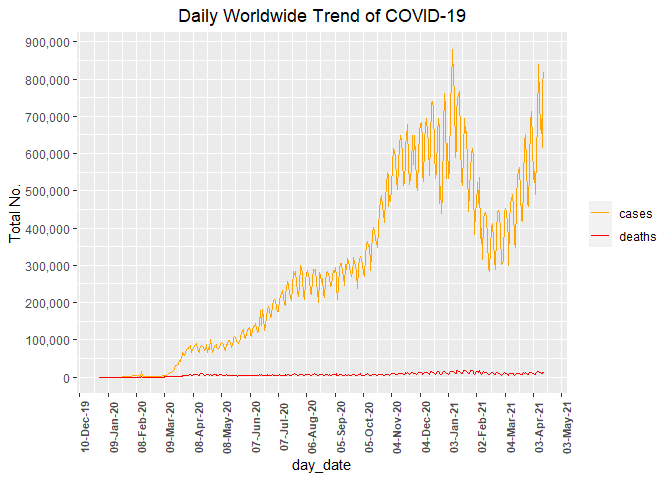<!-- -->

```r
ggplot(data=melt(dt4_COVID_19, id=c("week_year"))) +
  geom_line(aes(x=week_year, y=value, colour=variable))+
  scale_colour_manual(name="", values=c("orange","red"))+
  scale_x_date(date_labels = "%d-%b-%y", date_breaks = "4 weeks") +
  scale_y_continuous(labels = scales::comma, n.breaks = 10
    #breaks = seq(0, round(max(dt4_COVID_19$cases), digits = -5), by = 500000)
    )+ 
  theme(axis.text.x = element_text(angle = 90, size = 8, face = "bold"),
        plot.title = element_text(hjust = 0.5))+
  labs(title="Weekly Worldwide Trend of COVID-19", x="week_date", y ="Total No.")
```

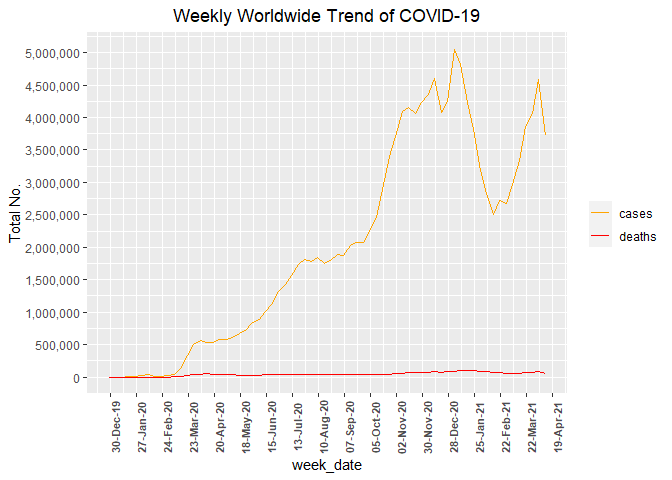<!-- -->

```r
ggplot(data=melt(dt5_COVID_19, id=c("month_year"))) +
  geom_line(aes(x=month_year, y=value, colour=variable))+
  scale_colour_manual(name="", values=c("orange","red"))+
  scale_x_date(date_labels = "%b-%y", date_breaks = "1 month") +
  scale_y_continuous(labels = scales::comma, n.breaks = 12
    #breaks = seq(0, round(max(dt5_COVID_19$cases), digits = -7), by = 1000000)
                     )+ 
  theme(axis.text.x = element_text(angle = 90, size = 8, face = "bold"),
        plot.title = element_text(hjust = 0.5))+
  labs(title="Monthly Worldwide Trend of COVID-19", x="month_date", y ="Total No.")
```

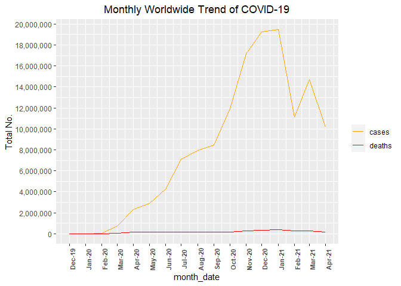<!-- -->


```r
ggplot(data=dt31_COVID_19) +
  geom_line(aes(x=date_rep, y=cases, color=continent_geographical))+
  scale_colour_manual(name="Continent", values=c("black","red", "green", "blue", "orange", 
                                                 "brown","darkmagenta"))+
  scale_x_date(date_labels = "%d-%b-%y", date_breaks = "30 days") +
  scale_y_continuous(labels = scales::comma, n.breaks = 12
    #breaks = seq(0, round(max(dt31_COVID_19$cases), digits = -4), by = 20000)
                     )+
  theme(legend.position="bottom", 
        axis.text.x = element_text(angle = 90, size = 8, face = "bold"),
        plot.title = element_text(hjust = 0.5))+
  labs(title="Daily Continent Trend of COVID-19 Cases",x="day_date", y = "Total No.")+
  guides(col = guide_legend(ncol = 4))
```

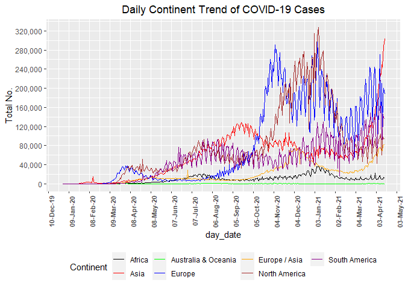<!-- -->

```r
ggplot(data=dt31_COVID_19) +
  geom_line(aes(x=date_rep, y=deaths, color=continent_geographical))+
  scale_colour_manual(name="Continent", values=c("black","red", "green", "blue", "orange", 
                                                 "brown","darkmagenta"))+
  scale_x_date(date_labels = "%d-%b-%y", date_breaks = "30 days") +
  scale_y_continuous(labels = scales::comma, n.breaks = 12
    #breaks = seq(0, round(max(dt31_COVID_19$deaths), digits = -3), by = 500)
                     )+
  theme(legend.position="bottom",
        axis.text.x = element_text(angle = 90, size = 8, face = "bold"),
        plot.title = element_text(hjust = 0.5))+
  labs(title="Daily Continent Trend of COVID-19 Deaths",x="day_date", y = "Total No.")+
  guides(col = guide_legend(ncol = 4))
```

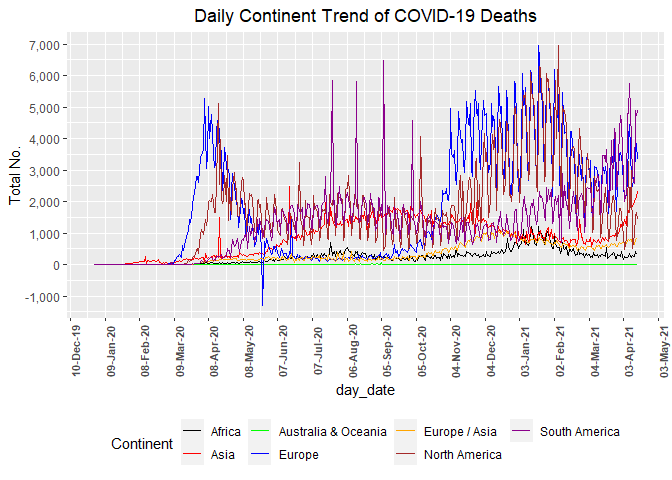<!-- -->

```r
ggplot(data=dt41_COVID_19) +
  geom_line(aes(x=week_year, y=cases, color=continent_geographical))+
  scale_colour_manual(name="Continent", values=c("black","red", "green", "blue", "orange", 
                                                 "brown","darkmagenta"))+
  scale_x_date(date_labels = "%d-%b-%y", date_breaks = "4 weeks") +
  scale_y_continuous(labels = scales::comma, n.breaks = 12
    #breaks = seq(0, round(max(dt41_COVID_19$cases), digits = -6), by = 200000)
                     )+
  theme(legend.position="bottom",
        axis.text.x = element_text(angle = 90, size = 8, face = "bold"),
        plot.title = element_text(hjust = 0.5))+
  labs(title="Weekly Continent Trend of COVID-19 Cases",x="week_date", y = "Total No.")+
  guides(col = guide_legend(ncol = 4))
```

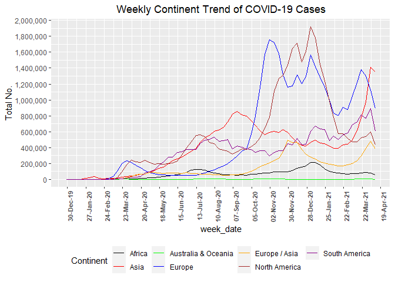<!-- -->

```r
ggplot(data=dt41_COVID_19) +
  geom_line(aes(x=week_year, y=deaths, color=continent_geographical))+
  scale_colour_manual(name="Continent", values=c("black","red", "green", "blue", "orange", 
                                                 "brown","darkmagenta"))+
  scale_x_date(date_labels = "%d-%b-%y", date_breaks = "4 weeks") +
  scale_y_continuous(labels = scales::comma, n.breaks = 12
    #breaks = seq(0, round(max(dt41_COVID_19$deaths), digits = -3), by = 2000)
                     )+
  theme(legend.position="bottom",
        axis.text.x = element_text(angle = 90, size = 8, face = "bold"),
        plot.title = element_text(hjust = 0.5))+
  labs(title="Weekly Continent Trend of COVID-19 Deaths",x="week_date", y = "Total No.")+
  guides(col = guide_legend(ncol = 4))
```

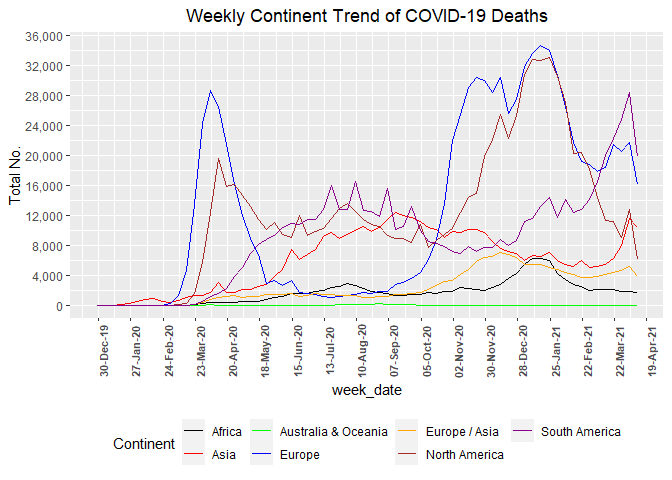<!-- -->

```r
ggplot(data=dt51_COVID_19) +
  geom_line(aes(x=month_year, y=cases, color=continent_geographical))+
  scale_colour_manual(name="Continent", values=c("black","red", "green", "blue", "orange", 
                                                 "brown","darkmagenta"))+
  scale_x_date(date_labels = "%b-%y", date_breaks = "1 month") +
  scale_y_continuous(labels = scales::comma, n.breaks = 12
    #breaks = seq(0, round(max(dt51_COVID_19$cases), digits = -5), by = 500000)
                     )+
  theme(legend.position="bottom",
        axis.text.x = element_text(angle = 90, size = 8, face = "bold"),
        plot.title = element_text(hjust = 0.5))+
  labs(title="Monthly Continent Trend of COVID-19 Cases",x="month_date", y = "Total No.")+
  guides(col = guide_legend(ncol = 4))
```

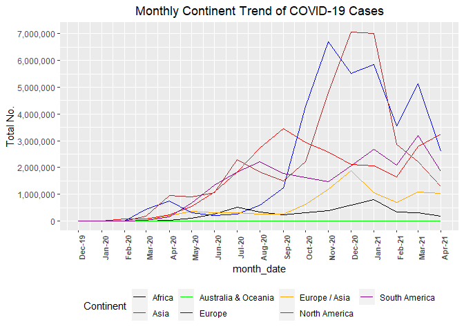<!-- -->

```r
ggplot(data=dt51_COVID_19) +
  geom_line(aes(x=month_year, y=deaths, color=continent_geographical))+
  scale_colour_manual(name="Continent", values=c("black","red", "green", "blue", "orange", 
                                                 "brown","darkmagenta"))+
  scale_x_date(date_labels = "%b-%y", date_breaks = "1 month") +
  scale_y_continuous(labels = scales::comma, n.breaks = 12
    #breaks = seq(0, round(max(dt51_COVID_19$deaths), digits = -3), by = 10000)
                     )+
  theme(legend.position="bottom",
        axis.text.x = element_text(angle = 90, size = 8, face = "bold"),
        plot.title = element_text(hjust = 0.5))+
  labs(title="Monthly Continent Trend of COVID-19 Deaths",x="month_date", y = "Total No.")+
  guides(col = guide_legend(ncol = 4))
```

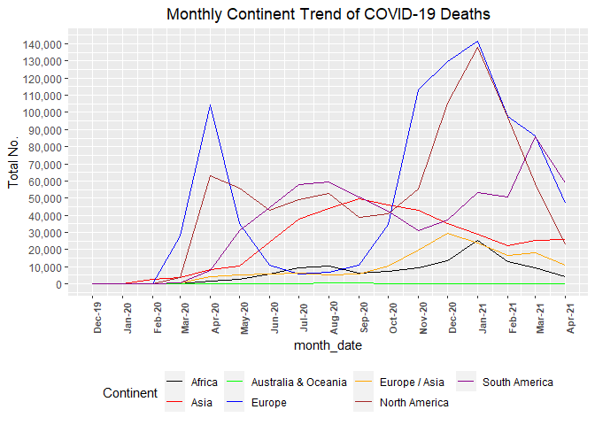<!-- -->


### Maps: geom_sf


```r
#library(devtools)
#install_github("ropensci/rnaturalearthhires")

library(sf)
library(rnaturalearth)
library(rnaturalearthdata)
library(rnaturalearthhires)

#world <- ne_countries(scale = "large", returnclass = "sf")

world <- ne_countries(scale = 10 , returnclass = "sf")
class(world)
```

```
## [1] "sf"         "data.frame"
```

```r
#plot_ly(world, color = I("gray90"), stroke = I("black"), span = I(1))

#world %>%
  #select(name) %>%
  #print(n = 255)


world_mapdt_COVID_19 <- merge(world[,c('admin', 'adm0_a3', "iso_a2",'continent','geometry')],
                            dt_COVID_19 %>% 
               group_by(countries, geo_id, countryterritory_code_adm0_a3,
                  continent_geographical, covid_19_spread, pop_data2019) %>% 
                  summarise(cases = sum(cases), deaths = sum(deaths), .groups = 'drop'),  
                              by.x = "adm0_a3", 
                              by.y = "countryterritory_code_adm0_a3", all=TRUE)


#Keep all rows from x AND from y #Outerjoin
world_mapdt_COVID_19 <- world_mapdt_COVID_19[!duplicated(world_mapdt_COVID_19$adm0_a3),]


 ggplot(data = world_mapdt_COVID_19) +
geom_sf(aes(fill = cases), size = 0.1) +
  coord_sf(xlim = c(-180, 180), ylim = c(-90, 90), expand = FALSE)+
    scale_fill_viridis_c(na.value = "red")+
  labs(title= paste("Global Impact of COVID-19 as at", max(dt_COVID_19$date_rep) )
       ,x="longitude", y = "latitude")+
  theme(plot.title = element_text(hjust = 0.5))
```

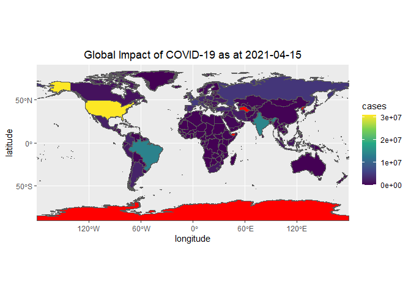<!-- -->

```r
ggplot(data = world_mapdt_COVID_19) +
geom_sf(aes(fill = cases), color = "black", size = 0.1) +
    coord_sf(xlim = c(-180, 180), ylim = c(-90, 90), expand = FALSE)+
    scale_fill_viridis_c(option = "C", na.value = "red")+
  labs(title=paste("Global Impact of COVID-19 as at", max(dt_COVID_19$date_rep) ),
       x="longitude", y = "latitude")+
  theme(plot.title = element_text(hjust = 0.5))
```

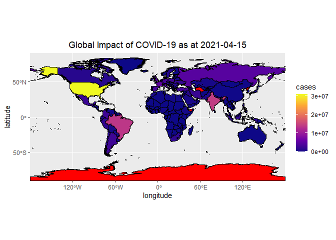<!-- -->

```r
  ggplot(data = world_mapdt_COVID_19) +
  geom_sf(aes(fill = deaths), size = 0.1) +
      coord_sf(xlim = c(-180, 180), ylim = c(-90, 90), expand = FALSE)+
    scale_fill_viridis_c(option = "plasma", na.value = "green" )+
  labs(title=paste("Global Impact of COVID-19 as at", max(dt_COVID_19$date_rep) ),
       x="longitude", y = "latitude")+
  theme(plot.title = element_text(hjust = 0.5))
```

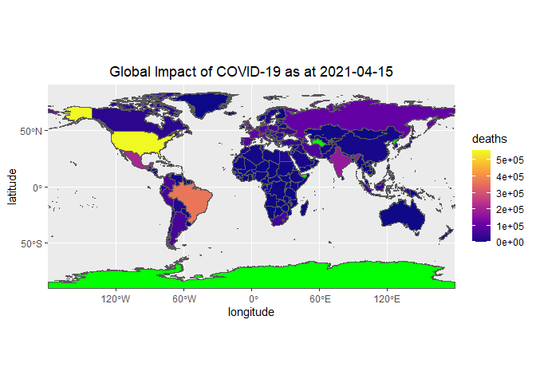<!-- -->


### Maps: geom_map


```r
world1 <- map_data("world")

ggplot() +
    geom_map(data = world1, map = world1, aes(x=long, y=lat, map_id = region),
             color = "white", fill = "lightgray") +
    ggtitle(paste("Global Cases of COVID-19 as at", max(dt_COVID_19$date_rep))) +
    geom_point( data = dt11_COVID_19,
               aes(x=longitude, y=latitude, colour=cases)) +
  theme(legend.text = element_text(size=8), 
        legend.title = element_text(colour="blue", size=10, face="bold"),
        plot.title = element_text(hjust = 0.5))+
  labs(x="longitude", y = "latitude")+
   scale_colour_gradient2(low="green", mid="yellow", high="red", 
                          midpoint = max(dt11_COVID_19$cases)/2)
```

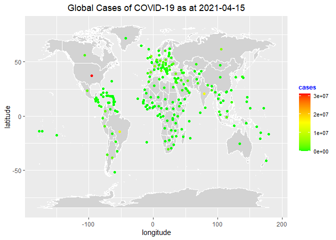<!-- -->

```r
    #scale_colour_gradient2()+
  #scale_colour_gradient(low="green", high="red",guide = "colourbar")

ggplot() +
    geom_map(data = world1, map = world1, aes(x=long, y=lat, map_id = region),
             color = "black", fill = "lightgray") +
    ggtitle(paste("Global Deaths of COVID-19 as at", max(dt_COVID_19$date_rep))) +
    geom_point( data = dt11_COVID_19,
               aes(x=longitude, y=latitude, colour=deaths)) +
  theme(legend.text = element_text(size=8), 
        legend.title = element_text(colour="blue",size=10, face="bold"),
        plot.title = element_text(hjust = 0.5))+
  labs(x="longitude", y = "latitude") +
   scale_colour_gradientn(colours = terrain.colors(10))
```

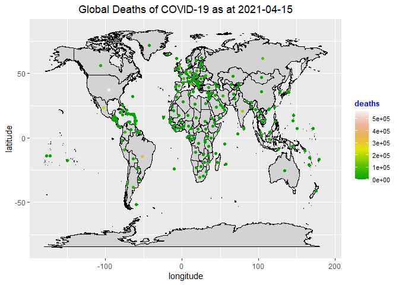<!-- -->

```r
ggplot() +
    geom_map(data = world1, map = world1, aes(x=long, y=lat, map_id = region),
             color = "white", fill = "lightgray") +
    ggtitle(paste("Global Cases of COVID-19 as at", max(dt_COVID_19$date_rep))) +
    geom_point(data = dt11_COVID_19,
               aes(x=longitude, y=latitude, size=cases, colour=continent_geographical)) +
  theme(legend.position = "right", 
        legend.box = "vertical", 
        legend.text = element_text(size=8), 
        legend.title = element_text(colour="blue", size=9, face="bold"),
        plot.title = element_text(hjust = 0.5)) +
   guides(col = guide_legend(nrow = 7), size = guide_legend(ncol = 1))+
  labs(colour = "continent", x="longitude", y = "latitude")
```

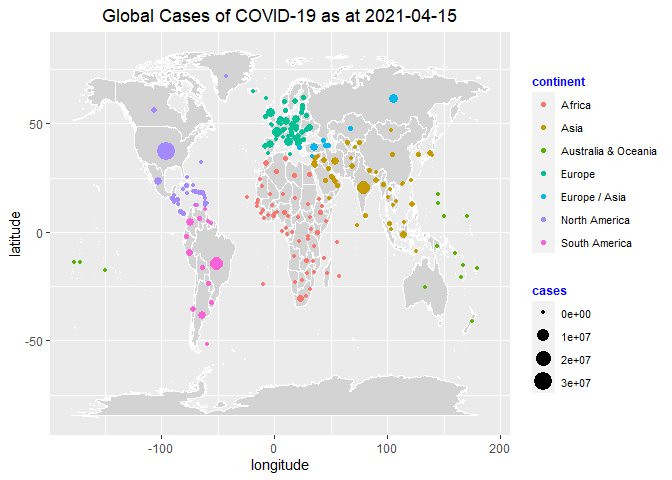<!-- -->

```r
  ggplot() +
    geom_map(data = world1, map = world1, aes(x=long, y=lat, map_id = region),
             color = "black", fill = "lightgray") +
    ggtitle(paste("Global Deaths of COVID-19 as at", max(dt_COVID_19$date_rep))) +
    geom_point(data = dt11_COVID_19,
               aes(x=longitude, y=latitude, size=deaths, colour=continent_geographical)) +
  theme(legend.position = "right", 
        legend.box = "vertical", 
        legend.text = element_text(size=8), 
        legend.title = element_text(colour="blue", size=9, face="bold"),
        plot.title = element_text(hjust = 0.5)) +
   guides(col = guide_legend(nrow = 7), size = guide_legend(ncol = 1))+
  labs(colour = "continent", x="longitude", y = "latitude")
```

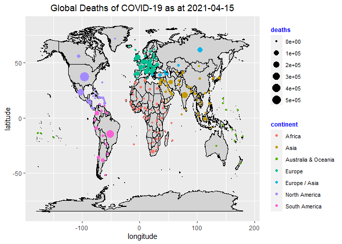<!-- -->


